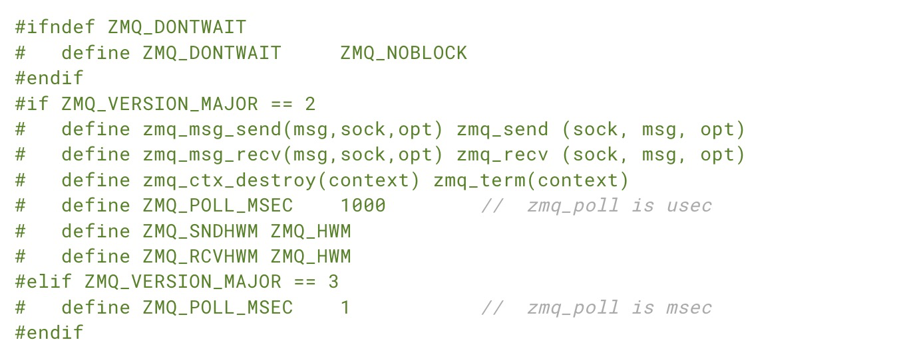

# 第1章-基础知识

## 修复世界

​		ZeroMQ是一个快速、功能强大的网络通信库，可以将套接字的功能提升到更高的水平。它的工作方式类似邮箱，具有路由功能。一些人会试图通过分享自己的顿悟瞬间来解释ZeroMQ，当一切变得显而易见时，复杂性消失，简单性增强，开阔了思维。其他人则试图通过比较来解释，它更小、更简单，但仍然看起来很熟悉。我个人喜欢记住我们为什么要制作ZeroMQ，因为这很可能就是您，读者，今天仍然所处的状态。

​		编程是穿上艺术外壳的科学，因为我们大多数人不理解软件的物理学，并且很少（如果有）教授它。软件的本质不是算法、数据结构、语言和抽象概念。这些只是我们制作、使用、丢弃的工具。软件的真正本质是人的本质，特别是我们在处理复杂性方面的局限以及我们希望一起解决大问题的愿望。这就是编程的科学：制作人们可以理解和轻松使用的模块，人们将共同努力解决最大的问题。

​		我们生活在一个连通的世界中，现代软件必须在这个世界中导航。因此，明天最大解决方案的构建块是连接的和大量并行的。代码不仅仅是"强大而沉默"了。代码必须和代码交流。代码必须健谈，社交，联系紧密。代码必须像人类大脑一样运行，数以万亿计的单独的神经元彼此发送消息，一个没有中央控制、没有单点故障的大规模并行网络，却能够解决极其困难的问题。代码的未来看起来像人类大脑并不是巧合，因为每个网络的端点在某种程度上都是人类大脑。

​		如果您有过任何与线程、协议或网络相关的工作，您会意识到这几乎是不可能的。这是一个梦想。当您开始处理真实生活中的情况时，即使在几个套接字上连接几个程序，也是纯粹讨厌的。万亿？代价将是不可想象的。连接计算机是如此困难，以至于这样做的软件和服务是一个多亿美元的业务。

​		因此，我们生活在一个电线远远超出我们使用能力的世界。在1980年代，我们经历了软件危机，当时像Fred Brooks这样的领先软件工程师相信没有“银弹”可以“承诺生产力、可靠性或简单性的提高至少一个数量级”。

​		布鲁克斯错过了自由和开源软件，它解决了这场危机，使我们能够高效地共享知识。今天，我们面临着另一场软件危机，但这是我们不常谈论的。只有最大，最富有的公司才能负担得起创建连接的应用程序。有云，但它是专有的。我们的数据和知识正在从我们的个人计算机消失到我们无法访问且无法与之竞争的云中。谁拥有我们的社交网络？这就像主机-个人计算机革命的逆转。

​		我们可以在其他书中讨论政治哲学。重要的是，虽然互联网提供了大量连接代码的潜力，但实际上对大多数人来说都是遥不可及的，因此大量有趣的问题（在健康、教育、经济、运输等领域）仍然无法解决，因为没有连接代码的方法，因此也没有办法连接可以一起解决这些问题的大脑。

​		有许多尝试解决连接代码的挑战。有数以千计的 IETF 规范，每个规范都解决了难题的一部分。对于应用程序开发人员，HTTP 可能是一个简单易行的解决方案，但它可以说是使问题更加恶化，因为它鼓励开发人员和架构师以大型服务器和薄薄的愚蠢客户端的方式思考。

​		所以现在人们仍然使用原始的UDP和TCP、专有协议、HTTP和Websockets来连接应用程序。它仍然痛苦、缓慢、难以扩展，本质上是集中的。分布式P2P架构主要是用于玩耍，而不是工作。有多少应用程序使用Skype或Bittorrent来交换数据？

​		这就回到了编程科学。为了修复这个世界，我们需要做两件事。第一，解决“如何将任何代码与任何代码连接”的一般问题。第二，把这些包装成最简单的构建模块，使人们能够简单易懂地使用。

​		听起来超级简单。或许就是这样。这正是关键所在。

## 起始假设

​		我们假设您至少使用了ZeroMQ的3.2版本。我们假设您正在使用类似于Mac的系统。我们假设您基本上能够读懂Python代码，因为示例代码的默认语言是Python。当我们写下常量（例如PUSH或SUBSCRIBE）时，我们假设您可以想象如果编程语言需要，它们实际上是称为zmq.PUSH或zmq.SUBSCRIBE的。

## 获取示例

示例代码位于一个公共的GitHub存储库中。获取所有示例的最简单方法是克隆此存储库：

```bash
git clone --depth=1 https://github.com/imatix/zguide.git
```

​		下一步，浏览 examples 子目录。您将找到按语言分类的示例。所有示例均根据 MIT/X11 许可。

## 问，你会收到

​		那么让我们从代码开始。当然，我们从 Hello World 的例子开始。我们将创建一个客户端和一个服务器。客户端向服务器发送“Hello”，服务器回复“World”。以下是 Python 语言的服务器，它在端口 5555 上打开一个 ZeroMQ 套接字，在上面读取请求并对每个请求回复“World”：

hwserver.py

```python
#
#   Hello World server in Python
#   Binds REP socket to tcp://*:5555
#   Expects b"Hello" from client, replies with b"World"
#

import time
import zmq

context = zmq.Context()
socket = context.socket(zmq.REP)
socket.bind("tcp://*:5555")

while True:
    #  Wait for next request from client
    message = socket.recv()
    print(f"Received request: {message}")

    #  Do some 'work'
    time.sleep(1)

    #  Send reply back to client
    socket.send_string("World")
```


​		REQ-REP 套接字对是同步的。客户端使用 socket.send() 和 socket.recv()，在循环中（或一次，如果这是所需的）。任何其他顺序（例如，连续发送两条消息）将导致 send 或 recv 调用返回代码 -1。同样，服务按顺序发出 socket.recv() 和 socket.send()，根据需要多次。

​		本书以 Python 语言为参考语言，这是我们将使用的主要语言示例。让我们比较一下 C++ 中的相同服务器：

```c++
//
//  Hello World server in C++
//  Binds REP socket to tcp://*:5555
//  Expects "Hello" from client, replies with "World"
//
#include <zmq.hpp>
#include <string>
#include <iostream>
#ifndef _WIN32
#include <unistd.h>
#else
#include <windows.h>

#define sleep(n)	Sleep(n)
#endif

int main () {
    //  Prepare our context and socket
    zmq::context_t context (2);
    zmq::socket_t socket (context, zmq::socket_type::rep);
    socket.bind ("tcp://*:5555");

    while (true) {
        zmq::message_t request;

        //  Wait for next request from client
        socket.recv (request, zmq::recv_flags::none);
        std::cout << "Received Hello" << std::endl;

        //  Do some 'work'
        sleep(1);

        //  Send reply back to client
        zmq::message_t reply (5);
        memcpy (reply.data (), "World", 5);
        socket.send (reply, zmq::send_flags::none);
    }
    return 0;
}
```

​		在像PHP或Java这样的语言中，我们可以隐藏更多内容，代码变得更易于阅读。

```php
<?php
/*
 *  Hello World server
 *  Binds REP socket to tcp://*:5555
 *  Expects "Hello" from client, replies with "World"
 * @author Ian Barber <ian(dot)barber(at)gmail(dot)com>
 */

$context = new ZMQContext(1);

//  Socket to talk to clients
$responder = new ZMQSocket($context, ZMQ::SOCKET_REP);
$responder->bind("tcp://*:5555");

while (true) {
    //  Wait for next request from client
    $request = $responder->recv();
    printf ("Received request: [%s]\n", $request);

    //  Do some 'work'
    sleep (1);

    //  Send reply back to client
    $responder->send("World");
}
```

```java
package guide;

//
//  Hello World server in Java
//  Binds REP socket to tcp://*:5555
//  Expects "Hello" from client, replies with "World"
//

import org.zeromq.SocketType;
import org.zeromq.ZMQ;
import org.zeromq.ZContext;

public class hwserver
{
    public static void main(String[] args) throws Exception
    {
        try (ZContext context = new ZContext()) {
            // Socket to talk to clients
            ZMQ.Socket socket = context.createSocket(SocketType.REP);
            socket.bind("tcp://*:5555");

            while (!Thread.currentThread().isInterrupted()) {
                byte[] reply = socket.recv(0);
                System.out.println(
                    "Received " + ": [" + new String(reply, ZMQ.CHARSET) + "]"
                );

                Thread.sleep(1000); //  Do some 'work'

                String response = "world";
                socket.send(response.getBytes(ZMQ.CHARSET), 0);
            }
        }
    }
}
```

​		以下是客户端代码：

hwclient.py

```python
#
#   Hello World client in Python
#   Connects REQ socket to tcp://localhost:5555
#   Sends "Hello" to server, expects "World" back
#

import zmq

context = zmq.Context()

#  Socket to talk to server
print("Connecting to hello world server...")
socket = context.socket(zmq.REQ)
socket.connect("tcp://localhost:5555")

#  Do 10 requests, waiting each time for a response
for request in range(10):
    print(f"Sending request {request} ...")
    socket.send_string("Hello")

    #  Get the reply.
    message = socket.recv()
    print(f"Received reply {request} [ {message} ]")
```

​		现在看起来这太简单了，不够真实，但是我们已经学到，ZeroMQ 套接字具有超能力。你可以同时将数以千计的客户端抛向这个服务器，它仍然可以快乐和快速地工作。为了好玩，试着启动客户端，然后启动服务器，看看它仍然可以工作，然后思考一下这意味着什么。

​		这里简要解释一下这两个程序实际上在做什么。它们创建了一个用于工作的ZeroMQ上下文和套接字。不要担心单词的含义。你会掌握它的。服务器将其REP（回复）套接字绑定到端口5555。服务器在循环中等待请求，并对每次请求作出回复。客户端发送请求并从服务器读取回复。

​		如果你杀死了服务器（Ctrl-C）并重新启动它，客户端不会正常恢复。从崩溃的进程恢复并不那么容易。创建可靠的请求-回复流程复杂到我们直到第4章-可靠的请求-回复模式才会涉及到。

​		这里有很多的背后操作，但对我们程序员来说重要的是代码的简洁明了以及它即使在高负载下也很少崩溃。这是请求-回复模式，可能是使用ZeroMQ最简单的方法。它映射到RPC和经典的客户端/服务器模型。

## 关于字符串的小注释

​		ZeroMQ并不知道你发送的数据的具体内容，只知道它的字节大小。这意味着你需要负责安全地格式化数据，以便应用程序可以读取它。对于对象和复杂的数据类型的格式化工作可由专门的库（例如Protocol Buffers）完成。但即使对于字符串，你也需要小心。

​		在C语言和其他一些语言中，字符串以一个空字节结尾。我们可以使用额外的空字节发送一个字符串，例如“HELLO”。

```c
zmq_send (requester, "Hello", 6, 0);
```

​		然而，如果你从另一种语言发送字符串，它可能不包含该空字节。例如，当我们在 Python 中发送相同的字符串时，我们这样做：

```python
socket.send ("Hello")
```

​		然后发送到线路上的是长度（对于较短的字符串是一个字节）和字符串内容作为单独的字符。


​		然后，如果您从C程序中读取，您将获得看起来像字符串的东西，并且可能偶然地像字符串（如果幸运的话，这五个字节会被一个无辜的隐藏的零字节后面），但不是正确的字符串。当您的客户端和服务器不统一字符串格式时，您将获得奇怪的结果。

​		当您在C语言中从ZeroMQ读取字符串数据时，您不能相信它是安全终止的。每次读取字符串时，您都应该分配一个新的带有额外字节的缓冲区，复制字符串，并通过null正确终止它。

​		因此，让我们确定一个规则：ZeroMQ字符串是长度指定的，在线路上发送时没有尾随的零值。在最简单的情况下（我们将在示例中这样做），ZeroMQ字符串很容易映射到ZeroMQ消息帧，如上图所示 - 长度和一些字节。

​		在C语言中，接收ZeroMQ字符串并将其作为有效的C字符串提供给应用程序，我们需要做以下事情：

```c
//  Receive ZeroMQ string from socket and convert into C string
//  Chops string at 255 chars, if it's longer
static char *
s_recv (void *socket) {
    char buffer [256];
    int size = zmq_recv (socket, buffer, 255, 0);
    if (size == -1)
        return NULL;
    if (size > 255)
        size = 255;
    buffer [size] = \0;
    /* use strndup(buffer, sizeof(buffer)-1) in *nix */
    return strdup (buffer);
}
```

​		这就成了一个方便的辅助功能，在利用可重复使用的代码赚钱的精神中，让我们编写一个类似的 s_send 函数，它以正确的 ZeroMQ 格式发送字符串，并将其打包到一个头文件中，以便我们可以重复使用。

​		结果是 zhelpers.h，它可以使我们在 C 语言中编写更加简洁和简单的 ZeroMQ 应用程序。这是一份相当长的源代码，只对 C 开发人员有趣，因此可以在闲暇时阅读。

## 关于命名约定的注记

"zhelpers.h" 和本指南中接下来的示例中的前缀 "s_" 表示静态方法或变量。

## 版本报告

​		ZeroMQ有几个版本，如果遇到问题，很可能是在后续版本中已经修复了的问题。因此，知道您实际链接的ZeroMQ版本非常有用。下面是一个可以做到这一点的小程序：

version.py

```python
# Report 0MQ version
#
# Author: Lev Givon <lev(at)columbia(dot)edu>

import zmq

print(f"Current libzmq version is {zmq.zmq_version()}")
print(f"Current  pyzmq version is {zmq.__version__}")
```

## 将消息发出

​		第二个经典模式是单向数据分发，其中服务器向一组客户端推送更新。让我们看一个示例，它推送天气更新，包括邮政编码、温度和相对湿度。我们将生成随机值，就像真实的气象站一样。

​		这是服务器。我们将为此应用程序使用端口5556：

wuserver.py

```python
#
#   Weather update server
#   Binds PUB socket to tcp://*:5556
#   Publishes random weather updates
#

import zmq
from random import randrange


context = zmq.Context()
socket = context.socket(zmq.PUB)
socket.bind("tcp://*:5556")

while True:
    zipcode = randrange(1, 100000)
    temperature = randrange(-80, 135)
    relhumidity = randrange(10, 60)

    socket.send_string(f"{zipcode} {temperature} {relhumidity}")
```

​		这是一个永无止境的更新流，就像永不停息的广播一样。

​		以下是客户端应用程序，它监听更新流并获取与特定邮政编码相关的任何内容，默认为上海市，因为这是任何冒险的好地方：

wuclient.py

```python
#
#   Weather update client
#   Connects SUB socket to tcp://localhost:5556
#   Collects weather updates and finds avg temp in zipcode
#

import sys
import zmq


#  Socket to talk to server
context = zmq.Context()
socket = context.socket(zmq.SUB)

print("Collecting updates from weather server...")
socket.connect("tcp://localhost:5556")

# Subscribe to zipcode, default is NYC, 10001
zip_filter = sys.argv[1] if len(sys.argv) > 1 else "10001"
socket.setsockopt_string(zmq.SUBSCRIBE, zip_filter)

# Process 5 updates
total_temp = 0
for update_nbr in range(5):
    string = socket.recv_string()
    zipcode, temperature, relhumidity = string.split()
    total_temp += int(temperature)

    print((f"Average temperature for zipcode " 
       f"'{zip_filter}' was {total_temp / (update_nbr+1)} F"))
```


​		在使用 SUB 套接字时，必须使用 setsockopt_string() 和 SUBSCRIBE 设置订阅，如代码所示。如果不设置任何订阅，则不会收到任何消息。这是初学者经常犯的错误。订阅者可以设置多个订阅，它们将被合并。也就是说，如果更新与任何订阅匹配，则订阅者将接收到它。订阅者也可以取消特定的订阅。订阅通常是（但不一定总是）可打印字符串，有关详情，请参阅 setsockopt_string()。

​		PUB-SUB 套接字对是异步的。客户端在循环（或一次）中执行 zmq.recv()。试图向 SUB 套接字发送消息将导致错误。类似地，服务在需要时随时可以执行 zmq.send()，但不能在 PUB 套接字上执行 zmq.recv()。

​		在理论上，ZeroMQ套接字的连接和绑定端并不影响其使用。但是实际上，还有一些未被记录的差异，稍后我会讲到。目前，请绑定PUB并连接SUB，除非您的网络设计不允许。

​		还有一件关于PUB-SUB套接字的重要事情需要了解：您不知道订阅者何时开始接收消息。即使您启动订阅者，等待一段时间，然后启动发布者，订阅者仍将始终错过发布者发送的第一条消息。这是因为当订阅者连接到发布者（这是一个需要少量但不为零的时间）时，发布者可能已经开始发送消息。

​		这个“慢加入者”的症状会经常影响到许多人，因此我们将详细说明这一点。请记住，ZeroMQ使用异步I/O，即在后台进行。假设您有两个节点按以下顺序执行：

1. 订阅者连接到端点并接收和计数消息。

2. 发布者绑定到端点并立即发送1,000条消息。

​		这意味着，在订阅者建立与发布者的连接（这需要一点不为零的时间）期间，发布者可能已经在发送消息。

​		在这种情况下，订阅者很可能不会收到任何消息。您会疑惑，检查您是否设置了正确的过滤器并再试一次，但订阅者仍然不会收到任何消息。

​		建立TCP连接需要来回握手，具体取决于您的网络和对等节点之间的跳数，这需要几毫秒的时间。在此期间，ZeroMQ可以发送许多消息。假设建立连接需要5毫秒，并且该链接每秒可以处理100万条消息。在订阅者连接到发布者的5毫秒期间，发布者仅需1毫秒就可以发送这1,000条消息。

​		在第2章-套接字和模式中，我们将解释如何同步发布者和订阅者，以便在订阅者真正连接和准备就绪时才开始发布数据。有一种简单但愚蠢的方法是让发布者延迟，那就是睡眠。然而，不要在实际应用中使用此方法，因为它非常不稳定，也不优雅和慢。可以使用睡眠来证明正在发生的情况，然后等待第2章套接字和模式，了解如何正确处理。

​		另一种同步方法，只是简单地假设发布的数据流是无限的，没有开始和结束。同样，也假设订阅者不关心它启动前的情况。这就是我们构建天气客户端示例的方法。

​		因此，客户端订阅其所选邮政编码，并收集该邮政编码的100次更新。如果邮政编码随机分布，这意味着大约从服务器获得一千万次更新。您可以启动客户端，然后启动服务器，客户端将继续工作。您可以随时停止和重新启动服务器，客户端将继续工作。当客户端收集了100次更新后，它将计算平均值，打印并退出。

​		关于发布-订阅（pub-sub）模式的一些要点：

- 订阅者可以连接到多个发布者，每次使用一次连接调用。数据将按顺序到达并交错（“公平排队”），因此不会有任何单一发布者淹没其他发布者。
- 如果发布者没有连接的订阅者，那么它将丢弃所有消息。
- 如果您使用TCP，并且订阅者速度慢，消息将在发布者上排队。我们将在稍后使用“高水位线”来保护发布者免受此影响。
- 从ZeroMQ v3.x开始，使用连接协议（tcp:@<>@或ipc:@<>@）时，过滤在发布者端发生。使用epgm:@<//>@协议时，过滤在订阅者端发生。在ZeroMQ v2.x中，所有过滤都发生在订阅者端。

以下是我的笔记本电脑（一个2011年的Intel i5，虽然不错，但并不特殊）接收和过滤10M消息所需的时间：


## 分而治之


​		最后，作为一个示例（您肯定已经厌倦了有趣的代码，想回到关于比较抽象规范的语言学讨论中），让我们进行一点超级计算。然后喝咖啡。我们的超级计算应用程序是一个相当典型的并行处理模型。我们有：

- 一个通风机，生成可以并行处理的任务 
- 一组工人，处理任务 
- 一个汇集工人进程结果的汇点 

​		实际上，工人在超快的盒子上运行，可能使用GPU（图形处理单元）来进行繁重的数学运算。以下是通风机。它生成100个任务，每个任务都是告诉工人睡眠一些毫秒数的消息：

taskvent.py

```python
# Task ventilator
# Binds PUSH socket to tcp://localhost:5557
# Sends batch of tasks to workers via that socket
#
# Author: Lev Givon <lev(at)columbia(dot)edu>

import zmq
import random
import time


context = zmq.Context()

# Socket to send messages on
sender = context.socket(zmq.PUSH)
sender.bind("tcp://*:5557")

# Socket with direct access to the sink: used to synchronize start of batch
sink = context.socket(zmq.PUSH)
sink.connect("tcp://localhost:5558")

print("Press Enter when the workers are ready: ")
_ = input()
print("Sending tasks to workers...")

# The first message is "0" and signals start of batch
sink.send(b'0')

# Initialize random number generator
random.seed()

# Send 100 tasks
total_msec = 0
for task_nbr in range(100):

    # Random workload from 1 to 100 msecs
    workload = random.randint(1, 100)
    total_msec += workload

    sender.send_string(f"{workload}")

print(f"Total expected cost: {total_msec} msec")

# Give 0MQ time to deliver
time.sleep(1)
```

​		这是工作程序。它接收一条消息，睡眠该数量的秒数，然后表示它已经完成：

taskwork.py

```python
# Task worker
# Connects PULL socket to tcp://localhost:5557
# Collects workloads from ventilator via that socket
# Connects PUSH socket to tcp://localhost:5558
# Sends results to sink via that socket
#
# Author: Lev Givon <lev(at)columbia(dot)edu>

import sys
import time
import zmq


context = zmq.Context()

# Socket to receive messages on
receiver = context.socket(zmq.PULL)
receiver.connect("tcp://localhost:5557")

# Socket to send messages to
sender = context.socket(zmq.PUSH)
sender.connect("tcp://localhost:5558")

# Process tasks forever
while True:
    s = receiver.recv()

    # Simple progress indicator for the viewer
    sys.stdout.write('.')
    sys.stdout.flush()

    # Do the work
    time.sleep(int(s)*0.001)

    # Send results to sink
    sender.send(b'')
```

​		这是汇集程序。它收集100个任务，然后计算总处理时间，以便我们可以确认工人是否真的在并行运行（如果有多个工人）。

tasksink.py

```python
# Task sink
# Binds PULL socket to tcp://localhost:5558
# Collects results from workers via that socket
#
# Author: Lev Givon <lev(at)columbia(dot)edu>

import sys
import time
import zmq


context = zmq.Context()

# Socket to receive messages on
receiver = context.socket(zmq.PULL)
receiver.bind("tcp://*:5558")

# Wait for start of batch
s = receiver.recv()

# Start our clock now
tstart = time.time()

# Process 100 confirmations
for task_nbr in range(100):
    s = receiver.recv()
    if task_nbr % 10 == 0:
        sys.stdout.write(':')
    else:
        sys.stdout.write('.')
    sys.stdout.flush()

# Calculate and report duration of batch
tend = time.time()
print(f"Total elapsed time: {(tend-tstart)*1000} msec")
```

​		一个批次的平均成本是5秒。当我们启动1个、2个或4个工人时，汇合点会得到以下结果：

- 1个工人：总用时：5034毫秒。 
- 2个工人：总用时：2421毫秒。 
- 4个工人：总用时：1018毫秒。 

​		让我们详细了解一下这段代码的一些方面：

- 工人向通风机上游连接，向汇合点下游连接。这意味着您可以任意增加工人。如果工人绑定到其端点，则需要（a）更多端点和（b）在每次增加工人时修改通风机和/或汇合点。我们说通风机和汇合点是我们架构的稳定部分，工人是其动态部分。
- 我们必须同步批量的开始，使所有工人都启动和运行。这是ZeroMQ中相当常见的坑，并没有简单的解决方案。socket.connect方法需要一定的时间。因此，当一组工人连接到通风机时，第一个成功连接的工人将在短时间内获得大量的消息，同时其他工人也在连接。如果您不以某种方式同步批量的开始，系统将不会并行运行。试着在通风机中删除等待，看看会发生什么。
- 通风机的PUSH套接字（假设所有工人在批量开始之前都已连接）均匀地分发任务给工人。这称为负载平衡，我们将在以后详细探讨。
- 汇合点的PULL套接字均匀地从工人那里收集结果。这称为公平队列。


​		这种管道模式也表现出了"慢启动"现象，导致有人指责PUSH套接字没有正确地实现负载平衡。如果您使用PUSH和PULL，并且其中一个工人收到的消息数量比其他工人多得多，这是因为该PULL套接字比其他套接字更快地加入，并在其他套接字尝试连接之前抓取了大量消息。如果您希望正确地实现负载平衡，则可能需要查看第3章 - 高级请求-回复模式中的负载平衡模式。

###  使用ZMQ编程

​		在看了一些例子之后，您肯定渴望在一些应用程序中开始使用ZeroMQ。在开始之前，请深呼吸，放松，并反思一些基本建议，这将为您节省很多压力和困惑。

- 学习ZeroMQ需要逐步进行。这只是一个简单的API，但它隐藏了一个世界的可能性。慢慢了解这些可能性，掌握每一个。
- 编写优美的代码。丑陋的代码会隐藏问题，使其他人难以帮助您。您可能习惯了意义不明的变量名称，但阅读您的代码的人不会。使用真实单词的名称，而不是“我太粗心以告诉您这个变量的真正用途”。使用一致的缩进和干净的布局。编写好的代码，您的世界将更舒适。
- 随着制作过程中对所制作的内容进行测试。当您的程序不工作时，您应该知道责任在于哪五行代码。当您尝试ZeroMQ魔法时，这尤其成立，因为它不会在您第一次尝试时正常工作。
- 当您发现事情不如预期时，将代码分解为几部分，对每个部分进行测试，查看哪一部分不正常。ZeroMQ可以让您制作基本上模块化的代码；利用这个优势。
- 根据需要制作抽象（类、方法等）。如果您随意复制粘贴大量代码，您也会复制粘贴错误。

### 正确理解上下文

​		在 ZeroMQ 中，应用程序总是从创建上下文开始，然后使用该上下文创建套接字。在 Python 中，这是 zmq.Context() 调用。您应该在进程中创建和使用恰好一个上下文。技术上，上下文是单个进程中所有套接字的容器，并作为 inproc 套接字的传输，这是在单个进程中连接线程的最快方法。如果在运行时进程有两个上下文，则它们就像独立的 ZeroMQ 实例。如果这是您明确的要求，那么 OK，但否则请记住：

​		在进程开始时调用 zmq.Context()，在结束时调用 context.destroy()。

​		如果您正在使用 fork() 系统调用，请在 fork 之后并且在子进程代码的开头调用 zmq.Context()。通常，您希望在子进程中进行有趣的（ZeroMQ）操作，并在父进程中进行枯燥的进程管理。

### 确保干净退出

​		高质量的程序员有着和高质量的刺客相同的座右铭：工作结束时始终保持干净。当您在像Python这样的语言中使用ZeroMQ时，内容将自动为您释放。但是在使用C时，您必须在使用完后仔细释放对象，否则会出现内存泄漏、不稳定的应用程序以及一般的坏运气。

​		内存泄漏只是一件事，其实ZeroMQ非常敏感您如何退出应用程序。原因是技术性的和令人痛苦的，但总的来说，如果您保留任何套接字，context.destroy()函数将永远挂起。即使您关闭了所有套接字，context.destroy()也将默认永远等待，如果存在挂起的连接或发送，除非您在关闭套接字之前将LINGER设置为零。

​		在 ZeroMQ 中，我们需要关注的对象是消息、套接字和上下文。幸运的是，在简单的程序中这很简单：

- 如果打开和关闭了很多套接字，那可能是您需要重新设计应用程序的信号。在某些情况下，套接字句柄不会被释放，直到您销毁上下文。

- 在退出程序时，请关闭套接字，然后调用 context.destroy()。这将销毁上下文。

​		在具有自动对象销毁功能的语言中，当你离开作用域时，套接字和上下文将被销毁。如果你使用异常，你将必须在像任何资源一样的“final”块中进行清理。

​		如果你正在进行多线程工作，那么情况会比这要复杂得多。我们将在下一章讨论多线程问题，但是因为一些人会忽略警告，在不能安全行走之前试图奔跑，所以以下是在多线程 ZeroMQ 应用程序中做出干净退出的快速简单指南。

​		首先，不要在多个线程中使用同一个套接字。请不要解释为什么您认为这将是非常有趣的，只是请不要这样做。其次，您需要关闭每个正在进行请求的套接字。正确的方法是设置一个低的LINGER值（1秒），然后关闭套接字。

​		最后，销毁上下文。这将导致附加在线程中的任何阻塞接收、轮询或发送（即共享相同上下文的线程）返回错误。捕获该错误，然后在该线程中设置linger，关闭套接字，然后退出。不要两次销毁相同的上下文。主线程中的context.destroy()将阻塞，直到它知道的所有套接字都已安全关闭。

​		好了！它复杂且令人痛苦，以至于任何语言绑定的作者，如果他们的颜值足够高，都会自动执行此操作，并使套接字关闭不那么复杂。

###  我们为什么需要ZMQ

​		现在你已经看到了 ZeroMQ 的实际应用，让我们回到“为什么”。

​		许多应用程序现在由跨越某种网络（LAN 或 Internet）的组件组成。因此，许多应用程序开发人员最终会做一些消息处理。一些开发人员使用消息队列产品，但大多数情况下他们自己使用 TCP 或 UDP 进行消息处理。这些协议并不难使用，但在以任何可靠方式进行消息处理方面，它们与从 A 发送几个字节到 B 存在很大的差异。

​		让我们来看一下我们在使用原始 TCP 连接组件时面临的典型问题。任何可重复使用的消息传递层都需要解决这些问题中的大多数或全部：

- 如何处理 I/O？我们的应用程序是阻塞的还是在后台处理 I/O？这是一个关键的设计决策。阻塞 I/O 的架构不容易扩展，但后台 I/O 可能很难实现正确。
- 如何处理动态组件，即暂时离开的部分？我们是否将组件正式划分为“客户端”和“服务器”，并要求服务器不能消失？那么，如果我们想要连接服务器到服务器，我们是否每隔几秒尝试重新连接？
- 我们如何在线表示一条消息？我们如何安排数据使其易于写入和读取，避免缓冲区溢出，对于小的消息是有效的，但对于最大的跳舞猫戴着聚会帽的视频也是足够的？
- 我们如何处理不能立即传递的消息？特别是，如果我们正在等待组件重新上线？我们是丢弃消息，将它们放入数据库，还是放入内存队列？
- 我们在哪里存储消息队列？如果从队列读取的组件非常慢，导致我们的队列积增，那么我们的策略是什么？
- 如何处理丢失的消息？我们是等待新数据，请求重发，还是构建一种保证消息不会丢失的可靠性层？如果这个层本身崩溃了怎么办？
- 如果我们需要使用不同的网络传输，例如，多播而不是单播 TCP？或者 IPv6？我们是否需要重写应用程序，或者传输在某些层中是抽象的？
- 如何路由消息？我们能向多个对等方发送相同的消息吗？我们能将回复发送回原始请求者吗？
- 如何为另一种语言编写API？我们是重新实现线路层协议还是重新打包库？如果是前者，如何保证高效稳定的栈？如果是后者，如何保证互操作性？
- 如何表示数据以便在不同架构间读取？我们是否强制执行数据类型的特定编码？这究竟是信息系统的工作还是更高层的工作？
- 如何处理网络错误？我们是等待并重试，静默忽略，还是中止？

​		读取像 Hadoop Zookeeper 这样的典型开源项目的代码，例如在 src/c/src/zookeeper.c 中的 C API 代码。在我于2013年1月阅读时，它是4200行神秘代码，其中有一个未经说明的、客户端/服务器网络通信协议。我看到它非常高效，因为它使用poll而不是select。但实际上，Zookeeper应该使用通用的消息层和明确的线路层协议。团队不断地在解决这个问题的长清单上建造这个特定的轮子是非常浪费的。

​		但是如何制作一个可重用的消息层？为什么，当如此多的项目需要这项技术时，人们仍然通过在代码中驱动TCP套接字，并一遍又一遍地解决这个长清单上的问题，仍然通过困难的方式做到这一点？

​		因为构建可重用的消息系统非常困难，这就是为什么很少有开源项目尝试，为什么商业消息产品复杂、昂贵、不灵活、脆弱。2006年，iMatix设计了AMQP，为开源开发者提供了一种可重用的消息系统配方。AMQP比其他许多设计更好，但仍相对复杂、昂贵和脆弱。学习使用需要几周的时间，创建稳定的架构需要几个月的时间，以确保在事情变得复杂时不会崩溃。


​		大多数试图以可重用的方式解决这一长串问题的消息项目，如AMQP，通过发明一个新概念“代理”来实现。代理完成地址、路由和队列管理。这导致了一个客户端/服务器协议或一组API，允许应用程序与该代理通信。代理在减少大型网络的复杂性方面非常好。但是，将基于代理的消息添加到像Zookeeper这样的产品中会变得更劣，而不是更好。这意味着添加一个额外的大箱子和一个新的单点故障。代理很快变成了瓶颈和一个新的风险要管理。如果软件支持，我们可以添加第二、第三和第四个代理，并制定一些故障转移方案。人们这样做了。这会产生更多的部分、更多的复杂性和更多的可以打破的东西。

​		一个以代理为中心的设置需要自己的操作团队。您需要每天每夜地看着代理，并在它们开始不良行为时用木棍敲打它们。您需要盒子，您需要备份盒子，并需要人来管理这些盒子。这仅对由多个团队在几年内构建的大型应用程序有价值。


​		因此，中小型应用开发者陷入困境。要么避免网络编程，制作不能扩展的单体应用；要么跳进网络编程，制作易碎且难以维护的复杂应用；要么押注消息产品，最终得到依赖昂贵易破的技术的可扩展应用。没有真正好的选择，这也许是为什么消息仍然停留在上世纪，引起强烈情绪：对用户来说是负面的，对那些销售支持和许可证的人来说是欢乐的。

​		我们需要的是一种可以完成消息传递任务的东西，但以如此简单和廉价的方式完成它，以至于它可以在任何应用程序中工作，几乎没有任何成本。它应该是一个库，您只需链接即可，没有其他依赖项。没有额外的部件，因此没有额外的风险。它应该在任何操作系统上运行，并与任何编程语言一起使用。

​		这就是ZeroMQ：一个高效、可嵌入的库，可以解决应用程序在网络上变得更弹性所需的大多数问题，成本很小。

​		具体来说：

- ZeroMQ 使用后台线程异步处理 I/O，并使用无锁数据结构与应用程序线程进行通信，因此并发的 ZeroMQ 应用程序不需要锁、信号量或其他等待状态。
- 组件可以动态进入和退出，ZeroMQ 将自动重新连接。这意味着您可以以任意顺序启动组件。您可以创建“服务导向架构”(SOA)，其中服务可以在任意时间加入和离开网络。
- 在需要时，它会自动对消息进行排队。它会智能地执行这一操作，在将消息排队之前尽可能推送消息到接收方。
- 它有处理队列过多的方法(称为“高水平标记”)。当队列已满时，ZeroMQ 会根据消息的类型(即所谓的“模式”)自动阻塞发送方或丢弃消息。
- 它可以让您的应用程序通过任意传输方式进行通信：TCP、多播、进程内、进程间。您不需要更改代码才能使用不同的传输。
- 它根据消息模式使用不同的策略安全地处理缓慢/阻塞的读者。
- 它允许您使用多种模式路由消息，例如请求回复和发布订阅。这些模式是如何创建网络的拓扑结构的。
- 它允许你通过单一调用创建代理，用于排队、转发或捕获消息，这可以减少网络的互连复杂性。
- 它使用简单的帧在线上传送完整的消息，如果你写了一条 10k 的消息，你将收到一条 10k 的消息。
- ZeroMQ不对消息施加任何格式限制。消息大小可以从零到几千兆字节不等。当你需要表示数据时，你可以选择其他产品，例如 msgpack，Google 的协议缓冲区等。
- 它以智能的方式处理网络错误，在合适的情况下自动重试。
- 它可以减少您的碳足迹，通过使用更少的 CPU 资源做更多的事，这意味着您的设备使用的功率更少，可以更长时间使用。Al Gore 会喜欢 ZeroMQ。

​		实际上，ZeroMQ 的作用远不止于此。它对您开发网络功能的应用程序有着深远的影响。从表面上看，它是一个类似套接字的 API，您可以在其上执行 socket.recv() 和 socket.send() 操作。但是，消息处理很快就成为核心循环，您的应用程序很快就分解为一系列消息处理任务。它是优雅而自然的。而且它具有扩展性：每个任务映射到一个节点，节点之间通过任意传输方式进行通信。在一个进程中的两个节点（节点是线程），在一个盒子上的两个节点（节点是进程），或在一个网络上的两个节点（节点是盒子）-这些都是相同的，无需更改应用程序代码。

## 套接字的可扩展性

​		让我们看看ZeroMQ的可伸缩性。以下是一个启动天气服务器并并行启动客户端的 shell 脚本：


​		随着客户端的运行，我们使用top命令查看活动进程，并在4核盒子上看到类似情况：


​		让我们思考一下这里发生了什么。天气服务器只有一个套接字，但是这里我们看到它并行地向五个客户端发送数据。我们可以有成千上万的并发客户端。服务器应用程序没有看到它们，也没有直接与它们交流。因此，ZeroMQ套接字表现得像一个小型服务器，静默地接受客户端请求并尽快地将数据推向客户端，而网络能够处理的速度。它是一个多线程服务器，可以从你的CPU中榨取更多的能量。

## 从ZeroMQ v2.2升级到ZeroMQ v3.2

### 可兼容性的更改

这些变化不直接影响现有的应用程序代码：

- 发布者的侧而不是订阅者的侧现在完成发布/订阅过滤。在许多发布/订阅场景中，这显着提高了性能。您可以安全地混合v3.2和v2.1/v2.2的发布者和订阅者。
- ZeroMQ v3.2有许多新的API方法（zmq_disconnect()，zmq_unbind()，zmq_monitor()，zmq_ctx_set()等）。

### 不兼容的更改

这些是对应用程序和语言绑定的影响的主要领域：

- 更改的send / recv方法：zmq_send()和zmq_recv()具有不同的、更简单的界面，而原来的功能现在由zmq_msg_send()和zmq_msg_recv()提供。症状：编译错误。解决方案：修复代码。
- 这两个方法在成功时返回正值，在错误时返回-1。在v2.x中，它们总是在成功时返回零。症状：事实上事情工作正常时显然出现错误。解决方案：严格测试return code = -1，而不是非零。
- zmq_poll()现在等待毫秒，而不是微秒。症状：应用程序停止响应（实际上响应速度慢1000倍）。解决方案：在所有zmq_poll调用中使用下面定义的ZMQ_POLL_MSEC宏。
- ZMQ_NOBLOCK现在称为ZMQ_DONTWAIT。症状：ZMQ_NOBLOCK宏的编译错误。
- ZMQ_HWM套接字选项现在分为ZMQ_SNDHWM和ZMQ_RCVHWM。症状：ZMQ_HWM宏的编译错误。
- 大多数zmq_getsockopt()选项现在是整数值。症状：zmq_setsockopt和zmq_getsockopt的运行时错误返回。
- ZMQ_SWAP选项已被移除。症状：在 ZMQ_SWAP 上编译失败。解决方案：重新设计使用此功能的代码。

### 建议的桥接宏

对于希望在 v2.x 和 v3.2 上运行的应用程序，例如语言绑定，我们的建议是尽可能模仿 v3.2。以下是 C 宏定义，帮助您的 C/C++ 代码在两个版本中都能工作（来自 CZMQ）：



## 警告：不稳定的范式！

​		在传统的网络编程中，我们普遍假设一个套接字与一个连接、一个对等点通信。虽然存在多播协议，但这些都是特殊的。当我们假设"一个套接字=一个连接"时，我们会以特定的方式扩展我们的架构。我们创建逻辑线程，其中每个线程与一个套接字、一个对等点工作。我们将智能和状态放在这些线程中。

​		在ZeroMQ宇宙中，套接字是快速小的后台通信引擎的门户，它们可以为您自动管理一整套连接。您无法看到、使用、打开、关闭或附加状态到这些连接。无论您是使用阻塞发送或接收，还是使用轮询，您都只能与套接字进行通信，而不是它为您管理的连接。连接是私有和不可见的，这是ZeroMQ可扩展性的关键。

​		这是因为你的代码可以与套接字进行通信，然后可以在任意数量的网络协议上处理任意数量的连接，而不需要更改。在 ZeroMQ 中的消息模式比在应用程序代码中的消息模式更便宜地扩展。

​		因此，通用假设不再适用。当你读代码示例时，你的大脑会试图将它们映射到你已知的内容。你会读到“套接字”，然后认为它代表与另一个节点的连接。这是错误的。你会读到“线程”，你的大脑再次会认为，“啊，线程代表与另一个节点的连接”，并且你的大脑再次是错误的。

​		如果你第一次阅读此指南，请意识到，在你实际写 ZeroMQ 代码一两天（甚至可能是三四天）之前，你可能会感到困惑，特别是 ZeroMQ 为您简化事情的方式，你可能会试图将通用假设强加于 ZeroMQ，这是不行的。然后你会体验你的启发和信任时刻，那个 zap-pow-kaboom satori 范式转变时刻，当一切都变得清晰明了。