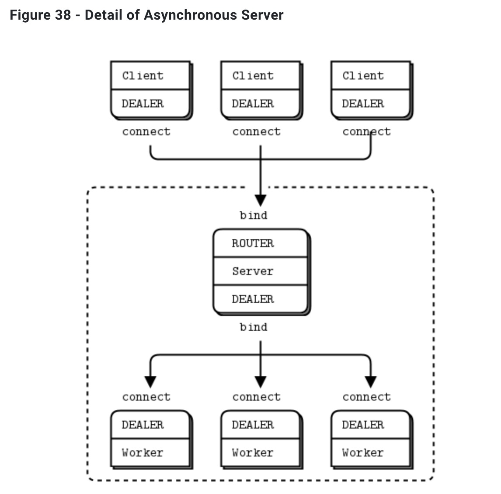
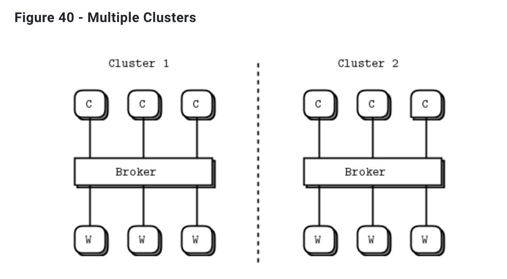

# 第3章-高级请求响应模式

​		在第二章“套接字和模式”中，我们通过开发一系列小型应用程序来探索ZeroMQ的各个方面，从而学习了ZeroMQ的基础知识。在本章中，我们将延续这种方法，探讨建立在ZeroMQ核心请求响应模式之上的高级模式。

我们将讨论以下内容：

- 请求-响应机制的工作原理 
- 如何结合使用REQ、REP、DEALER和ROUTER套接字 
- ROUTER套接字的详细工作原理 
- 负载均衡模式 
- 构建简单的负载均衡消息代理 
- 设计ZeroMQ的高级API 
- 构建异步请求-响应服务器 
- 一个详细的跨代理路由示例

## 请求-响应机制

​		我们已经简要地看过多帧消息。现在让我们来看一个重要的用例，即*回复消息信封*。信封是一种安全地将数据与地址打包的方法，而不触及数据本身。通过将回复地址分离到一个信封中，我们可以编写通用的中间件，例如API和代理，它们可以创建、读取和删除地址，而不管消息载荷或结构是什么。

​		在请求-响应模式中，信封保存回复的地址。它是一个没有状态的 ZeroMQ 网络能创建往返请求-响应对话的方式的原因。

​		当你使用 REQ 和 REP 套接字时，你甚至不会看到信封；这些套接字会自动处理它们。但对于大多数有趣的请求-响应模式，你需要了解信封，特别是 ROUTER 套接字。我们将逐步进行讲解。

### 简单回复信封

​		请求-回复交换包括一个*请求*消息和最终的*回复*消息。在简单的请求-回复模式中，每个请求都有一个回复。在更高级的模式中，请求和回复可以异步流动。但是，回复信封的工作方式始终相同。

​		ZeroMQ的回复信封正式包括零个或多个回复地址，后跟一个空帧（信封分隔符），然后是消息体（零个或多个帧）。这个信封是由多个套接字在链中协作创建的。我们将详细介绍这个过程。

​		我们将通过REQ套接字发送“Hello”开始。REQ套接字创建最简单的回复信封，其中没有地址，只有一个空分隔符帧和包含“Hello”字符串的消息帧。这是一个由两帧组成的消息。


​		REP套接字完成匹配工作：它剥离信封，包括分隔符帧，并将整个信封保存下来，将“Hello”字符串传递给应用程序。因此，我们最初的Hello World示例在内部使用请求-回复信封，但应用程序从未看到它们。

​		如果您嗅探hwclient和hwserver之间流动的网络数据，您会看到：每个请求和每个回复实际上都是两个帧，一个空帧和一个正文帧。对于简单的REQ-REP对话，这似乎没有多大意义。然而，当我们探索ROUTER和DEALER如何处理信封时，您将看到原因。

### 扩展回复信封

​		现在让我们在REQ-REP对之间加入一个ROUTER-DEALER代理，并看看这如何影响回复信封。这是我们在第二章“套接字和模式”中已经看到的*扩展请求-回复模式*。实际上，我们可以插入任意数量的代理步骤，机制都是相同的。


​		代理按照以下伪代码操作：

```
prepare context, frontend and backend sockets
while true:
    poll on both sockets
    if frontend had input:
        read all frames from frontend
        send to backend
    if backend had input:
        read all frames from backend
        send to frontend
```

​		与其他套接字不同，ROUTER套接字跟踪它拥有的每个连接，并告诉调用者这些连接。它告诉调用者的方式是在每个接收到的消息前面插入连接*标识*。标识，有时称为*地址*，只是一个没有任何含义的二进制字符串，除了“这是连接的唯一句柄”之外。然后，当您通过ROUTER套接字发送消息时，您首先发送一个标识帧。

​		zmq_socket()函数的手册描述如下：

> 在接收消息时，ZMQ_ROUTER套接字应在将消息传递给应用程序之前，添加一个包含发起端标识的消息部分。接收到的消息从所有已连接的对等方中公平排队。在发送消息时，ZMQ_ROUTER套接字应删除消息的第一部分，并使用它来确定消息将被路由到的对等方的标识。

​		作为历史记录，ZeroMQ v2.2及其以前版本使用UUID作为标识符。ZeroMQ v3.0及更高版本默认生成5字节的标识符（0+随机的32位整数）。这会对网络性能产生一些影响，但仅在使用多个代理跳时才会出现，这种情况很少见。主要是为了简化构建libzmq，而去掉了UUID库的依赖。

​		标识符是一个难以理解的概念，但如果你想成为一个ZeroMQ专家，它是必不可少的。 ROUTER套接字为每个连接*发明*一个随机标识符。如果有三个REQ套接字连接到一个ROUTER套接字，它将为每个REQ套接字发明一个随机标识符。

​		如果我们继续使用我们的示例，假设REQ套接字有一个3字节的标识符ABC。在内部，这意味着ROUTER套接字保留了一个哈希表，可以通过搜索ABC找到REQ套接字的TCP连接。

​		当我们从ROUTER套接字接收消息时，我们得到三个帧。


​		代理循环的核心是“从一个套接字读取，写入到另一个套接字”，所以我们在 DEALER 套接字上将这三帧直接发送出去。如果你现在嗅探网络流量，你会看到这三帧从 DEALER 套接字飞向 REP 套接字。REP 套接字像以前一样，剥去整个信封，包括新的回复地址，再次将“Hello”传递给调用方。

​		顺带一提，REP套接字一次只能处理一个请求-响应交换，这就是为什么如果你试图在不遵循严格的recv-send周期的情况下读取多个请求或发送多个响应，它会产生错误的原因。

​		现在您应该能够想象回程的路径。当hwserver发送“World”回复时，REP套接字会将其与保存的信封一起包装，然后将一个由三个帧组成的回复消息通过电线发送到DEALER套接字。


​		现在 DEALER 套接字会读取这三个帧，并将所有三个帧通过 ROUTER 套接字发送出去。ROUTER 套接字取出第一个帧作为消息，即 ABC 标识，并查找相应的连接。如果它找到了，就将接下来的两个帧发送出去。


​		现在REQ套接字接收到这条消息，检查第一个帧是否为空的分隔符，事实上它是。REQ套接字会丢弃该帧并将“World”传递给调用应用程序，而年幼的我们第一次接触ZeroMQ时惊奇地将其打印出来。

### 这有什么用处

​		说实话，严格请求-回复或扩展请求-回复的用例有些受限。一方面，没有简单的方法可以从常见故障中恢复，比如服务器由于有错误的应用程序代码而崩溃。我们将在第4章《可靠的请求-回复模式》中详细了解这一点。无论如何一旦你掌握了这四个套接字处理信封的方式以及它们之间的通信方式，你可以做非常有用的事情。我们看到ROUTER如何使用回复信封来决定将回复路由回哪个客户端REQ套接字。现在让我们另外一种方式来表达这个想法：

- 每当ROUTER向你发送一条消息时，它都会告诉你这条消息来自哪个对等体，作为身份标识。
- 你可以使用哈希表（以身份标识作为键）来跟踪新到达的对等体。
- 如果你在消息的第一帧中加入身份标识作为前缀，ROUTER将异步地将消息路由到任何连接到它的对等体。

​		ROUTER套接字不关心整个信封。它们对空分隔符一无所知。它们关心的只是那个能让它们确定将消息发送到哪个连接的身份标识帧。

### 回顾请求-回复套接字

让我们回顾一下：

​		REQ套接字在消息数据前发送一个空分隔符帧，将其发送到网络中。REQ套接字是同步的。REQ套接字总是发送一个请求，然后等待一个回复。REQ套接字一次只与一个对等体通信。如果将REQ套接字连接到多个对等体，则每次轮流将请求分发到每个对等体，并从每个对等体期望回复。

​		REP套接字读取并保存直到包括空分隔符在内的所有身份标识帧，然后将以下帧传递给调用者。REP套接字是同步的，一次只与一个对等体通信。如果将REP套接字连接到多个对等体，则公平地从各个对等体读取请求，并始终将回复发送到上一个发出请求的同一对等体。

​		DEALER套接字不关心回复信封，将其处理方式与任何多部分消息相同。DEALER套接字是异步的，类似于PUSH和PULL的组合。它们将发送的消息分发到所有连接，并公平地从所有连接接收到消息。

​		ROUTER套接字类似于DEALER，不关心回复信封。它为其连接创建身份标识，并将这些身份标识作为接收到的任何消息的第一帧传递给调用者。反之，当调用者发送消息时，它使用第一帧消息作为标识来查找要发送到的连接。ROUTER是异步的。

## 请求-回复组合

​		我们有四个请求-回复套接字，每个套接字都有不同的行为。我们已经了解了它们如何在简单和扩展的请求-回复模式中进行连接。但是，这些套接字是您可以用来解决许多问题的基本组件。

​		这些是合法的组合：

- REQ to REP
- DEALER to REP
- REQ to ROUTER
- DEALER to ROUTER
- DEALER to DEALER
- ROUTER to ROUTER

​		这些组合是无效的（我会解释原因）：

- REQ to REQ
- REQ to DEALER
- REP to REP
- REP to ROUTER

​		以下是一些记住语义的技巧。DEALER 就像是异步的 REQ 套接字，而 ROUTER 就像是异步的 REP 套接字。我们可以用 DEALER 替代 REQ 套接字，只需自己读取和编写信封。我们可以用 ROUTER 替代 REP 套接字，只需自己管理标识即可。

​		将 REQ 和 DEALER 套接字视为“客户端”，将 REP 和 ROUTER 套接字视为“服务器”。大多数情况下，您将希望将 REP 和 ROUTER 套接字绑定，并将 REQ 和 DEALER 套接字连接到它们。虽然不总是这么简单，但这是一个清晰且易记的起点。

### REQ和REP的组合

​		我们已经讨论过REQ客户端与REP服务器之间的通信，但是让我们来看一个方面：REQ客户端*必须*发起消息流。REP服务器无法与未先发送请求的REQ客户端通信。从技术上讲，这甚至不可能，如果尝试这样做，API也会返回一个EFSM错误。

### DEALER和REP的组合

​		现在，让我们用 DEALER 替换 REQ 客户端。这给了我们一个异步客户端，可以与多个 REP 服务器通信。如果我们使用 DEALER 重写“Hello World”客户端，我们将能够发送任意数量的“Hello”请求，而无需等待回复。

​		当我们使用 DEALER 与 REP 套接字通信时，*必须*准确模拟 REQ 套接字发送的信封，否则 REP 套接字将将消息丢弃为无效。因此，要发送消息，我们需要：

- 发送一个设置了 MORE 标志的空消息帧；然后
- 发送消息正文。

当我们接收消息时，我们需要：

- 接收第一帧，如果它不为空，则丢弃整个消息；
- 接收下一帧并将其传递给应用程序。

### REQ和ROUTER的组合

​		就像我们可以用 DEALER 替换 REQ 一样，我们也可以用 ROUTER 替换 REP。这样，我们就可以获得一个异步服务器，可以同时与多个 REQ 客户端通信。如果我们使用 ROUTER 重写“Hello World”服务器，我们将能够并行处理任意数量的“Hello”请求。我们在第二章-套接字和模式中的示例mtserver中看到了这一点。

​		我们可以以两种不同的方式使用 ROUTER：

- 作为在前端和后端套接字之间切换消息的代理。 
- 作为读取消息并对其进行操作的应用程序。 

在第一种情况下，ROUTER 只是盲目地读取所有帧，包括人为的身份帧，并将其传递给后端套接字。在第二种情况下，ROUTER *必须*知道它所接收到的应答信封的格式。由于对等方是一个 REQ 套接字，因此 ROUTER 获取了身份帧、空帧，然后是数据帧。

### DEALER和ROUTER的组合

​		现在我们可以用 DEALER 和 ROUTER 替换 REQ 和 REP，获得最强大的套接字组合，即 DEALER 与 ROUTER 通信。这使得异步客户端与异步服务器进行通信，双方都可以完全控制消息格式。

​		由于 DEALER 和 ROUTER 都可以使用任意消息格式，因此，如果您希望安全地使用它们，您必须成为一个小协议设计者。至少您必须决定是否希望模仿 REQ/REP 回复信封。这取决于您是否实际上需要发送回复。

### DEALER和DEALER的组合

​		您可以将 REP 替换为 ROUTER，但如果 DEALER 与一个且仅一个对等方通信，则也可以将 REP 替换为 DEALER。

​		当您用 DEALER 替换 REP 时，您的工作进程突然可以完全异步，可以发送任意数量的回复。代价是您必须自己管理回复信封，并确保正确，否则什么都不会起作用。稍后我们会看到一个实例。现在我们只需要说 DEALER 到 DEALER 是其中一个比较棘手的模式，幸运的是我们很少需要它。

### ROUTER和ROUTER的组合

​		这听起来非常适合 N 对 N 的连接，但它是最难使用的组合。在您对 ZeroMQ 有了很高的理解之前，应避免使用它。我们将在第四章“可靠的请求-响应模式”中的自由职业者模式中看到一个例子，以及第八章“分布式计算框架”中针对点对点工作的替代 DEALER 到 ROUTER 的设计。

### 无效的组合

​		大多数情况下，尝试将客户端连接到客户端，或将服务器连接到服务器都是一个不好的想法，并且不会起作用。然而，我不会给出笼统的警告，而是会详细解释：

- REQ 到 REQ：双方都想先向对方发送消息，只有在两个对等方同时交换消息的情况下才能正常工作。我甚至想到这件事就觉得脑袋痛。
- REQ 到 DEALER：理论上可以这样做，但如果添加第二个 REQ，则会出现问题，因为 DEALER 无法向原始对等方发送回复。因此，REQ 套接字会混乱，或返回给另一个客户端的消息。
- REP 到 REP：双方都将等待对方发送第一条消息。
- REP 到 ROUTER：理论上，如果 ROUTER 套接字知道 REP 套接字已连接并且知道该连接的标识，它可以启动对话并发送格式正确的请求。但这很混乱，并且在 DEALER 到 ROUTER 上没有任何优势。

​		有效和无效组合的共同点是，ZeroMQ 套接字连接始终偏向于一个绑定到终点的对等方和另一个连接到它的对等方。此外，绑定方和连接方的选择不是任意的，而是遵循自然的模式。我们期望“在那里”的一侧绑定：它将是服务器、代理、发布者、收集器。而“来来去去”的一侧连接：它将是客户端和工作者。记住这一点将有助于您设计更好的 ZeroMQ 架构。

## 探索ROUTER套接字

​		让我们更仔细地看一下ROUTER套接字。我们已经看到它们如何通过将单个消息路由到特定连接来工作。我将更详细地解释如何识别这些连接，以及当ROUTER套接字无法发送消息时会发生什么。

### 标识和地址 

​		ZeroMQ中的*身份*概念特指ROUTER套接字以及它们如何识别与其他套接字的连接。更广泛地说，身份被用作回复信封中的地址。在大多数情况下，身份是任意的，并且对于ROUTER套接字是本地的：它是散列表中的查找键。独立地，对等体可以具有物理地址（例如“tcp://192.168.55.117:5670”之类的网络端点）或逻辑地址（例如UUID、电子邮件地址或其他唯一键）。

​		使用 ROUTER 套接字与特定对等方通信的应用程序，如果构建了必要的哈希表，可以将逻辑地址转换为标识。因为 ROUTER 套接字仅在对等方发送消息时才公布连接的标识符（到特定对等方），因此您只能真正回复消息，而不能自发地与对等方交谈。

​		即使您颠倒规则，使 ROUTER 连接到对等方而不是等待对等方连接到 ROUTER，这也是正确的。但是，您可以强制 ROUTER 套接字在标识的位置使用逻辑地址。 zmq_setsockopt 参考页面将其称为*设置套接字标识*。它的工作方式如下：

- 对等应用程序在绑定或连接*之前*设置其对等套接字（DEALER 或 REQ）的 ZMQ_IDENTITY 选项。

- 通常，对等方然后连接到已绑定的 ROUTER 套接字。但是，ROUTER 也可以连接到对等方。

- 在连接时，对等方套接字告诉路由器套接字：“请使用此标识符进行此连接”。

- 如果对等套接字没有这样说，路由器将为连接生成其通常的任意随机标识符。

- ROUTER 套接字现在将此逻辑地址提供给应用程序作为来自该对等方的任何消息的前缀标识帧。

- ROUTER 还期望将逻辑地址作为任何发出消息的前缀标识帧。

  ​	以下是两个对等方连接到 ROUTER 套接字的简单示例，其中一个施加了逻辑地址“PEER2”：

identity.py

```python
# encoding: utf-8
#
#   Demonstrate identities as used by the request-reply pattern.  Run this
#   program by itself.
#
#   Author: Jeremy Avnet (brainsik) <spork(dash)zmq(at)theory(dot)org>
#

import zmq
import zhelpers

context = zmq.Context()

sink = context.socket(zmq.ROUTER)
sink.bind("inproc://example")

# First allow 0MQ to set the identity
anonymous = context.socket(zmq.REQ)
anonymous.connect("inproc://example")
anonymous.send(b"ROUTER uses a generated 5 byte identity")
zhelpers.dump(sink)

# Then set the identity ourselves
identified = context.socket(zmq.REQ)
identified.setsockopt(zmq.IDENTITY, b"PEER2")
identified.connect("inproc://example")
identified.send(b"ROUTER socket uses REQ's socket identity")
zhelpers.dump(sink)
```

这是程序打印的内容：

```
----------------------------------------
[005] 006B8B4567
[000]
[039] ROUTER uses a generated 5 byte identity
----------------------------------------
[005] PEER2
[000]
[038] ROUTER uses REQ's socket identity
```

### 路由器错误处理

​		ROUTER套接字在处理无法发送到任何地方的消息时有一种有些粗暴的方式：它们会默默地丢弃这些消息。这种态度在工作代码中是有意义的，但它会让调试变得困难。 "将身份作为第一个帧发送"的方法已经足够棘手，以至于在学习时我们经常会犯错误，而当我们搞砸时，路由器的沉默并没有什么建设性。

​		自从ZeroMQ v3.2以来，有一个套接字选项可以设置来捕获此错误：ZMQ_ROUTER_MANDATORY。将其设置在ROUTER套接字上，然后当您在发送调用中提供无法路由的标识时，套接字将发出EHOSTUNREACH错误信号。

## 负载均衡模式

​		现在让我们来看一些代码。我们将看到如何将ROUTER套接字连接到REQ套接字，然后连接到DEALER套接字。这两个例子遵循相同的逻辑，即*负载均衡*模式。这种模式是我们第一次接触使用ROUTER套接字进行有意识路由，而不仅仅是作为回复通道。

​		负载均衡模式非常常见，我们将在本书中多次看到它。它解决了简单的轮询路由（如PUSH和DEALER提供的）的主要问题，即如果任务的时间不都大致相同，则轮询变得低效。

​		这就是邮局的比喻。如果您每个柜台都有一个队列，并且有些人在购买邮票（一个快速的简单事务），有些人在开设新帐户（一个非常慢的事务），那么您会发现邮票买家在队列中不公平地被卡住。就像在邮局一样，如果您的消息架构不公平，人们会感到恼火。

​		邮局的解决方案是创建一个单一的队列，即使一个或两个柜台被慢速工作卡住，其他柜台仍将按先来先服务的顺序为客户提供服务。

​		PUSH和DEALER使用简单方法的一个原因是纯粹的性能。如果你到达美国任何一个主要机场，你会发现长队的人在等待入境。边境巡逻官员会提前派人排队到每个柜台，而不是使用单一队列。让人们提前步行50码可以为每位乘客节省一到两分钟。由于每个护照检查需要大致相同的时间，这更或多或少是公平的。这是PUSH和DEALER的策略：提前发送工作负载，以便行程距离更短。

​		这是ZeroMQ的一个经常出现的主题：世界上的问题是多样化的，您可以通过以正确的方式解决不同的问题而获益。机场不是邮局，一个标准适合不了所有人，真的很好。

​		让我们回到工作者（DEALER或REQ）连接到代理（ROUTER）的情景。代理必须知道何时工作者已准备好，并保持工作者列表，以便每次都可以选择*最近最少使用*的工作者。

​		事实上，解决方案非常简单：工作者在开始工作时和完成每个任务后发送“就绪”消息。代理逐个读取这些消息。每次读取消息时，都是来自最近使用的工作者。因为我们使用的是ROUTER套接字，所以我们可以获得一个标识，然后用它来将任务发送回工作者。

​		这是请求-响应的一个变化，因为任务是随着回复一起发送的，并且任何任务的响应都作为新请求发送。以下代码示例应该会让它更加清晰。

### ROUTER代理和REQ工作者

​		这是一个使用ROUTER代理与一组REQ工作者进行通信的负载平衡模式的示例：

rtreq.py

```python
# encoding: utf-8
#
#   Custom routing Router to Mama (ROUTER to REQ)
#
#   Author: Jeremy Avnet (brainsik) <spork(dash)zmq(at)theory(dot)org>
#

import time
import random
from threading import Thread

import zmq

import zhelpers

NBR_WORKERS = 10


def worker_thread(context=None):
    context = context or zmq.Context.instance()
    worker = context.socket(zmq.REQ)

    # We use a string identity for ease here
    zhelpers.set_id(worker)
    worker.connect("tcp://localhost:5671")

    total = 0
    while True:
        # Tell the router we're ready for work
        worker.send(b"ready")

        # Get workload from router, until finished
        workload = worker.recv()
        finished = workload == b"END"
        if finished:
            print("Processed: %d tasks" % total)
            break
        total += 1

        # Do some random work
        time.sleep(0.1 * random.random())


context = zmq.Context.instance()
client = context.socket(zmq.ROUTER)
client.bind("tcp://*:5671")

for _ in range(NBR_WORKERS):
    Thread(target=worker_thread).start()

for _ in range(NBR_WORKERS * 10):
    # LRU worker is next waiting in the queue
    address, empty, ready = client.recv_multipart()

    client.send_multipart([
        address,
        b'',
        b'This is the workload',
    ])

# Now ask mama to shut down and report their results
for _ in range(NBR_WORKERS):
    address, empty, ready = client.recv_multipart()
    client.send_multipart([
        address,
        b'',
        b'END',
    ])
```

​		这个例子运行五秒钟，然后每个工作者都会打印出他们处理了多少个任务。如果路由工作正常，我们会期望工作得到公平分配：

```
Completed: 20 tasks
Completed: 18 tasks
Completed: 21 tasks
Completed: 23 tasks
Completed: 19 tasks
Completed: 21 tasks
Completed: 17 tasks
Completed: 17 tasks
Completed: 25 tasks
Completed: 19 tasks
```

​		在这个例子中与工作者进行通信，我们需要创建一个适合REQ的信封，它由一个身份标识和一个空的信封分隔帧组成。


### ROUTER代理与DEALER工作者

​		无论何时你可以使用REQ，你都可以使用DEALER。这里有两个具体的不同之处：

- REQ套接字始终在任何数据帧之前发送一个空的分隔帧；DEALER不会。 
- REQ套接字在接收到回复之前只会发送一条消息；DEALER是完全异步的。 

​		同步与异步的行为对我们的例子没有影响，因为我们正在进行严格的请求-响应。它在我们处理从故障中恢复时更加相关，我们将在第4章 - 可靠的请求-响应模式中涉及。

​		现在让我们看一下完全相同的例子，但用DEALER套接字替换REQ套接字：

redealer.py

```python
# encoding: utf-8
#
#   Custom routing Router to Dealer
#
#   Author: Jeremy Avnet (brainsik) <spork(dash)zmq(at)theory(dot)org>
#

import time
import random
from threading import Thread

import zmq


# We have two workers, here we copy the code, normally these would
# run on different boxes...
#
def worker_a(context=None):
    context = context or zmq.Context.instance()
    worker = context.socket(zmq.DEALER)
    worker.setsockopt(zmq.IDENTITY, b'A')
    worker.connect("ipc://routing.ipc")

    total = 0
    while True:
        # We receive one part, with the workload
        request = worker.recv()
        finished = request == b"END"
        if finished:
            print("A received: %s" % total)
            break
        total += 1


def worker_b(context=None):
    context = context or zmq.Context.instance()
    worker = context.socket(zmq.DEALER)
    worker.setsockopt(zmq.IDENTITY, b'B')
    worker.connect("ipc://routing.ipc")

    total = 0
    while True:
        # We receive one part, with the workload
        request = worker.recv()
        finished = request == b"END"
        if finished:
            print("B received: %s" % total)
            break
        total += 1


context = zmq.Context.instance()
client = context.socket(zmq.ROUTER)
client.bind("ipc://routing.ipc")

Thread(target=worker_a).start()
Thread(target=worker_b).start()

# Wait for threads to stabilize
time.sleep(1)

# Send 10 tasks scattered to A twice as often as B
for _ in range(10):
    # Send two message parts, first the address...
    ident = random.choice([b'A', b'A', b'B'])
    # And then the workload
    work = b"This is the workload"
    client.send_multipart([ident, work])

client.send_multipart([b'A', b'END'])
client.send_multipart([b'B', b'END'])
```

​		代码几乎完全相同，只有工作者使用了DEALER套接字，并在数据帧之前读取和写入了该空帧。当我想要与REQ工作者保持兼容性时，这就是我使用的方法。

​		然而，请记住该空定界符帧的原因：它允许在REP套接字中终止的多跳扩展请求，REP使用该定界符将回复信封分离出来，以便将数据帧传递给其应用程序。

​		如果我们从不需要将消息传递到REP套接字，我们可以简单地在双方都省略空的定界符帧，这样会让事情更简单。这通常是我用于纯DEALER到ROUTER协议的设计。

### 一个负载均衡的消息代理

​		前面的例子已经完成了一半。它可以通过虚拟请求和回复来管理一组工作进程，但是它没有办法与客户端通信。如果我们添加第二个前端ROUTER套接字来接受客户端请求，并将我们的示例转换为代理，可以将消息从*前端*转换到后端，我们就可以得到一个有用且可重用的小型负载均衡消息代理。


该代理执行以下操作：

- 接受一组客户端的连接。
- 接受一组工作者的连接。
- 接受来自客户端的请求并将其保留在单个队列中。
- 使用负载平衡模式将这些请求发送到工作者。
- 接收工作者的回复。
- 将这些回复发送回最初请求的客户端。

该代理的代码相当冗长，但值得理解：

lbbroker.py

```python
"""
Load-balancing broker

Clients and workers are shown here in-process.

Author: Brandon Carpenter (hashstat) <brandon(dot)carpenter(at)pnnl(dot)gov>
"""

from __future__ import print_function

import multiprocessing

import zmq


NBR_CLIENTS = 10
NBR_WORKERS = 3


def client_task(ident):
    """Basic request-reply client using REQ socket."""
    socket = zmq.Context().socket(zmq.REQ)
    socket.identity = u"Client-{}".format(ident).encode("ascii")
    socket.connect("ipc://frontend.ipc")

    # Send request, get reply
    socket.send(b"HELLO")
    reply = socket.recv()
    print("{}: {}".format(socket.identity.decode("ascii"),
                          reply.decode("ascii")))


def worker_task(ident):
    """Worker task, using a REQ socket to do load-balancing."""
    socket = zmq.Context().socket(zmq.REQ)
    socket.identity = u"Worker-{}".format(ident).encode("ascii")
    socket.connect("ipc://backend.ipc")

    # Tell broker we're ready for work
    socket.send(b"READY")

    while True:
        address, empty, request = socket.recv_multipart()
        print("{}: {}".format(socket.identity.decode("ascii"),
                              request.decode("ascii")))
        socket.send_multipart([address, b"", b"OK"])


def main():
    """Load balancer main loop."""
    # Prepare context and sockets
    context = zmq.Context.instance()
    frontend = context.socket(zmq.ROUTER)
    frontend.bind("ipc://frontend.ipc")
    backend = context.socket(zmq.ROUTER)
    backend.bind("ipc://backend.ipc")

    # Start background tasks
    def start(task, *args):
        process = multiprocessing.Process(target=task, args=args)
        process.daemon = True
        process.start()
    for i in range(NBR_CLIENTS):
        start(client_task, i)
    for i in range(NBR_WORKERS):
        start(worker_task, i)

    # Initialize main loop state
    count = NBR_CLIENTS
    backend_ready = False
    workers = []
    poller = zmq.Poller()
    # Only poll for requests from backend until workers are available
    poller.register(backend, zmq.POLLIN)

    while True:
        sockets = dict(poller.poll())

        if backend in sockets:
            # Handle worker activity on the backend
            request = backend.recv_multipart()
            worker, empty, client = request[:3]
            workers.append(worker)
            if workers and not backend_ready:
                # Poll for clients now that a worker is available and backend was not ready
                poller.register(frontend, zmq.POLLIN)
                backend_ready = True
            if client != b"READY" and len(request) > 3:
                # If client reply, send rest back to frontend
                empty, reply = request[3:]
                frontend.send_multipart([client, b"", reply])
                count -= 1
                if not count:
                    break

        if frontend in sockets:
            # Get next client request, route to last-used worker
            client, empty, request = frontend.recv_multipart()
            worker = workers.pop(0)
            backend.send_multipart([worker, b"", client, b"", request])
            if not workers:
                # Don't poll clients if no workers are available and set backend_ready flag to false
                poller.unregister(frontend)
                backend_ready = False

    # Clean up
    backend.close()
    frontend.close()
    context.term()


if __name__ == "__main__":
    main()
```

​		这个程序中较为困难的部分是（a）每个套接字读取和写入的信封，以及（b）负载均衡算法。我们将分别介绍这些内容，首先是消息信封格式。

​		让我们从客户端到工作者的完整请求-响应链路走一遍。在这个代码中，我们设置了客户端和工作者套接字的身份，以便更容易追踪消息帧。实际上，我们应该允许ROUTER套接字为连接发明身份。让我们假设客户端的身份是“CLIENT”，工作者的身份是“WORKER”。客户端应用程序发送一个包含“Hello”的单帧。


​		由于 REQ 套接字会添加空分界帧，而 ROUTER 套接字会添加连接标识符，所以代理从前端 ROUTER 套接字中读取客户端地址、空分界帧和数据部分。


​		经过代理服务器的处理后，消息被发送给工作进程，消息的前缀包含了选中的工作进程的地址，还有一个额外的空白部分来满足另一端的REQ套接字的要求。


​		这个复杂的消息包首先被后端的ROUTER套接字处理，它会移除第一个帧。然后工作端的REQ套接字会移除空白部分，并将其余部分提供给工作端应用程序。


​		工作线程必须保存信封（即所有部分，包括空消息帧），然后才能对数据部分进行操作。请注意，REP套接字会自动执行此操作，但我们使用REQ-ROUTER模式，以便获得正确的负载平衡。

​		在返回路径上，消息与进入时相同，即后端套接字以五个部分向代理程序提供一条消息，代理程序以三个部分向前端套接字发送一条消息，客户端以一部分接收一条消息。

​		现在让我们看一下负载平衡算法。它要求客户端和工作线程都使用REQ套接字，并且工作线程正确地存储并重播它们接收到的消息信封。算法如下:

- 创建一个轮询集，始终轮询后端，并在有一个或多个可用的工作线程时才轮询前端。

- 无限超时轮询活动。

- 如果后端有活动，我们要么有一个“就绪”消息，要么有一个客户端的回复。在任何情况下，我们都将工作线程地址（第一个部分）存储在工作线程队列中，并且如果其余部分是客户端回复，我们通过前端将其发送回该客户端。

- 如果前端有活动，我们会获取客户端请求，弹出下一个工作进程（即最后使用的工作进程），并将请求发送到后端。这意味着发送工作进程地址、空帧，然后是客户端请求的三个部分。

​		现在，您可以看到可以根据工作进程在初始“就绪”消息中提供的信息重用和扩展负载均衡算法的变体。例如，工作进程可能启动并进行性能自测，然后告诉代理它们有多快。代理可以选择最快的可用工作进程，而不是最旧的。

## 一个用于 ZeroMQ 的高级 API

​		我们将把请求-响应模式推到一边，打开一个不同的领域，即 ZeroMQ API 本身。这个改变有其原因：随着我们编写越来越复杂的示例，低级别的 ZeroMQ API 开始看起来越来越笨重。看一下我们的负载均衡代理的工作线程的核心部分：

```c
while (true) {
    //  Get one address frame and empty delimiter
    char *address = s_recv (worker);
    char *empty = s_recv (worker);
    assert (*empty == 0);
    free (empty);

    //  Get request, send reply
    char *request = s_recv (worker);
    printf ("Worker: %s\n", request);
    free (request);

    s_sendmore (worker, address);
    s_sendmore (worker, "");
    s_send     (worker, "OK");
    free (address);
}
```

​		那段代码甚至不能重复利用，因为它只能处理信封中的一个回复地址，并且它已经在 ZeroMQ API 周围进行了一些包装。如果我们使用 libzmq 的简单消息 API，我们需要编写以下代码：

```c
while (true) {
    //  Get one address frame and empty delimiter
    char address [255];
    int address_size = zmq_recv (worker, address, 255, 0);
    if (address_size == -1)
        break;

    char empty [1];
    int empty_size = zmq_recv (worker, empty, 1, 0);
    assert (empty_size <= 0);
    if (empty_size == -1)
        break;

    //  Get request, send reply
    char request [256];
    int request_size = zmq_recv (worker, request, 255, 0);
    if (request_size == -1)
        return NULL;
    request [request_size] = 0;
    printf ("Worker: %s\n", request);

    zmq_send (worker, address, address_size, ZMQ_SNDMORE);
    zmq_send (worker, empty, 0, ZMQ_SNDMORE);
    zmq_send (worker, "OK", 2, 0);
}
```

​		当代码太长无法快速编写时，也会太长难以理解。到目前为止，我一直坚持使用原生API，因为作为ZeroMQ用户，我们需要对其有深入的了解。但是，当它成为我们的障碍时，我们必须把它看作是一个要解决的问题。

​		当然，我们不能仅仅改变ZeroMQ API，因为它是千千万万人同意和依赖的公开记录的契约。相反，我们在此基础上构建一个基于我们迄今为止的经验和特别是我们编写更复杂的请求-回复模式的经验的高级API。

​		我们想要的是一个API，它允许我们一次性接收和发送整个消息，包括具有任意数量回复地址的回复信封。它让我们能够用最少的代码做我们想做的事情。

​		创建一个好的消息API相当困难。我们有术语问题：ZeroMQ使用“消息”来描述多帧消息和单个消息帧。我们有期望问题：有时将消息内容视为可打印的字符串数据，有时将其视为二进制数据块是很自然的。并且我们有技术挑战，特别是如果我们想要避免过多地复制数据。

​		制作一个好的API的挑战影响到所有的编程语言，尽管我特定的使用案例是C语言。无论您使用什么编程语言，都要考虑如何为您的语言绑定做出贡献，使其与我将要描述的C绑定一样好（甚至更好）。

### Higher-Level API 的特点

​		我的解决方案是使用三个非常自然和明显的概念：*字符串*（已经是我们的s_send和s_recv的基础），*帧*（消息帧）和*消息*（一个或多个帧的列表）。这里是使用这些概念重新编写的工作线程代码的API版本：

```c
while (true) {
    zmsg_t *msg = zmsg_recv (worker);
    zframe_reset (zmsg_last (msg), "OK", 2);
    zmsg_send (&msg, worker);
}
```

​		减少阅读和编写复杂消息所需的代码量非常好：结果易于阅读和理解。让我们继续为使用ZeroMQ处理其他方面的问题进行这个过程。以下是我希望在高级API中具有的愿望清单，这是基于我到目前为止使用ZeroMQ的经验：

- *自动处理套接字*。我发现手动关闭套接字很麻烦，并且在某些情况下必须明确定义延迟超时，但并不是所有情况都需要。如果我关闭上下文时可以自动关闭套接字，那将是很棒的。
- *便携式线程管理*。每个非平凡的ZeroMQ应用程序都使用线程，但POSIX线程不可移植。因此，一个不错的高级API应该在可移植的层下隐藏这个。
- *从父线程到子线程的管道*。这是一个反复出现的问题：如何在父线程和子线程之间进行信号传递。我们的API应该提供一个ZeroMQ消息管道（使用PAIR套接字和inproc自动）。
- *便携式时钟*。即使将时间精确到毫秒分辨率，或者睡眠一些毫秒也不是可移植的。实际的ZeroMQ应用程序需要便携式时钟，因此我们的API应该提供它们。
- *用reactor替代zmq_poll()*。poll循环很简单，但笨重。写很多这样的循环，我们最终做了相同的工作：计算定时器，并在套接字准备就绪时调用代码。一个具有套接字读取器和定时器的简单反应器将节省很多重复的工作。
- *正确处理Ctrl-C*。我们已经看到如何捕获中断。如果所有应用程序都发生这种情况，那将非常有用。

### PyZMQ 高级API

​		将这个愿望清单转化为Python语言的现实，我们得到了PyMQ，一种用于Python语言的ZeroMQ语言绑定。实际上，这个高级绑定最初是由早期版本的示例开发出来的。它将更好的ZeroMQ语义与一些可移植性层和（对于Python语言而言很重要，但对于其他语言而言不太重要的）容器，如哈希和列表结合起来。PyZMQ还使用了一种优雅的对象模型，导致了非常漂亮的代码。

​		下面是使用高级API（PyZMQ）重写的负载均衡代理的示例：

lbbroker2.py

```python
"""

   Least-recently used (LRU) queue device
   Clients and workers are shown here in-process

   Author: Guillaume Aubert (gaubert) <guillaume(dot)aubert(at)gmail(dot)com>

"""

from __future__ import print_function
import threading
import time
import zmq

NBR_CLIENTS = 10
NBR_WORKERS = 3


def worker_thread(worker_url, context, i):
    """ Worker using REQ socket to do LRU routing """

    socket = context.socket(zmq.REQ)

    # set worker identity
    socket.identity = (u"Worker-%d" % (i)).encode('ascii')

    socket.connect(worker_url)

    # Tell the broker we are ready for work
    socket.send(b"READY")

    try:
        while True:

            address, empty, request = socket.recv_multipart()

            print("%s: %s\n" % (socket.identity.decode('ascii'),
                                request.decode('ascii')), end='')

            socket.send_multipart([address, b'', b'OK'])

    except zmq.ContextTerminated:
        # context terminated so quit silently
        return


def client_thread(client_url, context, i):
    """ Basic request-reply client using REQ socket """

    socket = context.socket(zmq.REQ)

    # Set client identity. Makes tracing easier
    socket.identity = (u"Client-%d" % (i)).encode('ascii')

    socket.connect(client_url)

    #  Send request, get reply
    socket.send(b"HELLO")
    reply = socket.recv()

    print("%s: %s\n" % (socket.identity.decode('ascii'),
                        reply.decode('ascii')), end='')


def main():
    """ main method """

    url_worker = "inproc://workers"
    url_client = "inproc://clients"
    client_nbr = NBR_CLIENTS

    # Prepare our context and sockets
    context = zmq.Context()
    frontend = context.socket(zmq.ROUTER)
    frontend.bind(url_client)
    backend = context.socket(zmq.ROUTER)
    backend.bind(url_worker)

    # create workers and clients threads
    for i in range(NBR_WORKERS):
        thread = threading.Thread(target=worker_thread,
                                  args=(url_worker, context, i, ))
        thread.start()

    for i in range(NBR_CLIENTS):
        thread_c = threading.Thread(target=client_thread,
                                    args=(url_client, context, i, ))
        thread_c.start()

    # Logic of LRU loop
    # - Poll backend always, frontend only if 1+ worker ready
    # - If worker replies, queue worker as ready and forward reply
    # to client if necessary
    # - If client requests, pop next worker and send request to it

    # Queue of available workers
    available_workers = 0
    workers_list = []

    # init poller
    poller = zmq.Poller()

    # Always poll for worker activity on backend
    poller.register(backend, zmq.POLLIN)

    # Poll front-end only if we have available workers
    poller.register(frontend, zmq.POLLIN)

    while True:

        socks = dict(poller.poll())

        # Handle worker activity on backend
        if (backend in socks and socks[backend] == zmq.POLLIN):

            # Queue worker address for LRU routing
            message = backend.recv_multipart()
            assert available_workers < NBR_WORKERS

            worker_addr = message[0]

            # add worker back to the list of workers
            available_workers += 1
            workers_list.append(worker_addr)

            #   Second frame is empty
            empty = message[1]
            assert empty == b""

            # Third frame is READY or else a client reply address
            client_addr = message[2]

            # If client reply, send rest back to frontend
            if client_addr != b'READY':

                # Following frame is empty
                empty = message[3]
                assert empty == b""

                reply = message[4]

                frontend.send_multipart([client_addr, b"", reply])

                client_nbr -= 1

                if client_nbr == 0:
                    break  # Exit after N messages

        # poll on frontend only if workers are available
        if available_workers > 0:

            if (frontend in socks and socks[frontend] == zmq.POLLIN):
                # Now get next client request, route to LRU worker
                # Client request is [address][empty][request]

                [client_addr, empty, request] = frontend.recv_multipart()

                assert empty == b""

                #  Dequeue and drop the next worker address
                available_workers += -1
                worker_id = workers_list.pop()

                backend.send_multipart([worker_id, b"",
                                        client_addr, b"", request])

    #out of infinite loop: do some housekeeping
    time.sleep(1)

    frontend.close()
    backend.close()
    context.term()


if __name__ == "__main__":
    main()
```

​		PyZMQ提供的一个功能是清晰的中断处理。这意味着，Ctrl-C会导致任何阻塞的ZeroMQ调用返回-1，并将errno设置为EINTR。在这种情况下，高级别的recv方法将返回NULL。因此，您可以像这样干净地退出循环：

```c
while (true) {
    zstr_send (client, "Hello");
    char *reply = zstr_recv (client);
    if (!reply)
        break;              //  Interrupted
    printf ("Client: %s\n", reply);
    free (reply);
    sleep (1);
}
```

​		如果你正在调用 `zmq_poll()`，可以在返回值上进行测试：

```c
if (zmq_poll (items, 2, 1000 * 1000) == -1)
    break;              //  Interrupted
```

​		前面的例子仍然使用了zmq_poll()，那么反应器模式怎么样呢？ PyZMQ的zloop反应器很简单但很实用。它允许您：

- 在任何套接字上设置一个读取器，即每当套接字有输入时调用的代码。
- 取消套接字上的读取器。
- 设置定时器，在特定时间间隔内触发一次或多次。
- 取消定时器。

​		zloop在内部当然使用了zmq_poll()。每当添加或删除reader时，它都会重新构建它的poll集，并计算出poll超时以匹配下一个timer。然后，它调用每个需要关注的socket和timer的reader和timer处理程序。

​		当我们使用reactor模式时，我们的代码会翻转。主要逻辑看起来像这样：

```c
zloop_t *reactor = zloop_new ();
zloop_reader (reactor, self->backend, s_handle_backend, self);
zloop_start (reactor);
zloop_destroy (&reactor);
```

​		实际处理消息的功能位于专用函数或方法中。您可能不喜欢这种风格-这是一种品味问题。它有助于混合定时器和套接字活动。在本文的其余部分中，我们将在更简单的情况下使用zmq_poll()，在更复杂的示例中使用zloop。

​		下面是再次重写的负载平衡代理，这次使用zloop：

lbbroker3.py

```python
"""

   Least-recently used (LRU) queue device
   Demonstrates use of pyzmq IOLoop reactor

   While this example runs in a single process, that is just to make
   it easier to start and stop the example. Each thread has its own
   context and conceptually acts as a separate process.

   Author: Min RK <benjaminrk(at)gmail(dot)com>
   Adapted from lruqueue.py by
           Guillaume Aubert (gaubert) <guillaume(dot)aubert(at)gmail(dot)com>

"""

from __future__ import print_function
import threading
import time
import zmq

from zmq.eventloop.ioloop import IOLoop
from zmq.eventloop.zmqstream import ZMQStream

NBR_CLIENTS = 10
NBR_WORKERS = 3


def worker_thread(worker_url, i):
    """ Worker using REQ socket to do LRU routing """
    context = zmq.Context.instance()

    socket = context.socket(zmq.REQ)

    # set worker identity
    socket.identity = (u"Worker-%d" % (i)).encode('ascii')

    socket.connect(worker_url)

    # Tell the broker we are ready for work
    socket.send(b"READY")

    try:
        while True:

            address, empty, request = socket.recv_multipart()

            print("%s: %s\n" % (socket.identity.decode('ascii'),
                                request.decode('ascii')), end='')

            socket.send_multipart([address, b'', b'OK'])

    except zmq.ContextTerminated:
        # context terminated so quit silently
        return


def client_thread(client_url, i):
    """ Basic request-reply client using REQ socket """
    context = zmq.Context.instance()

    socket = context.socket(zmq.REQ)

    # Set client identity. Makes tracing easier
    socket.identity = (u"Client-%d" % (i)).encode('ascii')

    socket.connect(client_url)

    #  Send request, get reply
    socket.send(b"HELLO")
    reply = socket.recv()

    print("%s: %s\n" % (socket.identity.decode('ascii'),
                        reply.decode('ascii')), end='')


class LRUQueue(object):
    """LRUQueue class using ZMQStream/IOLoop for event dispatching"""

    def __init__(self, backend_socket, frontend_socket):
        self.available_workers = 0
        self.is_workers_ready = False
        self.workers = []
        self.client_nbr = NBR_CLIENTS

        self.backend = ZMQStream(backend_socket)
        self.frontend = ZMQStream(frontend_socket)
        self.backend.on_recv(self.handle_backend)

        self.loop = IOLoop.instance()

    def handle_backend(self, msg):
        # Queue worker address for LRU routing
        worker_addr, empty, client_addr = msg[:3]

        assert self.available_workers < NBR_WORKERS

        # add worker back to the list of workers
        self.available_workers += 1
        self.is_workers_ready = True
        self.workers.append(worker_addr)

        #   Second frame is empty
        assert empty == b""

        # Third frame is READY or else a client reply address
        # If client reply, send rest back to frontend
        if client_addr != b"READY":
            empty, reply = msg[3:]

            # Following frame is empty
            assert empty == b""

            self.frontend.send_multipart([client_addr, b'', reply])

            self.client_nbr -= 1

            if self.client_nbr == 0:
                # Exit after N messages
                self.loop.add_timeout(time.time() + 1, self.loop.stop)

        if self.is_workers_ready:
            # when atleast 1 worker is ready, start accepting frontend messages
            self.frontend.on_recv(self.handle_frontend)

    def handle_frontend(self, msg):
        # Now get next client request, route to LRU worker
        # Client request is [address][empty][request]
        client_addr, empty, request = msg

        assert empty == b""

        #  Dequeue and drop the next worker address
        self.available_workers -= 1
        worker_id = self.workers.pop()

        self.backend.send_multipart([worker_id, b'', client_addr, b'', request])
        if self.available_workers == 0:
            # stop receiving until workers become available again
            self.is_workers_ready = False
            self.frontend.stop_on_recv()


def main():
    """main method"""

    url_worker = "ipc://backend.ipc"
    url_client = "ipc://frontend.ipc"

    # Prepare our context and sockets
    context = zmq.Context()
    frontend = context.socket(zmq.ROUTER)
    frontend.bind(url_client)
    backend = context.socket(zmq.ROUTER)
    backend.bind(url_worker)

    # create workers and clients threads
    for i in range(NBR_WORKERS):
        thread = threading.Thread(target=worker_thread, args=(url_worker, i, ))
        thread.daemon = True
        thread.start()

    for i in range(NBR_CLIENTS):
        thread_c = threading.Thread(target=client_thread,
                                    args=(url_client, i, ))
        thread_c.daemon = True
        thread_c.start()

    # create queue with the sockets
    queue = LRUQueue(backend, frontend)

    # start reactor
    IOLoop.instance().start()

if __name__ == "__main__":
    main()
```

​		使应用程序在接收到 Ctrl-C 时正常关闭可能很棘手。如果使用 zctx 类，它将自动设置信号处理，但是您的代码仍然必须配合。必须在 zmq_poll 返回 -1 或任何 zstr_recv、zframe_recv 或 zmsg_recv 方法返回 NULL 时中断任何循环。如果有嵌套循环，将外层循环设为条件 !zctx_interrupted 可能会有用。

​		如果使用子线程，它们不会收到中断。要告诉它们关闭，可以选择：

- 如果它们正在共享同一个上下文，则销毁该上下文，在这种情况下，它们正在等待的任何阻塞调用都将以 ETERM 结束。
- 如果它们正在使用自己的上下文，则发送关闭消息。为此，您需要一些套接字管道。

## 异步客户端/服务器模式

​		在ROUTER到DEALER的例子中，我们看到了一个一对多的用例，其中一个服务器异步地与多个工作者交流。我们可以颠倒这个模式，得到一个非常有用的多对一架构，其中各种客户端异步地与单个服务器交流。


以下是它的工作原理：

- 客户端连接到服务器并发送请求。 
- 对于每个请求，服务器会发送0个或多个响应。 
- 客户端可以发送多个请求，而无需等待回复。 
- 服务器可以发送多个响应，而无需等待新的请求。

下面是演示它如何工作的代码：

asyncsrv.py

```python
import zmq
import sys
import threading
import time
from random import randint, random

__author__ = "Felipe Cruz <felipecruz@loogica.net>"
__license__ = "MIT/X11"

def tprint(msg):
    """like print, but won't get newlines confused with multiple threads"""
    sys.stdout.write(msg + '\n')
    sys.stdout.flush()

class ClientTask(threading.Thread):
    """ClientTask"""
    def __init__(self, id):
        self.id = id
        threading.Thread.__init__ (self)

    def run(self):
        context = zmq.Context()
        socket = context.socket(zmq.DEALER)
        identity = u'worker-%d' % self.id
        socket.identity = identity.encode('ascii')
        socket.connect('tcp://localhost:5570')
        print('Client %s started' % (identity))
        poll = zmq.Poller()
        poll.register(socket, zmq.POLLIN)
        reqs = 0
        while True:
            reqs = reqs + 1
            print('Req #%d sent..' % (reqs))
            socket.send_string(u'request #%d' % (reqs))
            for i in range(5):
                sockets = dict(poll.poll(1000))
                if socket in sockets:
                    msg = socket.recv()
                    tprint('Client %s received: %s' % (identity, msg))

        socket.close()
        context.term()

class ServerTask(threading.Thread):
    """ServerTask"""
    def __init__(self):
        threading.Thread.__init__ (self)

    def run(self):
        context = zmq.Context()
        frontend = context.socket(zmq.ROUTER)
        frontend.bind('tcp://*:5570')

        backend = context.socket(zmq.DEALER)
        backend.bind('inproc://backend')

        workers = []
        for i in range(5):
            worker = ServerWorker(context)
            worker.start()
            workers.append(worker)

        zmq.proxy(frontend, backend)

        frontend.close()
        backend.close()
        context.term()

class ServerWorker(threading.Thread):
    """ServerWorker"""
    def __init__(self, context):
        threading.Thread.__init__ (self)
        self.context = context

    def run(self):
        worker = self.context.socket(zmq.DEALER)
        worker.connect('inproc://backend')
        tprint('Worker started')
        while True:
            ident, msg = worker.recv_multipart()
            tprint('Worker received %s from %s' % (msg, ident))
            replies = randint(0,4)
            for i in range(replies):
                time.sleep(1. / (randint(1,10)))
                worker.send_multipart([ident, msg])

        worker.close()


def main():
    """main function"""
    server = ServerTask()
    server.start()
    for i in range(3):
        client = ClientTask(i)
        client.start()

    server.join()


if __name__ == "__main__":
    main()
```

​		该示例在一个进程中运行，使用多个线程模拟真实的多进程体系结构。当您运行该示例时，您将看到三个客户端（每个具有随机 ID）打印出它们从服务器收到的回复。请仔细观察，您将看到每个客户端任务每个请求获取零个或多个回复。

​		对于这段代码的一些注释：

- 客户端每秒发送一次请求，并获得零个或多个回复。为了使用 zmq_poll() 进行操作，我们不能简单地使用 1 秒的超时进行轮询，否则我们将在*收到上一个回复后*仅一秒后发送新请求。因此，我们以高频率进行轮询（每个轮询为 1/100 秒，共 100 次），这大致是准确的。
- 服务器使用一个工作线程池，每个线程同步处理一个请求。它使用内部队列将其连接到前端套接字。它使用 zmq_proxy() 调用将前端和后端套接字连接起来。



​		请注意，我们在客户端和服务器之间使用 DEALER to ROUTER 对话，但在服务器主线程和工作者之间内部对话时，我们使用 DEALER to DEALER。如果工作者是严格同步的，我们会使用 REP。但是，因为我们想要发送多个回复，所以需要一个异步套接字。我们*不*希望路由回复，它们总是发送到发送请求的单个服务器线程。

​		让我们考虑路由信封。客户端发送一个包含单个帧的消息。服务器线程接收到一个由两个帧组成的消息（由客户端标识符前缀的原始消息）。我们将这两个帧发送给工作者，工作者将其视为正常的回复信封，并将其作为两个帧的消息返回给我们。然后，我们使用第一个帧作为标识符将第二个帧路由回客户端作为回复。

​		它看起来像这样：


​		现在来看看套接字：我们可以使用负载平衡的 ROUTER to DEALER 模式与工作者交互，但这是额外的工作。在这种情况下，DEALER to DEALER 模式可能是不错的选择：这样做的权衡是每个请求的延迟更低，但工作分配的风险更高。在这种情况下，简单性胜出。

​		当您构建需要与客户端保持有状态对话的服务器时，您将遇到一个经典问题。如果服务器为每个客户端保留某些状态，并且客户端不断地连接和断开，最终服务器将耗尽资源。即使相同的客户端不断连接，如果您使用默认的标识符，每个连接看起来都像是一个新连接。

​		我们通过仅保留非常短的时间（工作者处理请求所需的时间）来保留状态，然后放弃状态来欺骗上面的示例。但这对于许多情况来说并不实用。要在有状态的异步服务器中正确管理客户端状态，您必须：

- 从客户端到服务器进行心跳检测。在我们的示例中，我们每秒发送一次请求，这可以可靠地用作心跳检测。
- 使用客户端标识符（无论是生成的还是显式的）作为键来存储状态。
- 检测到停止的心跳检测。如果客户端在，比如，两秒钟内没有发出请求，则服务器可以检测到这一点，并销毁它为该客户端保留的任何状态。

## 工作示例：代理间路由

​		让我们把我们迄今为止所学的一切放大到一个真实的应用程序中。我们将分步骤逐步构建这个应用程序。我们的最好的客户紧急呼叫我们，并要求设计一个大型云计算设施。他有一个跨越多个数据中心的云的愿景，每个数据中心都是客户和工作者的集群，并作为一个整体协同工作。因为我们足够聪明地知道实践总是打败理论，我们建议使用ZeroMQ制作一个工作模拟。我们的客户渴望在他的老板改变主意之前锁定预算，并已经在Twitter上读到了关于ZeroMQ的好消息，因此同意使用它。

### 建立细节

​		喝了几杯浓缩咖啡后，我们想要立即开始编写代码，但一个小声音告诉我们，在解决完全错误的问题之前，需要获取更多的细节信息。“云正在做什么样的工作？”我们问道。

​		客户解释道：

- 工作线程在各种类型的硬件上运行，但它们都能处理任何任务。每个群集中有几百个工作线程，总共可能有十几个群集。

- 客户为工作线程创建任务。每个任务都是独立的工作单元，所有客户想要的就是尽快找到一个可用的工作线程，并将任务发送给它。会有很多客户，并且他们会任意地来来去去。

- 真正的难点在于能够随时添加和删除群集。群集可以立即离开或加入云，带着它的所有工作线程和客户端。

- 如果它们自己的群集中没有工作线程，客户端的任务将发送到云中其他可用的工作线程。

- 客户端一次发送一个任务，等待回复。如果他们在X秒内没有得到答案，他们将再次发送任务。这不是我们关心的事情，客户端API已经做到了。

- 工作线程一次只处理一个任务；它们是非常简单的实体。如果它们崩溃，它们将由启动它们的脚本重新启动。

​		因此，我们再次确认是否正确理解：

- “群集之间会有某种超级网络连接，对吧？”我们问道。客户说：“是的，当然，我们不是傻瓜。”

- “我们在谈论什么样的容量？”我们问道。客户回答说：“每个群集最多有一千个客户端，每个客户端每秒最多进行十次请求。请求很小，回复也很小，每个回复不超过1K字节。”


​		因此，我们进行了一些计算，并发现这将很好地适用于普通的TCP。2,500个客户端x 10/秒x 1,000字节x 2个方向= 50MB /秒或400Mb /秒，对于1Gb网络没有问题。

​		这是一个简单的问题，不需要异乎寻常的硬件或协议，只需要一些聪明的路由算法和仔细的设计。我们先设计一个群集（一个数据中心），然后再想办法将群集连接在一起。

### 单个集群的架构

​		工作者和客户端是同步的。我们希望使用负载均衡模式将任务路由到工作者。所有工作者都是相同的；我们的设施没有不同服务的概念。工作者是匿名的；客户端从不直接寻址它们。在这里，我们不试图提供保证交付、重试等功能。

​		出于我们已经考虑过的原因，客户端和工作者不能直接通信。这使得动态添加或删除节点变得不可能。因此，我们的基本模型包括了我们之前看到的请求-响应消息代理。


### 扩展到多个集群

​		现在我们将其扩展到超过一个集群。每个集群都有一组客户端和工作进程，以及将它们连接在一起的代理。



​		问题是：如何使每个集群的客户端与另一个集群的工作节点进行通信？有一些可能性，每种可能性都有其优点和缺点：

- 客户端可以直接连接到两个代理。优点是我们不需要修改代理或工作节点。但是客户端变得更加复杂，并且意识到整个拓扑。如果我们想添加第三个或第四个集群，例如，所有客户端都会受到影响。实际上，我们必须将路由和故障转移逻辑移到客户端中，这并不好。
- 工作节点可以直接连接到两个代理。但是REQ工作节点无法这样做，它们只能回复一个代理。我们可以使用REPs，但REPs不会像负载平衡一样为我们提供可定制的代理到工作节点路由，而只能提供内置的负载平衡。这是一个失败的方案；如果我们想将工作分配给空闲工作节点，我们需要负载平衡。一个解决方案是使用ROUTER套接字用于工作节点。让我们将其标记为“Idea #1”。
- 代理可以相互连接。这看起来最整洁，因为它创建了最少的附加连接。我们不能动态添加集群，但是这可能超出了范围。现在，客户端和工作节点仍然不知道实际的网络拓扑，代理会告诉彼此何时有空余容量。让我们将其标记为“Idea #2”。

​		让我们探讨“Idea #1”。在这个模型中，我们有工作节点连接到两个代理，并从任何一个代理接受作业。


​		这个想法看起来可行。但是，它并没有提供我们想要的功能，即客户端尽可能获取本地的工作人员，只有在等待时间更长时才使用远程工作人员。此外，工人将向两个代理发出“准备就绪”的信号，并可能同时获得两个任务，而其他工人则处于空闲状态。看起来这个设计失败了，因为我们又把路由逻辑放在了边缘。

​		因此，我们考虑idea #2。我们连接经纪人，不对客户端或工人进行任何修改，他们仍然是像我们习惯的那样的REQs。


​		这种设计很吸引人，因为问题在一个地方得到解决，对于其他人是不可见的。基本上，代理商彼此之间打开秘密渠道并私语，就像骆驼商人一样，“嘿，我有一些闲置容量。如果你的客户太多，给我打个电话，我们来处理。”

​		实际上，这只是一个更复杂的路由算法：代理商成为彼此的分包商。还有其他优点，即使在我们玩真正的代码之前：

- 它将常见情况（客户和工作人员在同一个群集中）视为默认情况，并为特殊情况（在群集之间移动工作）做额外的工作。
- 它让我们能够使用不同的消息流来处理不同类型的工作。这意味着我们可以使用不同类型的网络连接进行不同的处理。
- 感觉它会平稳扩展。互连三个或更多的代理商不会变得过于复杂。如果我们发现这是个问题，可以通过添加超级代理来轻松解决。

​		我们将现在进行一个示例。我们将把一个完整的集群打包到一个进程中。这显然不现实，但它使模拟变得简单，并且模拟可以准确地扩展到真正的进程。这就是 ZeroMQ 的美妙之处——你可以在微观层面上设计，然后将其扩展到宏观层面。线程变成进程，然后变成盒子，模式和逻辑保持不变。我们的每个“集群”进程都包含客户端线程、工作线程和代理线程。

​		我们现在对基本模型非常熟悉：

- REQ 客户端（REQ）线程创建工作负载并将其传递给代理（ROUTER）。
- REQ 工作线程（REQ）处理工作负载并将结果返回给代理（ROUTER）。
- 代理使用负载平衡模式排队和分配工作负载。

### 联邦与对等

​		有几种可能的连接代理的方式。我们希望能够告诉其他代理“我们有能力”，然后接收多个任务。我们还需要能够告诉其他代理“停止，我们已经满了”。它不需要是完美的；有时我们可能会接受我们无法立即处理的作业，然后尽快完成它们。

​		最简单的连接方式是*联邦*，其中代理相互模拟客户端和工作者。我们将通过将我们的前端连接到另一个代理的后端套接字来实现这一点。请注意，将套接字绑定到端点并将其连接到其他端点是合法的。


​		这将在两个代理之间提供简单的逻辑和相当不错的机制：当没有可用的工作者时，告诉另一个代理“准备就绪”，并从它那里接受一个任务。问题也在于它对这个问题来说过于简单了。联邦代理只能一次处理一个任务。如果代理模拟一个锁步的客户端和工作者，它就定义为是锁步的。如果它有很多可用的工作者，那么这些工作者就不会被使用。我们的代理需要以完全异步的方式相互连接。

​		联邦模型非常适合其他类型的路由，特别是面向服务的架构（SOAs），它们根据服务名称和距离而不是负载均衡或轮询进行路由。所以不要将它认为是无用的，它只是不适用于所有用例。

​		我们不采用联合方式，来看一下*对等*连接方法，其中经纪人明确知道彼此存在，并通过特权渠道进行通信。假设我们想要连接 N 个经纪人，让我们来分解一下。每个经纪人有 (N - 1) 个同行，所有经纪人都使用完全相同的代码和逻辑。在经纪人之间有两种不同的信息流动：

- 每个经纪人需要随时告诉它的同行它有多少可用的工人。这可以是相当简单的信息，只是一个定期更新的数量。这个信息的明显（也是正确的）套接字模式是发布-订阅。因此，每个经纪人都打开一个 PUB 套接字，并在其上发布状态信息，每个经纪人还打开一个 SUB 套接字，并将其连接到每个其他经纪人的 PUB 套接字，以从同行获取状态信息。
- 每个经纪人需要一种方法来将任务委托给同行并异步获取回复。我们将使用 ROUTER 套接字来实现这一点；没有其他组合可以工作。每个经纪人有两个这样的套接字：一个用于接收任务，一个用于委派任务。如果我们不使用两个套接字，每次读取请求或回复时都会更麻烦。这意味着需要在消息信封中添加更多信息。

​		还有经纪人与其本地客户和工人之间的信息流动。

### 命名仪式

​		三种流 x 每种流两个套接字 = 六个我们必须在经纪人中管理的套接字。选择好的名称对于在我们的头脑中保持多套接字的操作合理连贯非常重要。套接字要做一些事情，它们所做的应该是它们名称的基础。这是关于能够在几周后的一个寒冷的星期一早上在没有咖啡的情况下阅读代码，而不感到任何痛苦的问题。

​		让我们为套接字进行一次巫术式的命名仪式。三种流分别是：

- 经纪人与其客户端和工作进程之间的*本地*请求-响应流。
- 经纪人与其对等经纪人之间的*云*请求-响应流。
- 经纪人与其对等经纪人之间的*状态*流。

​		找到有意义的名称并使它们长度相同，这样我们的代码将排列得整齐。这并不是一件大事，但注重细节会有所帮助。对于每个流，经纪人有两个套接字，我们可以正交地称其为*前端*和*后端*。我们经常使用这些名称。前端接收信息或任务。后端将它们发送给其他对等方。概念流是从前往后（回复则相反，从后往前）。

​		所以，在我们为本教程编写的所有代码中，我们将使用这些套接字名称：

- *localfe*和*localbe*用于本地流。
- *cloudfe*和*cloudbe*用于云流。
- *statefe*和*statebe*用于状态流。

​		对于我们的传输方式，因为我们在一个盒子上模拟整个过程，我们将使用ipc。这具有与TCP相似的连接性（即，它是一种断开连接的传输，不像inproc），但我们不需要IP地址或DNS名称，这将很麻烦。相反，我们将使用名为“*something*-local”，“*something*-cloud”和“*something*-state”的ipc端点，其中“something”是我们模拟集群的名称。

​		你可能会认为为了起名字这是很多工作。为什么不称它们为s1、s2、s3、s4等？答案是，如果你的大脑不是一个完美的机器，在阅读代码时你需要很多帮助，我们将看到这些名称确实有帮助。记住“三个流，两个方向”比记住“六个不同的套接字”更容易。


​		请注意，我们将每个代理的`cloudbe`连接到每个其他代理的`cloudfe`，同样，我们将每个代理的`statebe`连接到每个其他代理的`statefe`。

### 状态流原型

​		因为每个套接字流都有自己的小陷阱，所以我们将逐个测试它们的真实代码，而不是尝试一次性将所有内容都放入代码中。当我们对每个流程感到满意时，我们可以将它们组合成完整的程序。我们将从状态流开始。


​		这是它在代码中的工作方式：

peering1.py

```python
#
#   Broker peering simulation (part 1) in Python
#   Prototypes the state flow
#
#   Author : Piero Cornice
#   Contact: root(at)pieroland(dot)net
#
import sys
import time
import random

import zmq


def main(myself, others):
    print("Hello, I am %s" % myself)

    context = zmq.Context()

    # State Back-End
    statebe = context.socket(zmq.PUB)

    # State Front-End
    statefe = context.socket(zmq.SUB)
    statefe.setsockopt(zmq.SUBSCRIBE, b'')

    bind_address = u"ipc://%s-state.ipc" % myself
    statebe.bind(bind_address)

    for other in others:
        statefe.connect(u"ipc://%s-state.ipc" % other)
        time.sleep(1.0)

    poller = zmq.Poller()
    poller.register(statefe, zmq.POLLIN)

    while True:

########## Solution with poll() ##########
        socks = dict(poller.poll(1000))

        # Handle incoming status message
        if socks.get(statefe) == zmq.POLLIN:
            msg = statefe.recv_multipart()
            print('%s Received: %s' % (myself, msg))

        else:
            # Send our address and a random value
            # for worker availability
            msg = [bind_address, (u'%i' % random.randrange(1, 10))]
            msg = [ m.encode('ascii') for m in msg]
            statebe.send_multipart(msg)
##################################

######### Solution with select() #########
#        pollin, pollout, pollerr = zmq.select([statefe], [], [], 1)
#
#        if pollin and pollin[0] == statefe:
#            # Handle incoming status message
#            msg = statefe.recv_multipart()
#            print 'Received:', msg
#
#        else:
#            # Send our address and a random value
#            # for worker availability
#            msg = [bind_address, str(random.randrange(1, 10))]
#            statebe.send_multipart(msg)
##################################


if __name__ == '__main__':
    if len(sys.argv) >= 2:
        main(myself=sys.argv[1], others=sys.argv[2:])
    else:
        print("Usage: peering.py <myself> <peer_1> ... <peer_N>")
        sys.exit(1)
```

​		这段代码的一些说明：

- 每个经纪人都有一个身份，我们使用它来构造ipc端点名称。一个真实的经纪人需要使用TCP和更复杂的配置方案。我们将在本书后面讨论这样的方案，但现在，使用生成的ipc名称让我们忽略了从哪里获取TCP/IP地址或名称的问题。
- 我们使用zmq_poll()循环作为程序的核心。这个循环处理传入的消息并发送状态消息。我们只在没有接收到任何传入消息并等待了一秒钟时才发送状态消息。如果我们每次接收到一条消息就发送一条状态消息，我们将会遭遇消息风暴。
- 我们使用由发送者地址和数据组成的两部分发布-订阅消息。请注意，我们需要知道发布者的地址才能向其发送任务，而唯一的方法是将其作为消息的一部分明确发送出去。
- 我们不为订阅者设置身份，因为如果这样做，连接到正在运行的经纪人时会得到过时的状态信息。
- 我们没有在发布者上设置HWM，但如果我们使用ZeroMQ v2.x，这将是一个明智的想法。

​		我们可以构建这个小程序并运行它三次来模拟三个集群。让我们把它们称为DC1、DC2和DC3（名称是任意的）。我们在三个窗口中分别运行以下三个命令：

```
peering1 DC1 DC2 DC3  #  Start DC1 and connect to DC2 and DC3
peering1 DC2 DC1 DC3  #  Start DC2 and connect to DC1 and DC3
peering1 DC3 DC1 DC2  #  Start DC3 and connect to DC1 and DC2
```

​		你会看到每个集群都会报告其对等点的状态，几秒钟后它们都会快乐地每秒打印一次随机数。试试这个，确保三个代理程序全部匹配并同步到每秒状态更新。

​		在实际应用中，我们不会按照固定间隔发送状态消息，而是在状态发生变化时发送，即每当工作程序变为可用或不可用时。这可能看起来像是很多流量，但状态消息很小，而且我们已经证明了跨集群连接非常快。

​		如果我们想以精确的间隔发送状态消息，我们将创建一个子线程并在该线程中打开statebe套接字。然后我们将从主线程向该子线程发送不规则的状态更新，并允许子线程将它们合并成定期的传出消息。这比我们在这里需要的更多的工作。

### 本地和云流程的原型制作

​		让我们现在原型设计本地和云套接字之间任务的流动。这段代码从客户端获取请求，然后根据随机分配将它们分发到本地工作线程和云同行之间。


​		在我们进入有些复杂的代码之前，让我们先勾勒出核心路由逻辑，并将其分解为一个简单但健壮的设计。

​		我们需要两个队列，一个是来自本地客户端的请求队列，另一个是来自云客户端的请求队列。一个选项是从本地和云前端拉取消息，并将其泵送到各自的队列中。但这有点毫无意义，因为 ZeroMQ 套接字本身就是队列。所以让我们使用 ZeroMQ 套接字缓冲区作为队列。

​		这是我们在负载平衡代理中使用的技术，它效果很好。只有当我们有地方发送请求时，才从两个前端读取。我们就可以始终从后端读取，因为它们会给我们回复以进行路由。只要后端不与我们通信，就没有必要甚至查看前端。

​		所以我们的主循环变成了：

- 轮询后端是否有活动。当我们收到消息时，它可能是来自一个工作进程的“准备就绪”消息，也可能是一个回复。如果是回复，则通过本地或云前端路由回去。
- 如果一个工作进程回复，它就可用了，所以我们将其排队并计数。
- 只要有可用的工作进程，就从任一前端获取请求（如果有），并路由到本地工作进程或随机路由到云对等体。

​		随机将任务发送到代理而不是工作进程，模拟了跨集群的工作分配。这很蠢，但对于这个阶段来说，这是可以接受的。

​		我们使用代理的标识来在代理之间路由消息。每个代理都有一个名称，我们在命令行中提供该名称以进行简单的原型设计。只要这些名称不与用于客户端节点的ZeroMQ生成的UUID重叠，我们就可以确定是将回复路由回客户端还是代理。

​		下面是这段代码的工作方式。有趣的部分从“Interesting part”的注释开始。

peering2.py

```python
#
#   Broker peering simulation (part 2) in Python
#   Prototypes the request-reply flow
#
#   While this example runs in a single process, that is just to make
#   it easier to start and stop the example. Each thread has its own
#   context and conceptually acts as a separate process.
#
#   Author : Min RK
#   Contact: benjaminrk(at)gmail(dot)com
#
import random
import sys
import threading
import time

import zmq

try:
    raw_input
except NameError:
    # Python 3
    raw_input = input

NBR_CLIENTS = 10
NBR_WORKERS = 3

def tprint(msg):
    sys.stdout.write(msg + '\n')
    sys.stdout.flush()

def client_task(name, i):
    """Request-reply client using REQ socket"""
    ctx = zmq.Context()
    client = ctx.socket(zmq.REQ)
    client.identity = (u"Client-%s-%s" % (name, i)).encode('ascii')
    client.connect("ipc://%s-localfe.ipc" % name)
    while True:
        client.send(b"HELLO")
        try:
            reply = client.recv()
        except zmq.ZMQError:
            # interrupted
            return
        tprint("Client-%s: %s" % (i, reply))
        time.sleep(1)


def worker_task(name, i):
    """Worker using REQ socket to do LRU routing"""
    ctx = zmq.Context()
    worker = ctx.socket(zmq.REQ)
    worker.identity = (u"Worker-%s-%s" % (name, i)).encode('ascii')
    worker.connect("ipc://%s-localbe.ipc" % name)

    # Tell broker we're ready for work
    worker.send(b"READY")

    # Process messages as they arrive
    while True:
        try:
            msg = worker.recv_multipart()
        except zmq.ZMQError:
            # interrupted
            return
        tprint("Worker-%s: %s\n" % (i, msg))
        msg[-1] = b"OK"
        worker.send_multipart(msg)

def main(myself, peers):
    print("I: preparing broker at %s..." % myself)

    # Prepare our context and sockets
    ctx = zmq.Context()

    # Bind cloud frontend to endpoint
    cloudfe = ctx.socket(zmq.ROUTER)
    if not isinstance(myself, bytes):
        ident = myself.encode('ascii')
    else:
        ident = myself
    cloudfe.identity = ident
    cloudfe.bind("ipc://%s-cloud.ipc" % myself)

    # Connect cloud backend to all peers
    cloudbe = ctx.socket(zmq.ROUTER)
    cloudbe.identity = ident
    for peer in peers:
        tprint("I: connecting to cloud frontend at %s" % peer)
        cloudbe.connect("ipc://%s-cloud.ipc" % peer)


    if not isinstance(peers[0], bytes):
        peers = [peer.encode('ascii') for peer in peers]

    # Prepare local frontend and backend
    localfe = ctx.socket(zmq.ROUTER)
    localfe.bind("ipc://%s-localfe.ipc" % myself)
    localbe = ctx.socket(zmq.ROUTER)
    localbe.bind("ipc://%s-localbe.ipc" % myself)

    # Get user to tell us when we can start...
    raw_input("Press Enter when all brokers are started: ")

    # create workers and clients threads
    for i in range(NBR_WORKERS):
        thread = threading.Thread(target=worker_task, args=(myself, i))
        thread.daemon = True
        thread.start()

    for i in range(NBR_CLIENTS):
        thread_c = threading.Thread(target=client_task, args=(myself, i))
        thread_c.daemon = True
        thread_c.start()

    # Interesting part
    # -------------------------------------------------------------
    # Request-reply flow
    # - Poll backends and process local/cloud replies
    # - While worker available, route localfe to local or cloud

    workers = []

    # setup pollers
    pollerbe = zmq.Poller()
    pollerbe.register(localbe, zmq.POLLIN)
    pollerbe.register(cloudbe, zmq.POLLIN)

    pollerfe = zmq.Poller()
    pollerfe.register(localfe, zmq.POLLIN)
    pollerfe.register(cloudfe, zmq.POLLIN)

    while True:
        # If we have no workers anyhow, wait indefinitely
        try:
            events = dict(pollerbe.poll(1000 if workers else None))
        except zmq.ZMQError:
            break  # interrupted

        # Handle reply from local worker
        msg = None
        if localbe in events:
            msg = localbe.recv_multipart()
            (address, empty), msg = msg[:2], msg[2:]
            workers.append(address)

            # If it's READY, don't route the message any further
            if msg[-1] == b'READY':
                msg = None
        elif cloudbe in events:
            msg = cloudbe.recv_multipart()
            (address, empty), msg = msg[:2], msg[2:]

            # We don't use peer broker address for anything

        if msg is not None:
            address = msg[0]
            if address in peers:
                # Route reply to cloud if it's addressed to a broker
                cloudfe.send_multipart(msg)
            else:
                # Route reply to client if we still need to
                localfe.send_multipart(msg)

        # Now route as many clients requests as we can handle
        while workers:
            events = dict(pollerfe.poll(0))
            reroutable = False
            # We'll do peer brokers first, to prevent starvation
            if cloudfe in events:
                msg = cloudfe.recv_multipart()
                reroutable = False
            elif localfe in events:
                msg = localfe.recv_multipart()
                reroutable = True
            else:
                break  # No work, go back to backends

            # If reroutable, send to cloud 20% of the time
            # Here we'd normally use cloud status information
            if reroutable and peers and random.randint(0, 4) == 0:
                # Route to random broker peer
                msg = [random.choice(peers), b''] + msg
                cloudbe.send_multipart(msg)
            else:
                msg = [workers.pop(0), b''] + msg
                localbe.send_multipart(msg)

if __name__ == '__main__':
    if len(sys.argv) >= 2:
        main(myself=sys.argv[1], peers=sys.argv[2:])
    else:
        print("Usage: peering2.py <me> [<peer_1> [... <peer_N>]]")
        sys.exit(1)
```

​		例如，通过在两个窗口中启动代理的两个实例来运行它：

```bash
peering2 me you
peering2 you me
```

​		关于这段代码的一些注释：

- 至少在 C 代码中，使用 zmsg 类可以让生活变得更加轻松，而且我们的代码也更短。显然这是一种有效的抽象。如果您在 C 中构建 ZeroMQ 应用程序，应该使用 CZMQ。
- 因为我们没有从节点获取任何状态信息，所以我们天真地假设它们正在运行。当您启动所有代理时，代码会提示您确认。在实际情况下，我们不会向没有告诉我们它们存在的代理发送任何信息。

​		您可以通过观察其永久运行来满足自己代码是否有效。如果有任何错误路由的消息，客户端将阻塞，代理将停止打印跟踪信息。您可以通过终止其中一个代理来证明这一点。另一个代理会尝试向云发送请求，它的每个客户端都会一个接一个地阻塞，等待答案。

### 把它们放在一起

​		让我们将这些内容整合成一个单一的程序包。与之前一样，我们将一个完整的集群作为一个进程运行。我们将把之前的两个示例合并成一个正常工作的设计，让您能够模拟任意数量的集群。

​		这段代码的大小是前两个原型的总和，为270行代码。对于一个包括客户端、工作节点和云工作负载分配的集群模拟，这相当不错。以下是代码：

peering3.py

```python
#
#   Broker peering simulation (part 3) in Python
#   Prototypes the full flow of status and tasks
#
#   While this example runs in a single process, that is just to make
#   it easier to start and stop the example. Each thread has its own
#   context and conceptually acts as a separate process.
#
#   Author : Min RK
#   Contact: benjaminrk(at)gmail(dot)com
#
import random
import sys
import threading
import time

import zmq


NBR_CLIENTS = 10
NBR_WORKERS = 5

def asbytes(obj):
    s = str(obj)
    if str is not bytes:
        # Python 3
        s = s.encode('ascii')
    return s

def client_task(name, i):
    """Request-reply client using REQ socket"""
    ctx = zmq.Context()
    client = ctx.socket(zmq.REQ)
    client.identity = (u"Client-%s-%s" % (name, i)).encode('ascii')
    client.connect("ipc://%s-localfe.ipc" % name)
    monitor = ctx.socket(zmq.PUSH)
    monitor.connect("ipc://%s-monitor.ipc" % name)

    poller = zmq.Poller()
    poller.register(client, zmq.POLLIN)
    while True:
        time.sleep(random.randint(0, 5))
        for _ in range(random.randint(0, 15)):
            # send request with random hex ID
            task_id = u"%04X" % random.randint(0, 10000)
            client.send_string(task_id)

            # wait max 10 seconds for a reply, then complain
            try:
                events = dict(poller.poll(10000))
            except zmq.ZMQError:
                return # interrupted

            if events:
                reply = client.recv_string()
                assert reply == task_id, "expected %s, got %s" % (task_id, reply)
                monitor.send_string(reply)
            else:
                monitor.send_string(u"E: CLIENT EXIT - lost task %s" % task_id)
                return

def worker_task(name, i):
    """Worker using REQ socket to do LRU routing"""
    ctx = zmq.Context()
    worker = ctx.socket(zmq.REQ)
    worker.identity = ("Worker-%s-%s" % (name, i)).encode('ascii')
    worker.connect("ipc://%s-localbe.ipc" % name)

    # Tell broker we're ready for work
    worker.send(b"READY")

    # Process messages as they arrive
    while True:
        try:
            msg = worker.recv_multipart()
        except zmq.ZMQError:
            # interrupted
            return
        # Workers are busy for 0/1 seconds
        time.sleep(random.randint(0, 1))
        worker.send_multipart(msg)

def main(myself, peers):
    print("I: preparing broker at %s..." % myself)

    # Prepare our context and sockets
    ctx = zmq.Context()

    # Bind cloud frontend to endpoint
    cloudfe = ctx.socket(zmq.ROUTER)
    cloudfe.setsockopt(zmq.IDENTITY, myself)
    cloudfe.bind("ipc://%s-cloud.ipc" % myself)

    # Bind state backend / publisher to endpoint
    statebe = ctx.socket(zmq.PUB)
    statebe.bind("ipc://%s-state.ipc" % myself)

    # Connect cloud and state backends to all peers
    cloudbe = ctx.socket(zmq.ROUTER)
    statefe = ctx.socket(zmq.SUB)
    statefe.setsockopt(zmq.SUBSCRIBE, b"")
    cloudbe.setsockopt(zmq.IDENTITY, myself)

    for peer in peers:
        print("I: connecting to cloud frontend at %s" % peer)
        cloudbe.connect("ipc://%s-cloud.ipc" % peer)
        print("I: connecting to state backend at %s" % peer)
        statefe.connect("ipc://%s-state.ipc" % peer)

    # Prepare local frontend and backend
    localfe = ctx.socket(zmq.ROUTER)
    localfe.bind("ipc://%s-localfe.ipc" % myself)
    localbe = ctx.socket(zmq.ROUTER)
    localbe.bind("ipc://%s-localbe.ipc" % myself)

    # Prepare monitor socket
    monitor = ctx.socket(zmq.PULL)
    monitor.bind("ipc://%s-monitor.ipc" % myself)

    # Get user to tell us when we can start...
    # raw_input("Press Enter when all brokers are started: ")

    # create workers and clients threads
    for i in range(NBR_WORKERS):
        thread = threading.Thread(target=worker_task, args=(myself, i))
        thread.daemon = True
        thread.start()

    for i in range(NBR_CLIENTS):
        thread_c = threading.Thread(target=client_task, args=(myself, i))
        thread_c.daemon = True
        thread_c.start()

    # Interesting part
    # -------------------------------------------------------------
    # Publish-subscribe flow
    # - Poll statefe and process capacity updates
    # - Each time capacity changes, broadcast new value
    # Request-reply flow
    # - Poll primary and process local/cloud replies
    # - While worker available, route localfe to local or cloud

    local_capacity = 0
    cloud_capacity = 0
    workers = []

    # setup backend poller
    pollerbe = zmq.Poller()
    pollerbe.register(localbe, zmq.POLLIN)
    pollerbe.register(cloudbe, zmq.POLLIN)
    pollerbe.register(statefe, zmq.POLLIN)
    pollerbe.register(monitor, zmq.POLLIN)

    while True:
        # If we have no workers anyhow, wait indefinitely
        try:
            events = dict(pollerbe.poll(1000 if local_capacity else None))
        except zmq.ZMQError:
            break  # interrupted

        previous = local_capacity
        # Handle reply from local worker
        msg = None
        if localbe in events:
            msg = localbe.recv_multipart()
            (address, empty), msg = msg[:2], msg[2:]
            workers.append(address)
            local_capacity += 1

            # If it's READY, don't route the message any further
            if msg[-1] == b'READY':
                msg = None
        elif cloudbe in events:
            msg = cloudbe.recv_multipart()
            (address, empty), msg = msg[:2], msg[2:]

            # We don't use peer broker address for anything

        if msg is not None:
            address = msg[0]
            if address in peers:
                # Route reply to cloud if it's addressed to a broker
                cloudfe.send_multipart(msg)
            else:
                # Route reply to client if we still need to
                localfe.send_multipart(msg)

        # Handle capacity updates
        if statefe in events:
            peer, s = statefe.recv_multipart()
            cloud_capacity = int(s)

        # handle monitor message
        if monitor in events:
            print(monitor.recv_string())


        # Now route as many clients requests as we can handle
        # - If we have local capacity we poll both localfe and cloudfe
        # - If we have cloud capacity only, we poll just localfe
        # - Route any request locally if we can, else to cloud
        while local_capacity + cloud_capacity:
            secondary = zmq.Poller()
            secondary.register(localfe, zmq.POLLIN)
            if local_capacity:
                secondary.register(cloudfe, zmq.POLLIN)
            events = dict(secondary.poll(0))

            # We'll do peer brokers first, to prevent starvation
            if cloudfe in events:
                msg = cloudfe.recv_multipart()
            elif localfe in events:
                msg = localfe.recv_multipart()
            else:
                break  # No work, go back to backends

            if local_capacity:
                msg = [workers.pop(0), b''] + msg
                localbe.send_multipart(msg)
                local_capacity -= 1
            else:
                # Route to random broker peer
                msg = [random.choice(peers), b''] + msg
                cloudbe.send_multipart(msg)
        if local_capacity != previous:
            statebe.send_multipart([myself, asbytes(local_capacity)])

if __name__ == '__main__':
    if len(sys.argv) >= 2:
        myself = asbytes(sys.argv[1])
        main(myself, peers=[ asbytes(a) for a in sys.argv[2:] ])
    else:
        print("Usage: peering3.py <me> [<peer_1> [... <peer_N>]]")
        sys.exit(1)
```

​		这是一个相当复杂的程序，花了大约一天的时间才得以运行。以下是一些亮点：

- 客户端线程会检测并报告请求失败。它们通过轮询响应，在一段时间（10秒）后如果没有收到响应，将打印出错误消息。
- 客户端线程不直接打印，而是发送一条消息到监控套接字（PUSH），主循环收集（PULL）并打印出来。这是我们第一次使用ZeroMQ套接字进行监控和日志记录；这是一个重要的用例，我们将在以后回到它。
- 客户端模拟不同的负载，以在任意时刻将任务转移到云端，从而使集群的负载达到100%。客户端和工作线程的数量，以及客户端和工作线程的延迟控制这一点。随意尝试一下，看看是否可以进行更真实的模拟。
- 主循环使用了两个pollset。实际上，它可以使用三个：信息、后端和前端。与早期原型一样，如果没有后端容量，就没有必要接受前端消息。

​		这是在开发程序时遇到的一些问题：

- 由于请求或回复消息丢失，客户端会冻结。回想一下，ROUTER套接字会丢弃它无法路由的消息。这里的第一种策略是修改客户端线程以检测和报告此类问题。其次，我在主循环中的每个接收之后和发送之前都添加了zmsg_dump()调用，直到问题的起源变得清晰明了。
- 主循环错误地从多个就绪套接字中读取。这会导致第一条消息丢失。我通过仅从第一个就绪套接字读取来修复了这个问题。
- zmsg类未正确将UUID编码为C字符串。这会导致包含0字节的UUID被损坏。我通过修改zmsg将UUID编码为可打印的十六进制字符串来解决了这个问题。

​		此模拟程序未检测到云对等体的消失。如果您启动了多个对等体并停止了其中一个，并且它正在向其他对等体广播能力，那么它们将继续向它发送任务，即使它已经离线了。您可以尝试此操作，您将收到客户端投诉丢失请求的消息。解决方案有两个：首先，仅保留短时间的能力信息，以便如果对等体消失，其能力将迅速设置为零。其次，为请求-回复链添加可靠性。我们将在下一章中介绍可靠性。