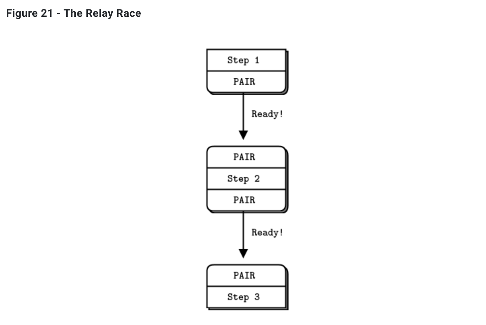

# 第2章-套接字和模式

​		在第一章 - 基础中，我们体验了 ZeroMQ ，并学习了一些主要 ZeroMQ 模式（请求-回复、发布-订阅和管道）的基本示例。在本章中，我们将动手深入学习如何在真实程序中使用这些工具。

​		我们将覆盖：

- 如何创建和使用 ZeroMQ 套接字。 
- 如何在套接字上发送和接收消息。 
- 如何围绕 ZeroMQ 的异步 I/O 模型构建应用。 
- 如何在一个线程中处理多个套接字。 
- 如何正确处理致命和非致命错误。 
- 如何处理诸如 Ctrl-C 的中断信号。 
- 如何干净地关闭 ZeroMQ 应用程序。 
- 如何检查 ZeroMQ 应用程序的内存泄漏。 
- 如何发送和接收多段消息。 
- 如何在网络间转发消息。 
- 如何构建一个简单的消息队列代理。 
- 如何使用 ZeroMQ 编写多线程应用程序。 
- 如何使用 ZeroMQ 在线程间进行信号传递。 
- 如何使用 ZeroMQ 协调一个节点网络。 
- 如何为发布-订阅创建和使用消息封装。 
- 使用 HWM（高水位标记）来防止内存溢出。

###  套接字API

​		说实话，ZeroMQ 对你进行了一种欺骗，我们不为此感到抱歉。这是为了你的利益，我们的痛苦比你的痛苦更多。ZeroMQ 提供了一个熟悉的基于套接字的 API，要隐藏大量的消息处理引擎需要很大的努力。然而，最终结果将逐渐改变您关于如何设计和编写分布式软件的世界观。

​		套接字是网络编程的默认标准 API，也可以防止你的眼睛掉落到你的脸颊上。ZeroMQ 对开发人员特别吸引人的一个原因是，它使用套接字和消息，而不是一些其他任意的概念集合。向 Martin Sustrik 致敬，他完成了这一切。它将“消息导向中间件”这个词变成了“特别辛辣的套接字！”，这让我们对披萨有奇怪的渴望，并渴望了解更多。

​		ZeroMQ sockets 就像我们喜欢的食物一样，易于消化。Sockets 有四个部分的生命周期，就像 BSD sockets 一样：

- 创建和销毁套接字，形成套接字生命周期的因果循环（详见 context.socket() 和 socket.close()）。
- 通过在套接字上设置选项并在必要时检查它们来配置套接字（详见 socket.setsockopt() 和 socket.getsockopt()）。
- 通过创建 ZeroMQ 连接并将它们连接到网络拓扑结构中来安装套接字（详见 socket.bind() 和 socket.connect()）。
- 通过在套接字上写入和接收消息来使用套接字传递数据（详见 socket.send() 和 socket.recv()）。

​		记住“在 ZeroMQ 中，所有套接字都属于我们”，但消息实际上是您在代码中拥有的东西。

​		创建、销毁和配置套接字的工作如同任何对象一样。但请记住，ZeroMQ 是一个异步、弹性网络构造。这会对我们如何将套接字插入网络拓扑以及之后如何使用套接字产生影响。

### 把套接字插入拓扑结构

​		创建两个节点之间的连接，您在一个节点中使用socket.bind()，在另一个节点中使用socket.connect()。作为一般的经验法则，进行socket.bind()的节点是“服务器”，位于一个众所周知的网络地址上，而进行socket.connect()的节点是“客户端”，具有未知或任意的网络地址。因此，我们说，“将套接字绑定到端点”和“将套接字连接到端点”，端点是众所周知的网络地址。

​		ZeroMQ 连接与传统的 TCP 连接有些不同。主要的显著差异包括：

- 它们可以通过任意传输（inproc、ipc、tcp、pgm 或 epgm）进行传输。
- 一个套接字可以有许多出站和许多入站连接。
- 没有 socket.accept() 方法。当一个套接字绑定到一个端点时，它会自动开始接受连接。
- 网络连接本身在后台进行，如果网络连接中断（例如，如果对等方消失并重新出现），ZeroMQ 会自动重新连接。
- 应用程序代码不能直接与这些连接打交道；它们被套接字封装。

​		许多架构遵循客户端/服务器模型，其中服务器是最静态的组件，客户端是最动态的组件，即它们最多地进入和离开。有时存在地址问题：服务器对客户端可见，但不一定反过来。因此，通常很明显哪个节点应该执行 socket.bind()（服务器），哪个节点应该执行 socket.connect()（客户端）。它还取决于您使用的套接字类型，对于不寻常的网络架构存在一些例外。我们将稍后考虑套接字类型。

​		现在，想象一下我们在服务器启动之前启动客户端。在传统网络中，我们会得到一个大红色失败标志。但 ZeroMQ 允许我们任意启动和停止组件。一旦客户端节点执行 socket.connect()，连接就存在，该节点可以开始向套接字写入消息。在某个阶段（希望在消息队列累积到被丢弃或客户端阻塞之前），服务器激活，执行 socket.bind()，ZeroMQ 开始传递消息。

​		一个服务器节点可以绑定到多个端点（即协议和地址的组合），并且可以使用单个套接字进行绑定。这意味着它可以在不同的传输协议中接受连接：

```python
socket.bind("tcp://*:5555");
socket.bind("tcp://*:9999");
socket.bind("inproc://somename");
```

​		大多数传输协议不允许重复绑定到同一端点，不像UDP那样。但是IPC传输协议却允许一个进程绑定到已经被第一个进程使用的端点。这是为了允许进程在崩溃后恢复。

​		尽管ZeroMQ试图对绑定和连接的哪一方持中立态度，但仍存在差异。我们稍后将详细说明。总之，你应该考虑将“服务器”作为拓扑结构中的静态部分，它们绑定到更多或更少固定的端点，将“客户端”作为动态部分，它们会出现并连接到这些端点。然后围绕这种模型设计你的应用程序。以这种方式，它能“很好地工作”的机会更大。

​		套接字具有类型。套接字类型定义了套接字的语义，其对内部和外部路由消息的策略，排队等。您可以将某些类型的套接字连接在一起，例如，发布者套接字和订阅者套接字。套接字在“消息模式”中协同工作。我们稍后将详细探讨。

​		ZeroMQ 的基本力量在于其可以以不同方式连接套接字，这使其成为一个消息队列系统。稍后我们将了解其他层，例如代理。但基本上，使用 ZeroMQ 时，您可以像玩具积木一样将部件连接在一起，定义网络架构。

### 发送和接收消息

​		发送和接收消息使用socket.send()和socket.recv()方法。名称是惯例的，但是ZeroMQ的I/O模型与经典的TCP模型不同，因此您需要一些时间来理解它。


​		让我们来看一下TCP套接字和ZeroMQ套接字在处理数据方面的主要差异：

- ZeroMQ套接字在传输信息时，像UDP一样运载信息，而不是像TCP一样传输一个字节流。ZeroMQ消息是长度指定的二进制数据。我们稍后再详细讨论消息；它们的设计面向性能，因此有点棘手。
- ZeroMQ套接字在后台线程中完成I / O。这意味着无论您的应用程序正在忙于做什么，消息都会到达本地输入队列并从本地输出队列发送。
- 根据套接字类型，ZeroMQ套接字内置了一对N的路由行为。

​		socket.send()方法实际上不会将消息发送到套接字连接（s）。它将消息排队，以便I / O线程可以异步发送。除了一些例外情况外，它不会阻塞。因此，当socket.send()返回到应用程序时，消息不一定已发送。

### 单播传输

​		ZeroMQ提供一组单播传输（inproc、ipc 和 tcp）和组播传输（epgm、pgm）。组播是一种高级技术，我们稍后再详细讨论。除非您知道单播1-to-N不可能的扇出比，否则请不要开始使用它。

​		对于大多数常见情况，使用tcp，它是一个断开的TCP传输。它是弹性的、可移植的，对于大多数情况来说足够快。我们称其为断开，因为ZeroMQ的tcp传输不需要端点在您连接到它之前存在。客户端和服务器可以在任何时候连接和绑定，可以来回走动，对应用程序透明。

​		进程间的ipc传输与tcp一样断开。它有一个限制：它尚未在Windows上工作。按照惯例，我们使用带有“.ipc”扩展名的端点名称，以避免与其他文件名的潜在冲突。在UNIX系统上，如果您使用ipc端点，您需要创建具有适当权限的端点，否则它们可能在运行在不同用户ID下的进程间不可共享。您还必须确保所有进程都可以访问文件，例如，在同一工作目录中运行。

​		ZeroMQ提供了一组单播传输（inproc、ipc和tcp）和组播传输（epgm、pgm）。inproc是一种连接的信令传输，它比tcp或ipc快得多。与tcp和ipc相比，这种传输具有特定的限制：服务器必须在任何客户端发出连接请求之前发出绑定请求。在ZeroMQ v4.0及更高版本中，这一限制已得到修复。

### ZeroMQ不是一个中立的运输者

​		一个ZeroMQ新手常问的问题（这也是我问过的问题）是：“如何用ZeroMQ编写XYZ服务器？”例如，“如何用ZeroMQ编写HTTP服务器？”这意味着，如果我们使用正常的套接字来传输HTTP请求和响应，那么我们应该能够使用ZeroMQ套接字做同样的事，只是更快更好。

​		答案是：“这不是它的工作方式”。ZeroMQ不是一个中立的载体：它对所使用的传输协议施加了一种帧结构。这种帧结构与现有协议的帧结构不兼容，这些协议往往使用自己的帧结构。例如，比较HTTP请求和ZeroMQ请求，它们都在TCP / IP上。


​		ZeroMQ不是一个中立的载体：它对其使用的传输协议施加了一个框架。这个框架与现有协议不兼容，现有协议往往使用自己的框架。例如，在TCP / IP上比较HTTP请求和ZeroMQ请求。HTTP请求使用CR-LF作为其最简单的框架定界符，而ZeroMQ使用长度指定的帧。因此，您可以使用ZeroMQ编写类似HTTP的协议，例如使用请求-回复套接字模式。但它不是HTTP。


​		ZeroMQ有一个名为ZMQ_ROUTER_RAW的套接字选项，它允许你在没有ZeroMQ封装的情况下读写数据。您可以使用它读写正确的HTTP请求和响应。Hardeep Singh提出了这个更改，以便他可以从他的ZeroMQ应用程序连接到Telnet服务器。截至编写本文时，它仍然是有点实验性的，但它显示了ZeroMQ如何不断发展以解决新的问题。

### I/O 线程

​		ZeroMQ在后台线程中执行I/O。除了极端的应用程序外，一个I/O线程(对于所有套接字)就足够了。当您创建一个新的上下文时，它将以一个I/O线程开始。通用经验法则是每秒入或出的数据量为一千兆字节允许一个I/O线程。要增加I/O线程的数量，请在创建任何套接字之前使用zmq_ctx_set()调用：

```python
int io_threads = 4;
void *context = zmq_ctx_new ();
zmq_ctx_set (context, ZMQ_IO_THREADS, io_threads);
assert (zmq_ctx_get (context, ZMQ_IO_THREADS) == io_threads);
```

​		我们已经看到，一个套接字可以同时处理数十甚至数千个连接。这对于如何编写应用程序有着根本的影响。传统的网络应用程序每个远程连接有一个进程或一个线程，该进程或线程处理一个套接字。 ZeroMQ允许您将整个结构压缩到单个进程中，然后根据需要进行分割以实现扩展。

​		如果您仅使用ZeroMQ进行线程间通信（即，不进行外部套接字I / O的多线程应用程序），则可以将I / O线程设置为零。这不是一个重要的优化，而是一个好奇。

## 消息模式

​		ZeroMQ在套接字API的棕色纸片下面隐藏着消息模式的世界。如果您有企业消息的背景知识，或者熟悉UDP，这些将是熟悉的。但对于大多数ZeroMQ的新手，它们是一个惊喜。我们习惯于将套接字一一映射到另一个节点的TCP范式。

​		让我们简要回顾一下ZeroMQ为您做了什么。它快速高效地将数据块（消息）传递给节点。您可以将节点映射到线程、进程或节点。无论实际传输（例如进程内、进程间、TCP或多播）如何，ZeroMQ都给您的应用程序提供单一的套接字API。当对等方出现和消失时，它会自动重新连接到对等方。在发送方和接收方需要时，它会对队列中的消息进行队列。它将这些队列限制为保护进程免受内存不足的影响。它处理套接字错误。它在后台线程中执行所有I/O。它使用无锁技术与节点通信，因此永远不会有锁定、等待、信号量或死锁。

​		然而，通过它，它根据称为模式的精确配方对消息进行路由和排队。正是这些模式提供了ZeroMQ的智能。它们封装了我们对分发数据和工作的最佳方法的经验。 ZeroMQ的模式是硬编码的，但未来的版本可能允许用户定义的模式。

​		ZeroMQ模式由具有匹配类型的套接字对实现。换句话说，要理解ZeroMQ模式，您需要理解套接字类型以及它们如何一起工作。大部分只需学习；在这个层面上几乎没有什么是显而易见的。

​		核心的 ZeroMQ 模式包括：

- 请求回复，将一组客户端连接到一组服务。这是远程过程调用和任务分配模式。
- 发布订阅，将一组发布者连接到一组订阅者。这是数据分发模式。
- 管道，在风扇式分配 / 风扇式收集模式下连接节点，可以有多个步骤和循环。这是并行任务分配和收集模式。
- 排他对，将两个套接字专门连接。这是在进程中连接两个线程的模式，不应与“普通”的套接字对混淆。

​		我们在第一章 - 基础中看到了前三种，在本章后面我们会看到排他对模式。zmq_socket() 手册页对模式很清晰，值得多读几次，直到开始变得有意义。以下是可用于连接绑定对（任何一侧都可以绑定）的有效套接字组合：

- PUB and SUB

- REQ and REP

- REQ and ROUTER (请注意，REQ会插入一个额外的空帧)

- DEALER and REP (请注意，REP 假定存在一个空帧)

- DEALER and ROUTER

- DEALER and DEALER

- ROUTER and ROUTER

- PUSH and PULL

- PAIR and PAIR

​		需要注意的是，其他组合会产生未文档化和不可靠的结果，ZeroMQ的未来版本可能在尝试时返回错误。当然，您可以通过代码桥接其他套接字类型，例如从一种套接字类型读取并写入另一种套接字类型。

### 高层消息模式

​		这四个核心模式是 ZeroMQ 的一部分。它们是 ZeroMQ API 的一部分，在核心 C++ 库中实现，并保证在所有优质零售商店中都可以使用。

​		在这些之上，我们增加了高级消息模式。我们在 ZeroMQ 的基础上构建这些高级模式，并使用我们的应用程序语言对它们进行实现。它们不是核心库的一部分，不随 ZeroMQ 包一起提供，并作为 ZeroMQ 社区的一部分存在于自己的空间中。例如，我们在第4章可靠请求-回复模式中探索的 Majordomo 模式，位于 ZeroMQ 组织的 GitHub Majordomo 项目中。

​		我们在本书中为您提供一组这样的高级模式，既有小的（如何处理消息），也有大的（如何建立可靠的 pub-sub 架构）。

### 处理消息

​		libzmq核心库实际上有两种发送和接收消息的API。我们已经看到和使用过的zmq_send()和zmq_recv()方法是简单的一行代码。我们经常使用这些，但是zmq_recv()处理任意消息大小不好：它将消息截断为您提供的缓冲区大小。因此，还有一个使用zmq_msg_t结构的更丰富但更困难的API：

- 初始化消息：zmq_msg_init()、zmq_msg_init_size()、zmq_msg_init_data()；
- 发送和接收消息：zmq_msg_send()、zmq_msg_recv()；
- 释放消息：zmq_msg_close()；
- 访问消息内容：zmq_msg_data()、zmq_msg_size()、zmq_msg_more()；
- 处理消息属性：zmq_msg_get()、zmq_msg_set()；
- 消息操作：zmq_msg_copy()、zmq_msg_move()。

​		在网络上，ZeroMQ消息是从零开始的任意大小的内存块。您可以使用protocol buffers、msgpack、JSON或其他您的应用程序需要使用的任何其他数据表示来进行序列化。选择可移植的数据表示是明智的，但您可以自己决定权衡。

​		在内存中，ZeroMQ消息是zmq_msg_t结构（或类）。这是使用C中的ZeroMQ消息的基本规则：

- 您创建和传递zmq_msg_t对象，而不是数据块。
- 要读取消息，您使用zmq_msg_init()创建一个空消息，然后将其传递给zmq_msg_recv()。
- 要从新数据写入消息，您使用zmq_msg_init_size()创建消息，同时分配一个大小为一些大小的数据块。然后使用memcpy填充该数据，并将消息传递给zmq_msg_send()。
- 要释放（不销毁）消息，请调用zmq_msg_close()。这会丢弃一个引用，最终ZeroMQ将销毁消息。
- 要访问消息内容，请使用zmq_msg_data()。要知道消息包含多少数据，请使用zmq_msg_size()。
- 除非您阅读man页面并确切知道为什么需要这些，否则不要使用zmq_msg_move()，zmq_msg_copy()或zmq_msg_init_data()。
- 将消息传递给zmq_msg_send()后，ØMQ 将清空这个消息，即将大小设置为零。你不能再次发送同一个消息，并且在发送消息后不能访问消息数据。
- 如果你使用 zmq_send() 和 zmq_recv()，这些规则不适用，因为你传递的是字节数组，而不是消息结构。

​		如果您想多次发送同一消息并且它的大小较大，请创建第二条消息，使用 zmq_msg_init() 初始化该消息，然后使用 zmq_msg_copy() 创建第一条消息的副本。这不会复制数据，而是复制了一个引用。您然后可以两次（或更多次，如果您创建更多的副本）发送该消息，并且只有在最后一个副本被发送或关闭时才会销毁该消息。

​		ZeroMQ 还支持多段消息，允许您作为单个在线消息发送或接收一个帧列表。这在实际应用中广泛使用，我们将在本章后面和第 3 章 - 高级请求-回复模式中进一步探讨。

​		帧（在ZeroMQ参考手册页面中也称为“消息部分”）是ZeroMQ消息的基本线路格式。帧是长度指定的数据块。长度可以从零开始。如果您进行过任何TCP编程，您会欣赏到为什么帧是回答“我现在应该从这个网络套接字读取多少数据？”这个问题的有用答案。

​		有一种名为ZMTP的线路协议，它定义了ZeroMQ如何在TCP连接上读写帧。如果您对此如何工作感兴趣，该规范很短。

​		最初，ZeroMQ消息是一个帧，就像UDP。我们后来扩展了多帧消息，这是一系列帧，“more”位设置为1，然后是一个“more”位设置为零的帧。然后，ZeroMQ API允许您使用“more”标志编写消息，并在读取消息时，允许您检查是否有“more”。

​		在低级 ZeroMQ API 和参考手册中，有关消息与帧的概念存在一定的模糊。因此，这里提供了一个有用的词汇表：

- 一条消息可以有一个或多个部分。
- 这些部分也称为 "帧"。
- 每个部分都是一个 zmq_msg_t 对象。
- 在低级 API 中，您分别发送和接收每个部分。
- 更高级的 API 提供了发送整个多帧消息的包装器。

​		关于消息的一些其他需要知道的事项：

- 您可以发送零长度消息，例如，从一个线程发送信号到另一个线程。
- ZeroMQ保证传递消息的所有部分（一个或多个），或者不传递任何部分。
- ZeroMQ不会立即发送消息（单一或多个），而是在以后的某个不确定时间。因此，多个消息必须适合内存。
- 消息（单一或多个）必须适合内存。如果要发送任意大小的文件，应将它们分成小块，并将每个块作为单独的单部分消息发送。使用多个数据不会减少内存消耗。
- 在语言中自动销毁对象时不需要调用zmq_msg_close()的语言中，收到消息后必须调用zmq_msg_close()。发送消息后不需要调用此方法。

​		不要现在使用 zmq_msg_init_data()。这是一种零复制方法，保证会给你带来麻烦。在你开始担心减少微秒前，有更多重要的关于 ZeroMQ 的东西需要学习。

​		这个丰富的 API 可能很难使用。这些方法是为了性能而优化，而不是简单易用。如果开始使用它们，在读完手册页之前，你几乎肯定会把它们做错。因此，一个好的语言绑定的主要任务是将这个 API 包装在更易于使用的类中。

### 处理多个套接字

​		到目前为止，所有示例的主循环都是：

1. 等待套接字上的消息。 
2. 处理消息。 
3. 重复。 

​		如果我们想同时从多个端点读取，最简单的方法是将一个套接字连接到所有端点，让 ZeroMQ 为我们完成扇入。如果远程端点在同一模式中，这是合法的，但将 PULL 套接字连接到 PUB 端点是错误的。

​		要同时从多个套接字读取，请使用 poller.poll() 。另一种更好的方法可能是将 poller.poll() 包装在一个框架中，将其变成一个很好的事件驱动的反应器，但这比我们想要覆盖的内容要多得多。

​		让我们从一个脏技巧开始，一部分是为了不做正确的乐趣，但主要是因为它可以让我向您展示如何进行非阻塞套接字读取。下面是一个使用非阻塞读取从两个套接字读取的简单示例。这个相当困惑的程序既作为对天气更新的订阅者，又作为并行任务的工作者：

msreader.py

```python
# encoding: utf-8
#
#   Reading from multiple sockets
#   This version uses a simple recv loop
#
#   Author: Jeremy Avnet (brainsik) <spork(dash)zmq(at)theory(dot)org>
#

import zmq
import time

# Prepare our context and sockets
context = zmq.Context()

# Connect to task ventilator
receiver = context.socket(zmq.PULL)
receiver.connect("tcp://localhost:5557")

# Connect to weather server
subscriber = context.socket(zmq.SUB)
subscriber.connect("tcp://localhost:5556")
subscriber.setsockopt(zmq.SUBSCRIBE, b"10001")

# Process messages from both sockets
# We prioritize traffic from the task ventilator
while True:

    # Process any waiting tasks
    while True:
        try:
            msg = receiver.recv(zmq.DONTWAIT)
        except zmq.Again:
            break
        # process task

    # Process any waiting weather updates
    while True:
        try:
            msg = subscriber.recv(zmq.DONTWAIT)
        except zmq.Again:
            break
        # process weather update

    # No activity, so sleep for 1 msec
    time.sleep(0.001)
```

​		这种方法的代价是在第一条消息上的额外延迟（循环末尾的睡眠，当没有等待处理的消息时）。这将是在子毫秒级延迟至关重要的应用中的问题。此外，您还需要检查您使用的任何函数的文档，以确保它不会造成繁忙循环。

​		您可以通过先从一个读取，再从第二个读取，而不是将它们作为我们在此示例中所做的那样优先处理，来公平对待套接字。

​		现在让我们看一下使用 poller.poll() 正确完成的相同的无意义小应用程序：

mspoller.py

```python
# encoding: utf-8
#
#   Reading from multiple sockets
#   This version uses zmq.Poller()
#
#   Author: Jeremy Avnet (brainsik) <spork(dash)zmq(at)theory(dot)org>
#

import zmq

# Prepare our context and sockets
context = zmq.Context()

# Connect to task ventilator
receiver = context.socket(zmq.PULL)
receiver.connect("tcp://localhost:5557")

# Connect to weather server
subscriber = context.socket(zmq.SUB)
subscriber.connect("tcp://localhost:5556")
subscriber.setsockopt(zmq.SUBSCRIBE, b"10001")

# Initialize poll set
poller = zmq.Poller()
poller.register(receiver, zmq.POLLIN)
poller.register(subscriber, zmq.POLLIN)

# Process messages from both sockets
while True:
    try:
        socks = dict(poller.poll())
    except KeyboardInterrupt:
        break

    if receiver in socks:
        message = receiver.recv()
        # process task

    if subscriber in socks:
        message = subscriber.recv()
        # process weather update
```

结构体 items 具有以下四个成员：

```c
typedef struct {
    void *socket;       //  要轮询的ZeroMQ套接字
    int fd;             //  或者要轮询的原生文件句柄
    short events;       //  要轮询的事件
    short revents;      //  轮询后返回的事件
} zmq_pollitem_t;
```

### 多帧消息

​		ZeroMQ 允许我们将一条消息分成多帧构成“多帧消息”。现实应用中经常大量使用多帧消息，既用于将消息与地址信息一起封装，也用于简单的序列化。我们稍后会讲回复信封。

​		我们现在将学习的是在任意应用程序（如代理）中盲目且安全地读写多帧消息，而无需检查它们。

​		当你使用多帧消息时，每个部分都是一个 zmq_msg 项。例如，如果要发送五部分的消息，您必须构造、发送和销毁五个 zmq_msg 项。您可以提前进行（并将 zmq_msg 项存储在数组或其他结构中），或者逐个发送。

​		以下是我们发送多帧消息中的帧的方法（我们将每个帧接收到消息对象）：

```c
zmq_msg_send (&message, socket, ZMQ_SNDMORE);
...
zmq_msg_send (&message, socket, ZMQ_SNDMORE);
...
zmq_msg_send (&message, socket, 0);
```

​		这是如何接收和处理消息的所有部分的方法，无论是单个部分还是多个部分：

```c
while (1) {
    zmq_msg_t message;
    zmq_msg_init (&message);
    zmq_msg_recv (&message, socket, 0);
    //  Process the message frame
    ...
    zmq_msg_close (&message);
    if (!zmq_msg_more (&message))
        break;      //  Last message frame
}
```

​		关于多段消息，你需要了解的一些事情：

- 当你发送多段消息时，只有当你发送最后一部分时，第一部分（以及所有后续部分）才会真正在网络上发送。 
- 如果你使用 poller.poll() ，当你接收到消息的第一部分时，所有其余部分都已经到达。
- 你将一次性接收所有消息的所有部分，或者根本不接收。 
- 消息的每个部分都是单独的 zmq_msg 项。 
- 无论您是否检查 more 属性，您都将接收到消息的所有部分。 
- 在发送时，ZeroMQ 将消息帧在内存中排队，直到最后一帧被接收，然后再发送它们。 
- 除非关闭套接字，否则没有取消部分发送消息的方法。

### 中间件和代理

​		ZeroMQ 的目标是实现分布式智能，但这并不意味着您的网络中间是空白的。它充满了对消息敏感的基础设施，我们通常使用 ZeroMQ 构建这样的基础设施。ZeroMQ 管道的范围可以从小的管道到完整的面向服务的代理。消息行业将其称为中间件，意味着中间的东西与两边打交道。在 ZeroMQ 中，我们根据上下文称其为代理、队列、转发器、设备或代理。

​		这种模式在现实世界中非常常见，这就是为什么我们的社会和经济充满了中间人，他们除了减少更大网络的复杂性和扩展成本外，没有其他真正的功能。现实世界中的中间人通常被称为批发商、分销商、经理等。

### 动态发现问题

​		动态发现问题是在设计分布式架构时会遇到的问题之一，即，各个部件如何互相知道？如果部件随时出现和消失，这就特别困难，因此我们称这为“动态发现问题”。

​		解决动态发现问题的方法有多种，最简单的方法是通过手工硬编码（或配置）网络架构来完全避免它，这样，当添加新部件时，您可以重新配置网络以了解它。


​		实际上，这会导致架构变得越来越不稳定和难以管理。假设您有一个发布者和一百个订阅者。您通过在每个订阅者中配置发布者端点来将每个订阅者连接到发布者。很容易。订阅者是动态的，发布者是静态的。现在再加入更多的发布者。突然之间，它不再那么容易了。如果继续将每个订阅者与每个发布者连接，避免动态发现的成本就会越来越高。


​		解决这个问题的方法有很多，但是最简单的方法是加入一个中间件，也就是一个网络中所有其他节点连接的静态点。在传统的消息处理中，这是消息代理的工作。ZeroMQ并没有像消息代理一样的功能，但它很容易构建中间件。

​		你可能想知道，如果所有网络最终都需要中间件，为什么不直接为所有应用程序提供消息代理呢？对于初学者来说，这是一个合理的妥协。只需始终使用星形拓扑，忽略性能，通常情况下就能正常工作。然而，消息代理是一种贪婪的东西；作为中央中间件，它变得太复杂，太状态性，最终成为问题。

​		最好将中间件视为简单的无状态消息交换。一个很好的类比是HTTP代理；它在那里，但没有任何特殊角色。添加一个pub-sub代理可以解决我们示例中的动态发现问题。我们将代理设置在网络的“中间”。代理打开一个XSUB套接字和一个XPUB套接字，并将它们各自绑定到已知的IP地址和端口。然后，所有其他进程连接到代理，而不是相互连接。添加更多的订阅者或发布者变得很容易。


​		我们需要XPUB和XSUB套接字，因为ZeroMQ对订阅者进行订阅转发到发布者。XSUB和XPUB与SUB和PUB完全相同，只是它们将订阅作为特殊消息公开。代理必须从XPUB套接字读取这些订阅消息并将它们写入XSUB套接字，以从订阅者端转发到发布者端。这是XSUB和XPUB的主要用例。

### 共享队列（DEALER 和 ROUTER 套接字）

​		在 Hello World 客户端/服务端应用程序中，我们有一个客户端与一个服务器通信。但是在实际情况下，我们通常需要允许多个服务和多个客户端。这使我们能够扩展服务的能力（多个线程或进程或节点，而不仅仅是一个）。唯一的限制是服务必须是无状态的，所有状态都在请求中或在某些共享存储中，例如数据库中。


​		有两种方法将多个客户端连接到多个服务器。暴力方法是将每个客户端套接字连接到多个服务端点。一个客户端套接字可以连接到多个服务套接字，然后 REQ 套接字将请求分配到这些服务中。假设你将一个客户端套接字连接到三个服务端点；A，B 和 C。客户端发送请求 R1，R2，R3，R4。R1 和 R4 去 A 服务，R2 去 B，R3 去 C 服务。

​		这种设计可以便宜地添加更多客户端。您也可以添加更多服务。每个客户端将向服务分发请求。但是，每个客户端都必须知道服务拓扑。如果您有100个客户端，然后再决定添加三个更多的服务，您需要重新配置和重启100个客户端，以便客户端了解这三个新服务。

​		这显然不是我们想要在凌晨3点做的事情，当我们的超级计算集群的资源耗尽时，我们急需增加几百个新的服务节点。太多静态的东西就像液态水泥：知识是分散的，你有越多静态的东西，改变拓扑的难度就越大。我们想要的是站在客户端和服务之间的东西，它集中了所有关于拓扑的知识。理想情况下，我们应该能够随时添加和删除服务或客户端，而不影响拓扑的其他部分。

​		因此，我们将编写一个小的消息队列代理，为我们提供这种灵活性。代理绑定到两个端点，一个是客户端的前端，一个是服务的后端。然后它使用 poller.poll() 监视这两个套接字的活动，并在有活动时在两个套接字之间穿梭消息。它实际上并不明确地管理任何队列，ZeroMQ在每个套接字上自动执行这一操作。

​		当使用REQ与REP通信时，您将获得严格同步的请求-回复对话。客户端发送请求。服务读取请求并发送回复。客户端然后读取回复。如果客户端或服务试图做任何其他操作（例如，在不等待响应的情况下连续发送两个请求），它们将出错。

​		但我们的代理必须是非阻塞的。显然，我们可以使用 poller.poll() 等待套接字上的活动，但我们不能使用REP和REQ。


​		幸运的是，有两个叫做DEALER和ROUTER的套接字，它们允许您执行非阻塞请求-响应。您将在第3章-高级请求-回复模式中看到，DEALER和ROUTER套接字如何帮助您构建各种异步请求-回复流。现在，我们只需看一下DEALER和ROUTER如何扩展REQ-REP跨越中间件，也就是我们的小经纪人。

​		在这种简单的扩展请求-回复模式中，REQ与ROUTER进行通信，DEALER与REP进行通信。在DEALER和ROUTER之间，我们必须有代码（例如我们的经纪人），从一个套接字上拉消息并将其推到另一个套接字上。

​		请求-回复经纪人绑定到两个端点，一个是供客户端连接的（前端套接字），一个是供工作者连接的（后端套接字）。为了测试此经纪人，您需要更改工作者，使其连接到后端套接字。这里是一个客户端，显示了我的意思：

rrclient.py

```python
#
#   Request-reply client in Python
#   Connects REQ socket to tcp://localhost:5559
#   Sends "Hello" to server, expects "World" back
#
import zmq

#  Prepare our context and sockets
context = zmq.Context()
socket = context.socket(zmq.REQ)
socket.connect("tcp://localhost:5559")

#  Do 10 requests, waiting each time for a response
for request in range(1, 11):
    socket.send(b"Hello")
    message = socket.recv()
    print(f"Received reply {request} [{message}]")
```

​		这是工作者：

rrworker.py

```python
#
#   Request-reply service in Python
#   Connects REP socket to tcp://localhost:5560
#   Expects "Hello" from client, replies with "World"
#
import zmq

context = zmq.Context()
socket = context.socket(zmq.REP)
socket.connect("tcp://localhost:5560")

while True:
    message = socket.recv()
    print(f"Received request: {message}")
    socket.send(b"World")
```

​		这是代理，它正确处理多帧消息：

rrbroker.py

```python
# Simple request-reply broker
#
# Author: Lev Givon <lev(at)columbia(dot)edu>

import zmq

# Prepare our context and sockets
context = zmq.Context()
frontend = context.socket(zmq.ROUTER)
backend = context.socket(zmq.DEALER)
frontend.bind("tcp://*:5559")
backend.bind("tcp://*:5560")

# Initialize poll set
poller = zmq.Poller()
poller.register(frontend, zmq.POLLIN)
poller.register(backend, zmq.POLLIN)

# Switch messages between sockets
while True:
    socks = dict(poller.poll())

    if socks.get(frontend) == zmq.POLLIN:
        message = frontend.recv_multipart()
        backend.send_multipart(message)

    if socks.get(backend) == zmq.POLLIN:
        message = backend.recv_multipart()
        frontend.send_multipart(message)
```


​		使用请求-回复代理可以使您的客户端/服务器架构更易于扩展，因为客户端看不到工作者，工作者看不到客户端。中间唯一的静态节点是代理。

### ZeroMQ内置代理功能

​		事实证明，前面章节中 rrbroker 的核心循环非常有用，并且可重复使用。它可以让我们非常轻松地构建 pub-sub 转发器和共享队列以及其他小型中间件。ZeroMQ 将此包装在单个方法 zmq_proxy() 中：

```c
zmq_proxy (frontend, backend, capture);
```

​		这两个（如果我们想捕获数据，可能是三个套接字）必须正确连接，绑定和配置。当我们调用zmq_proxy方法时，它就像启动rrbroker的主循环一样。让我们重写请求回复代理以调用zmq_proxy，并将其重新标记为昂贵的“消息队列”（人们已经因所做的代码收取了费用，它的功能比它更少）：

msgqueue.py

```python
"""

   Simple message queuing broker
   Same as request-reply broker but using ``zmq.proxy``

   Author: Guillaume Aubert (gaubert) <guillaume(dot)aubert(at)gmail(dot)com>

"""


import zmq


def main():
    """ main method """

    context = zmq.Context()

    # Socket facing clients
    frontend = context.socket(zmq.ROUTER)
    frontend.bind("tcp://*:5559")

    # Socket facing services
    backend  = context.socket(zmq.DEALER)
    backend.bind("tcp://*:5560")

    zmq.proxy(frontend, backend)

    # We never get here...
    frontend.close()
    backend.close()
    context.term()


if __name__ == "__main__":
    main()
```

​		如果你像大多数ZeroMQ用户一样，此时你的思想开始想到：“如果我随机插入代理的套接字类型，我可以做什么邪恶的事情？”简短的回答是：试试并弄清楚发生了什么。实际上，通常你会选择ROUTER / DEALER，XSUB / XPUB或PULL / PUSH。

### 运输桥接

​		ZeroMQ用户经常询问：“如何将我的ZeroMQ网络与技术X连接？”其中X是其他网络或消息传递技术。


​		简单的答案是构建桥接。桥接是一个小应用程序，在一个套接字上使用一种协议，在另一个套接字上进行第二种协议的转换/转换。一种协议解释器，如果您愿意。 ZeroMQ中的一个常见的桥接问题是桥接两个传输或网络。

​		例如，我们将编写一个小的代理，它坐在发布者和一组订阅者之间，桥接两个网络。前端套接字（SUB）面向内部网络，其中天气服务器坐在，后端（PUB）面向外部网络的订阅者。它在前端套接字上订阅天气服务，并在后端套接字上重新发布其数据。

wuproxy.py

```python
# Weather proxy device
#
# Author: Lev Givon <lev(at)columbia(dot)edu>

import zmq

context = zmq.Context()

# This is where the weather server sits
frontend = context.socket(zmq.SUB)
frontend.connect("tcp://192.168.55.210:5556")

# This is our public endpoint for subscribers
backend = context.socket(zmq.PUB)
backend.bind("tcp://10.1.1.0:8100")

# Subscribe on everything
frontend.setsockopt(zmq.SUBSCRIBE, b'')

# Shunt messages out to our own subscribers
while True:
    # Process all parts of the message
    message = frontend.recv_multipart()
    backend.send_multipart(message)
```

​		这看起来非常类似于先前的代理示例，但关键部分是前端和后端套接字位于两个不同的网络中。我们可以使用这种模型，例如将多播网络（pgm传输）连接到tcp发布者。

## 处理错误和 ETERM

​		ZeroMQ 的错误处理理念是快速失败和弹性的混合。我们认为，进程对内部错误应该尽可能脆弱，对外部攻击和错误应该尽可能强大。为了给出一个类比，一个活细胞如果检测到单个内部错误，它会自我摧毁，但它将通过一切可能的方法抵抗外部攻击。

​		断言，它们涂抹着 ZeroMQ 代码，对于稳健的代码至关重要；它们只需要在细胞壁的正确侧面。应该有这样的壁。如果不清楚故障是内部还是外部，这是一个需要修复的设计缺陷。在 C/C++ 中，断言立即以错误的方式终止应用程序。在其他语言中，您可能会得到异常或中止。

​		当ZeroMQ检测到外部故障时，它会向调用代码返回错误。在某些罕见的情况下，如果没有明显的恢复策略，它可能会静默丢弃消息。

​		到目前为止，我们看到的大多数C示例都没有错误处理。实际代码应该对每一个ZeroMQ调用都进行错误处理。如果您使用的不是C语言绑定，那么绑定可能会为您处理错误。在C语言中需要自行处理。以POSIX惯例为基础的一些简单规则：

- 创建对象的方法在失败时返回NULL。 

- 处理数据的方法可能返回已处理的字节数，或在出错或失败时返回-1。 

- 其他方法在成功时返回0，在出错或失败时返回-1。 

- 错误代码在errno或zmq_errno()中提供。 

- zmq_strerror()提供了用于记录的描述性错误文本。 

  例如：

```c
void *context = zmq_ctx_new ();
assert (context);
void *socket = zmq_socket (context, ZMQ_REP);
assert (socket);
int rc = zmq_bind (socket, "tcp://*:5555");
if (rc == -1) {
    printf ("E: bind failed: %s\n", strerror (errno));
    return -1;
}
```

​		有两种主要的异常情况，您应该将其作为非致命性处理：

- 当您的代码使用ZMQ_DONTWAIT选项接收消息，但没有等待数据时，ZeroMQ将返回-1，并将errno设置为EAGAIN。
- 当一个线程调用zmq_ctx_destroy()，而其他线程仍在执行阻塞工作时，zmq_ctx_destroy()调用关闭上下文，所有阻塞调用以-1退出，并将errno设置为ETERM。

​		在C/C++中，断言可以在优化代码中完全删除，因此请不要犯错误，将整个ZeroMQ调用包装在assert()中。它看起来很整洁；然后优化器删除所有断言和您要调用的调用，您的应用程序以令人印象深刻的方式中断。


​		让我们看看如何干净地关闭进程。我们将采用前一节中的并行管道示例。如果我们已经在后台启动了很多工人，现在我们希望在批处理完成时杀死它们。我们可以通过向工人发送杀死消息来实现这一点。这样做的最佳地点是Sink，因为它真的知道批处理何时完成。

​		我们如何将Sink连接到工人？PUSH / PULL套接字只是单向的。我们可以切换到另一种套接字类型，也可以混合多个套接字流。我们尝试后者：使用 pub-sub 模型向工人发送 kill 消息：

- Sink创建一个新端点上的PUB套接字。 

- 工人连接他们的输入套接字到这个端点。 

- 当Sink检测到批次结束时，它向其PUB套接字发送一条kill消息。 

- 当工人检测到这个kill消息时，它就退出。 

​		在Sink中不需要很多新的代码：

```c
void *controller = zmq_socket (context, ZMQ_PUB);
zmq_bind (controller, "tcp://*:5559");
...
//  Send kill signal to workers
s_send (controller, "KILL");
```

​		这是工作进程，它管理着两个套接字（一个接收任务的 PULL 套接字和一个接收控制命令的 SUB 套接字），使用我们先前看到的 poller.poll() 技巧：

taskwork2.py

```python
# encoding: utf-8
#
#   Task worker - design 2
#   Adds pub-sub flow to receive and respond to kill signal
#
#   Author: Jeremy Avnet (brainsik) <spork(dash)zmq(at)theory(dot)org>
#

import sys
import time
import zmq

context = zmq.Context()

# Socket to receive messages on
receiver = context.socket(zmq.PULL)
receiver.connect("tcp://localhost:5557")

# Socket to send messages to
sender = context.socket(zmq.PUSH)
sender.connect("tcp://localhost:5558")

# Socket for control input
controller = context.socket(zmq.SUB)
controller.connect("tcp://localhost:5559")
controller.setsockopt(zmq.SUBSCRIBE, b"")

# Process messages from receiver and controller
poller = zmq.Poller()
poller.register(receiver, zmq.POLLIN)
poller.register(controller, zmq.POLLIN)
# Process messages from both sockets
while True:
    socks = dict(poller.poll())

    if socks.get(receiver) == zmq.POLLIN:
        message = receiver.recv_string()

        # Process task
        workload = int(message)  # Workload in msecs

        # Do the work
        time.sleep(workload / 1000.0)

        # Send results to sink
        sender.send_string(message)

        # Simple progress indicator for the viewer
        sys.stdout.write(".")
        sys.stdout.flush()

    # Any waiting controller command acts as 'KILL'
    if socks.get(controller) == zmq.POLLIN:
        break

# Finished
receiver.close()
sender.close()
controller.close()
context.term()
```

​		这是修改后的接收端应用程序。 当它完成收集结果时，它将 kill 消息广播到所有工作者：

```python
# encoding: utf-8
#
#   Task sink - design 2
#   Adds pub-sub flow to send kill signal to workers
#
#   Author: Jeremy Avnet (brainsik) <spork(dash)zmq(at)theory(dot)org>
#

import sys
import time
import zmq

context = zmq.Context()

# Socket to receive messages on
receiver = context.socket(zmq.PULL)
receiver.bind("tcp://*:5558")

# Socket for worker control
controller = context.socket(zmq.PUB)
controller.bind("tcp://*:5559")

# Wait for start of batch
receiver.recv()

# Start our clock now
tstart = time.time()

# Process 100 confirmiations
for task_nbr in range(100):
    receiver.recv()
    if task_nbr % 10 == 0:
        sys.stdout.write(":")
    else:
        sys.stdout.write(".")
    sys.stdout.flush()

# Calculate and report duration of batch
tend = time.time()
tdiff = tend - tstart
total_msec = tdiff * 1000
print("Total elapsed time: %d msec" % total_msec)

# Send kill signal to workers
controller.send(b"KILL")

# Finished
receiver.close()
controller.close()
context.term()
```

## 处理中断信号

​		实际的应用程序需要在用 Ctrl-C 或其他信号（如 SIGTERM）中断时干净地关闭。默认情况下，这些信号只是简单地杀死进程，这意味着消息不会被刷新，文件不会干净地关闭等。

​		以下是各种语言中处理信号的方法：

interrupt.py

```python
#
#   Shows how to handle Ctrl-C
#
import signal
import time
import zmq

context = zmq.Context()
socket = context.socket(zmq.REP)
socket.bind("tcp://*:5558")

# SIGINT will normally raise a KeyboardInterrupt, just like any other Python call
try:
    socket.recv()
except KeyboardInterrupt:
    print("W: interrupt received, stopping...")
finally:
    # clean up
    socket.close()
    context.term()
```

​		程序提供了 s_catch_signals()，它可以捕获 Ctrl-C（SIGINT）和SIGTERM信号。当这些信号到达时，s_catch_signals()处理程序将设置全局变量s_interrupted。由于信号处理程序，您的应用程序不会自动终止。相反，您有机会清理并优雅地退出。现在，您必须明确检查中断并正确处理它。通过在主代码的开头调用 s_catch_signals()（从interrupt.c复制此内容）来实现此目的。这将设置信号处理。信号将如下影响ZeroMQ调用：

- 如果您的代码正在阻塞调用（发送消息，接收消息或轮询），那么当信号到达时，该调用将返回EINTR。 
- s_recv()等包装器如果被中断，则返回NULL。

​		因此，请检查EINTR返回代码，NULL返回值和/或s_interrupted。

以下是典型的代码片段：

```c
s_catch_signals ();
client = zmq_socket (...);
while (!s_interrupted) {
    char *message = s_recv (client);
    if (!message)
        break;          //  Ctrl-C used
}
zmq_close (client);
```

​		如果你调用了 s_catch_signals() 并且没有测试中断，那么你的应用程序将不受Ctrl-C和SIGTERM的影响，这可能是有用的，但通常不是。

## 检测内存泄漏

​		任何长时间运行的应用程序都必须正确管理内存，否则最终它将使用所有可用内存并崩溃。如果您使用了自动为您处理这个问题的语言，那么恭喜您。如果您使用C或C++或任何其他需要您自己管理内存的语言，这里有一个关于使用valgrind的简短教程，它将报告您的程序是否有泄漏。

- 要安装valgrind，例如在Ubuntu或Debian上，发出以下命令：

```bash
sudo apt-get install valgrind
```

- 默认情况下，ZeroMQ会导致valgrind抱怨很多。要删除这些警告，请创建一个名为vg.supp的文件，其中包含以下内容：

```
{
   <socketcall_sendto>
   Memcheck:Param
   socketcall.sendto(msg)
   fun:send
   ...
}
{
   <socketcall_sendto>
   Memcheck:Param
   socketcall.send(msg)
   fun:send
   ...
}
```

- 请确保您的应用程序在按下Ctrl-C后干净地退出。对于任何自行退出的应用程序，不需要这样做，但是对于长时间运行的应用程序，这是必不可少的，否则valgrind将抱怨所有当前分配的内存。
- 如果它不是默认设置，请使用-DDEBUG构建您的应用程序。这确保valgrind可以告诉您内存泄漏的确切位置。
- 最后，运行valgrind如下：

```bash
valgrind --tool=memcheck --leak-check=full --suppressions=vg.supp someprog
```

最后，在修复了所有报告的错误之后，您应该得到愉快的消息：

```
==30536== ERROR SUMMARY: 0 errors from 0 contexts...
```

## ZeroMQ的多线程

​		使用ZeroMQ编写多线程程序是一件非常美妙的事情。如果您习惯于使用传统的套接字，则需要对ZeroMQ套接字进行一些调整，但ZeroMQ多线程将会扔掉您对于编写多线程应用程序的所有了解，将它们堆放在花园中，浇上汽油，然后点燃。这是一本值得被焚毁的罕见的书，但大多数关于并发编程的书都是如此。

​		为了创建完全完美的多线程程序（我的字面意思是完美），**我们不需要互斥锁，锁定或任何其他形式的线程间通信，只需要通过ZeroMQ套接字发送的消息**。

​		“完美的多线程程序”，我的意思是代码易于编写和理解，可以在任何编程语言和任何操作系统上使用相同的设计方法，并且在任意数量的 CPU 上规模扩展，而没有等待状态和不断减少的回报点。

​		如果您花了几年的时间学习如何使用锁、信号量和临界区来编写快速的多线程代码，那么当您意识到这一切都是徒劳无益时，您可能会感到非常失望。如果有一个经验教训是我们从30多年的并发编程中学到的，那就是：不要共享状态。这就像两个醉汉试图分享一瓶啤酒。不管他们是多好的朋友，迟早会打起来。加入更多的醉汉，他们会越来越争夺那瓶啤酒。悲剧的是，绝大多数多线程应用程序看起来像醉酒后的酒吧打斗。

​		写经典的共享状态多线程代码时，需要解决的一堆奇怪的问题，因为看似有效的代码在压力下突然失效，就很可笑。一家在有缺陷的代码方面具有全球领先的经验的大型公司，发布了“11种可能存在于您的多线程代码中的问题”的列表，其中包括忘记同步，不正确的粒度，读写撕裂，无锁定重新排序，锁护送，两步跳，以及优先级反转。

​		是的，我们数了七个问题，不是十一个。但这不是重点。重点是，你真的想要在忙碌的星期四下午3点运行电网或股票市场的代码开始出现两步锁护送吗？谁关心这些术语实际上是什么意思？用越来越复杂的黑客不断与越来越复杂的副作用作斗争，这不是我们对编程产生兴趣的地方。

​		一些广泛使用的模型，尽管是整个行业的基础，却根本是损坏的，共享状态并发就是其中之一。想要无限制扩展的代码，就像互联网那样，通过发送消息并且只共享一个对破损的编程模型的共同蔑视。

​		你应该遵循一些规则来使用ZeroMQ编写快乐的多线程代码：

- 在单独的线程中隔离数据，不要在多个线程中共享数据。唯一的例外是线程安全的ZeroMQ上下文。
- 避免使用互斥锁、临界区、信号量等经典的并发机制。这些在ZeroMQ应用程序中是反模式。
- 在进程开始时创建一个ZeroMQ上下文，并将其传递给所有通过inproc套接字连接的线程。
- 使用*附加*线程在应用程序中创建结构，并使用inproc上的PAIR套接字将这些线程连接到其父线程。模式是：绑定父套接字，然后创建连接其套接字的子线程。
- 使用*独立*线程模拟独立任务，拥有自己的上下文。通过tcp连接这些任务。以后，你可以将这些任务移到独立的进程中，而不需要显著改变代码。
- 所有线程间的交互都以ZeroMQ消息的形式进行，你可以更多或更少地正式定义这些消息。
- 不要在线程间共享 ZeroMQ 套接字。ZeroMQ 套接字不是线程安全的。从技术上讲，可以从一个线程迁移到另一个线程，但需要技巧。唯一安全共享套接字的地方是某些语言会进行垃圾回收等魔术。

​		如果你需要在一个应用程序中启动多个代理，例如，你将希望在自己的线程中运行每个代理。创建代理前端和后端套接字的线程并将套接字传递给另一个线程中的代理容易犯错。这可能起初看起来是正确的，但在实际使用中会随机失败。请记住：*除了创建它们的线程外，不要使用或关闭套接字*。

​		如果您遵循这些规则，您可以很容易地构建优雅的多线程应用程序，并在需要时将线程分裂成单独的进程。应用程序逻辑可以在线程、进程或节点中：无论您的规模需要什么。

​		ZeroMQ 使用原生操作系统线程，而不是虚拟的“绿色”线程。优点是您不需要学习任何新的线程 API，并且 ZeroMQ 线程很容易映射到您的操作系统。您可以使用标准工具（如 Intel 的 ThreadChecker）查看应用程序的行为。缺点是原生线程 API 不始终可移植，并且如果有大量线程（数以千计），一些操作系统会受到压力。

​		让我们实际操作一下。我们将旧版的 Hello World 服务器改造成更强大的版本。原始的服务器在单个线程中运行。如果每次请求的工作量很低，那很好：一个 ØMQ 线程可以在一个 CPU 核心上全速运行，没有等待，做了大量的工作。但是现实中的服务器每次请求都要做不平凡的工作。当 10,000 个客户同时访问服务器时，单个核心可能不够。因此，现实的服务器将启动多个工作线程。然后，它尽快接受请求，并将这些请求分配给工作线程。工作线程处理工作，最终发送回复。

​		当然，您可以使用代理经纪人和外部工作进程来完成所有此类任务，但是通常启动一个占用16个核心的进程比启动16个占用一个核心的进程更容易。此外，将工作线程作为线程运行将减少网络跳跃，延迟和网络流量。

​		Hello World服务的多线程版本基本上将经纪人和工作线程合并为单一进程：

mtserver.py

```python
"""

   Multithreaded Hello World server

   Author: Guillaume Aubert (gaubert) <guillaume(dot)aubert(at)gmail(dot)com>

"""
import time
import threading
import zmq


def worker_routine(worker_url: str,
                   context: zmq.Context = None):
    """Worker routine"""
    context = context or zmq.Context.instance()

    # Socket to talk to dispatcher
    socket = context.socket(zmq.REP)
    socket.connect(worker_url)

    while True:
        string = socket.recv()
        print(f"Received request: [ {string} ]")

        # Do some 'work'
        time.sleep(1)

        # Send reply back to client
        socket.send(b"World")


def main():
    """Server routine"""

    url_worker = "inproc://workers"
    url_client = "tcp://*:5555"

    # Prepare our context and sockets
    context = zmq.Context.instance()

    # Socket to talk to clients
    clients = context.socket(zmq.ROUTER)
    clients.bind(url_client)

    # Socket to talk to workers
    workers = context.socket(zmq.DEALER)
    workers.bind(url_worker)

    # Launch pool of worker threads
    for i in range(5):
        thread = threading.Thread(target=worker_routine, args=(url_worker,))
        thread.daemon = True
        thread.start()

    zmq.proxy(clients, workers)

    # We never get here but clean up anyhow
    clients.close()
    workers.close()
    context.term()


if __name__ == "__main__":
    main()
```


​		所有的代码现在应该对您来说都是可以认识的。它的工作原理：

- 服务器启动一组工作线程。每个工作线程创建一个REP套接字，然后在该套接字上处理请求。工作线程就像单线程服务器。唯一的不同之处在于传输（inproc代替tcp）和绑定-连接方向。
- 服务器创建一个ROUTER套接字与客户端通信，并将其绑定到其外部接口（通过tcp）。
- 服务器创建一个DEALER套接字与工作者通信，并将其绑定到其内部接口（通过inproc）。
- 服务器启动一个代理，连接这两个套接字。代理从所有客户端公平地拉出传入请求，并将这些请求分配给工作者。它还将回复路由回它们的起源。

​		请注意，在大多数编程语言中创建线程都不是可移植的。POSIX库是pthreads，但在Windows上，您必须使用不同的API。在我们的示例中，pthread_create调用启动了一个新线程，运行我们定义的worker_routine函数。我们将在第3章-高级请求-回复模式中看到如何使用可移植的API包装它。

​		在这里，“工作”只是一秒的暂停。我们可以在工人中做任何事情，包括与其他节点交流。这就是多线程服务器在ØMQ套接字和节点方面的外观。请注意请求-回复链如何是REQ-ROUTER-queue-DEALER-REP。

## 线程间的信号（PAIR 套接字）

​		当您使用ZeroMQ开始制作多线程应用程序时，您将遇到如何协调线程的问题。虽然您可能被诱惑插入“sleep”语句，或使用信号量或互斥量等多线程技术，但您应该使用的唯一机制是ZeroMQ消息。记住醉汉和啤酒瓶的故事。

​		让我们制作三个线程，当他们准备好时相互发信号。在这个例子中，我们使用inproc传输的PAIR套接字：

mtrelay.py

```python
"""

   Multithreaded relay

   Author: Guillaume Aubert (gaubert) <guillaume(dot)aubert(at)gmail(dot)com>

"""

import threading
import zmq


def step1(context: zmq.Context = None):
    """Step 1"""
    context = context or zmq.Context.instance()
    # Signal downstream to step 2
    sender = context.socket(zmq.PAIR)
    sender.connect("inproc://step2")

    sender.send(b"")


def step2(context: zmq.Context = None):
    """Step 2"""
    context = context or zmq.Context.instance()
    # Bind to inproc: endpoint, then start upstream thread
    receiver = context.socket(zmq.PAIR)
    receiver.bind("inproc://step2")

    thread = threading.Thread(target=step1)
    thread.start()

    # Wait for signal
    msg = receiver.recv()

    # Signal downstream to step 3
    sender = context.socket(zmq.PAIR)
    sender.connect("inproc://step3")
    sender.send(b"")


def main():
    """ server routine """
    # Prepare our context and sockets
    context = zmq.Context.instance()

    # Bind to inproc: endpoint, then start upstream thread
    receiver = context.socket(zmq.PAIR)
    receiver.bind("inproc://step3")

    thread = threading.Thread(target=step2)
    thread.start()

    # Wait for signal
    string = receiver.recv()

    print("Test successful!")

    receiver.close()
    context.term()


if __name__ == "__main__":
    main()
```



​		这是使用ZeroMQ进行多线程编程的经典模式：

1. 两个线程使用共享上下文通过inproc进行通信。 
2. 父线程创建一个套接字，将其绑定到inproc：端点，然后启动子线程，并将上下文传递给它。 
3. 子线程创建第二个套接字，将其连接到该inproc：端点，然后向父线程发出已准备好的信号。 

​		请注意，使用此模式的多线程代码不能扩展到进程。如果使用inproc和socket pairs,，则您正在构建紧密绑定的应用程序，即线程结构上互相依赖的应用程序。当延迟非常关键时，请这样做。另一种设计模式是松散绑定的应用程序，其中线程具有自己的上下文，并通过ipc或tcp进行通信。您可以轻松将松散绑定的线程分解为单独的进程。

​		这是我们第一次展示使用PAIR套接字的示例。为什么使用PAIR？其他套接字组合可能看起来可行，但它们都有可能干扰信令的副作用：

- 发送者可以使用PUSH，接收者可以使用PULL。这看起来简单并且可以工作，但请记住，PUSH将消息分发到所有可用的接收者。如果您不小心启动了两个接收者（例如，您已经启动了一个，然后启动了第二个），您将“丢失”一半的信号。 PAIR具有拒绝超过一个连接的优点，该对是*独占的*。
- 发送者可以使用DEALER，接收者可以使用ROUTER。然而，ROUTER将您的消息包装在“信封”中，这意味着零大小的信号变成多分段消息。如果您不关心数据并将任何内容视为有效信号，并且如果您不从套接字读取多次，这不会有关系。但是，如果您决定发送真实数据，您将突然发现ROUTER提供“错误”消息。 DEALER也分发出站消息，给出与PUSH相同的风险。
- 你可以使用 PUB 做为发送者，SUB 做为接收者。这样可以正确地把你发送的消息传送出去，并且 PUB 不像 PUSH 或 DEALER 传送数据。但是，你需要让订阅者配置空订阅，这是令人恼火的。

因此，PAIR 是线程间协调最佳的选择。

## 节点协调

​		当您想要协调网络上的一组节点时，PAIR套接字不再好用。这是线程和节点策略不同的少数领域之一。主要来说，节点会来也会走，而线程通常是静态的。如果远程节点消失并重新出现，PAIR套接字不会自动重新连接。


​		线程和节点的第二个重要差异是，你通常有一定数量的线程，但节点数量更多变化。让我们从我们早期的场景（天气服务器和客户端）中取一个，并使用节点协调来确保订阅者在启动时不会丢失数据。

​		这是应用程序的工作方式：

- 发布者预先知道它需要多少订阅者。这只是从某个地方获取的神奇数字。
- 发布者启动并等待所有订阅者连接。这是节点协调部分。每个订阅者订阅并通过另一个套接字告诉发布者已准备好。
- 当发布者与所有订阅者连接时，它开始发布数据。

​		在这种情况下，我们将使用REQ-REP套接字流来同步订阅者和发布者。这是发布者：

syncpub.py

```python
#
#  Synchronized publisher
#
import zmq

#  We wait for 10 subscribers
SUBSCRIBERS_EXPECTED = 10


def main():
    context = zmq.Context()

    # Socket to talk to clients
    publisher = context.socket(zmq.PUB)
    # set SNDHWM, so we don't drop messages for slow subscribers
    publisher.sndhwm = 1100000
    publisher.bind("tcp://*:5561")

    # Socket to receive signals
    syncservice = context.socket(zmq.REP)
    syncservice.bind("tcp://*:5562")

    # Get synchronization from subscribers
    subscribers = 0
    while subscribers < SUBSCRIBERS_EXPECTED:
        # wait for synchronization request
        msg = syncservice.recv()
        # send synchronization reply
        syncservice.send(b'')
        subscribers += 1
        print(f"+1 subscriber ({subscribers}/{SUBSCRIBERS_EXPECTED})")

    # Now broadcast exactly 1M updates followed by END
    for i in range(1000000):
        publisher.send(b"Rhubarb")

    publisher.send(b"END")


if __name__ == "__main__":
    main()
```

​		这里是订阅者：

syncsub.py

```python
#
#  Synchronized subscriber
#
import time
import zmq


def main():
    context = zmq.Context()

    # First, connect our subscriber socket
    subscriber = context.socket(zmq.SUB)
    subscriber.connect("tcp://localhost:5561")
    subscriber.setsockopt(zmq.SUBSCRIBE, b'')

    time.sleep(1)

    # Second, synchronize with publisher
    syncclient = context.socket(zmq.REQ)
    syncclient.connect("tcp://localhost:5562")

    # send a synchronization request
    syncclient.send(b'')

    # wait for synchronization reply
    syncclient.recv()

    # Third, get our updates and report how many we got
    nbr = 0
    while True:
        msg = subscriber.recv()
        if msg == b"END":
            break
        nbr += 1

    print(f"Received {nbr} updates")


if __name__ == "__main__":
    main()
```

​		这是一个启动十个订阅者并启动发布者的Bash shell脚本：

```bash
echo "Starting subscribers..."
for ((a=0; a<10; a++)); do
    syncsub &
done
echo "Starting publisher..."
syncpub
```

​		这会带来令人满意的输出：

```
Starting subscribers...
Starting publisher...
Received 1000000 updates
Received 1000000 updates
...
Received 1000000 updates
Received 1000000 updates
```

​		我们不能假定SUB连接在REQ / REP对话完成时就已经完成。如果您使用的不是inproc，那么没有任何保证出站连接将按任何顺序完成。因此，示例在订阅和发送REQ / REP同步之间进行了一秒的暴力睡眠。

​		一个更强大的模型可以是：

- 发布者打开PUB套接字并开始发送“Hello”消息（不是数据）。 
- 订阅者连接SUB套接字，当他们收到Hello消息时，他们通过REQ / REP套接字对告诉发布者。 
- 当发布者已经收到所有必要的确认时，它开始发送真实数据。

## 零拷贝

​		在 ZeroMQ 的消息 API 中，您可以直接从应用程序缓冲区发送和接收消息，无需复制数据。我们称这为零复制，它可以提高某些应用程序的性能。

​		您应该考虑在特定情况下使用零复制，即频繁发送大量内存块（数千字节）的情况。对于短消息或较低消息速率，使用零复制会使代码变得更加混乱和复杂，而且没有可测试对比的好处。像所有优化一样，当您知道它有帮助时使用它，并在前后测试对比。

​		为了使用零复制，您可以使用zmq_msg_init_data()创建一个消息，该消息指向已经使用malloc或其他分配器分配的数据块，然后将其传递给zmq_msg_send()。当您创建消息时，您还会传递一个函数，当ZeroMQ完成发送消息后，它将调用该函数释放数据块。这是最简单的示例，假设buffer是一块1,000字节的堆分配数据块：

```c
void my_free (void *data, void *hint) {
    free (data);
}
//  Send message from buffer, which we allocate and ZeroMQ will free for us
zmq_msg_t message;
zmq_msg_init_data (&message, buffer, 1000, my_free, NULL);
zmq_msg_send (&message, socket, 0);
```

​		注意，在发送消息后，您不需要调用zmq_msg_close()，libzmq在实际完成发送消息时会自动完成此操作。

​		接收方没有零复制的方法：ZeroMQ会提供一个缓冲区，您可以随意存储，但不会直接将数据写入应用程序缓冲区。

​		写入时，ZeroMQ的多帧消息与零复制非常协调。在传统的消息传递中，您需要将不同的缓冲区整合到一个缓冲区中，以便进行发送。这意味着复制数据。使用ZeroMQ，您可以将来自不同源的多个缓冲区作为单独的消息帧发送。将每个字段作为长度限制的帧发送。对于应用程序，它看起来像一系列发送和接收调用。但内部，多个部分使用单个系统调用写入网络并读回，因此非常高效。

##  发布-订阅消息信封

​		在发布-订阅模式中，我们可以将关键字拆分成一个称为“*信封*”的单独的消息帧。如果您想使用发布-订阅信封，请自己创建它们。这是可选的，而在之前的发布-订阅示例中我们没有这样做。对于简单情况，使用发布-订阅信封可能比较麻烦，但对于实际情况，它更加清晰，因为关键字和数据是自然分离的。


​		订阅执行前缀匹配。也就是说，它们查找“所有以XYZ开头的消息”。显而易见的问题是：如何分隔键和数据，以便前缀匹配不会意外地匹配到数据。最好的答案是使用信封，因为匹配不会跨帧边界。下面是发布-订阅信封在代码中的最简示例。该发布者发送两种类型的消息A和B。信封保存消息类型：

psenvpub.py

```python
"""

   Pubsub envelope publisher

   Author: Guillaume Aubert (gaubert) <guillaume(dot)aubert(at)gmail(dot)com>

"""
import time
import zmq


def main():
    """main method"""

    # Prepare our context and publisher
    context = zmq.Context()
    publisher = context.socket(zmq.PUB)
    publisher.bind("tcp://*:5563")

    while True:
        # Write two messages, each with an envelope and content
        publisher.send_multipart([b"A", b"We don't want to see this"])
        publisher.send_multipart([b"B", b"We would like to see this"])
        time.sleep(1)

    # We never get here but clean up anyhow
    publisher.close()
    context.term()


if __name__ == "__main__":
    main()
```

​		订阅者仅想接收类型为 B 的消息：

psenvsub.py

```python
"""

   Pubsub envelope subscriber

   Author: Guillaume Aubert (gaubert) <guillaume(dot)aubert(at)gmail(dot)com>

"""
import zmq


def main():
    """ main method """

    # Prepare our context and publisher
    context = zmq.Context()
    subscriber = context.socket(zmq.SUB)
    subscriber.connect("tcp://localhost:5563")
    subscriber.setsockopt(zmq.SUBSCRIBE, b"B")

    while True:
        # Read envelope with address
        [address, contents] = subscriber.recv_multipart()
        print(f"[{address}] {contents}")

    # We never get here but clean up anyhow
    subscriber.close()
    context.term()


if __name__ == "__main__":
    main()
```

​		运行这两个程序时，订阅者应该会显示这个：

```
[B] We would like to see this
[B] We would like to see this
[B] We would like to see this
...
```

​		这个例子展示了订阅过滤器如何接受或者拒绝整个多帧消息（键加数据）。你不会收到部分多帧消息。如果你订阅了多个发布者并且想要知道他们的地址，以便你可以通过另一个套接字向他们发送数据（这是一个典型的用例），你可以创建一个三部分消息。


## 高水位标记

​		当你能够快速地在进程之间发送消息时，你很快就会发现内存是一种宝贵的资源，而且很容易被填满。某个进程中的几秒延迟可能会变成一个积压，除非你了解问题并采取预防措施，否则可能会导致服务器崩溃。

​		假设你有进程 A 高频地向进程 B 发送消息，而进程 B 正在处理这些消息。突然间 B 变得非常繁忙（垃圾回收、CPU 超载等等），在短时间内无法处理这些消息。这可能是一些重度垃圾回收需要几秒钟，或者可能更长，如果出现更严重的问题。进程 A 仍然试图疯狂地发送消息会发生什么？一些消息将停留在 B 的网络缓冲区中，一些将停留在以太网线上，一些将停留在 A 的网络缓冲区中。其余的消息将以应用程序背后 A 发送它们的速度快速积累在 A 的内存中。如果你不采取一些预防措施，A 可以很容易地耗尽内存并崩溃。

​		这是消息代理常见的、经典的问题。更让人痛苦的是，表面上看起来是 B 的问题，而 B 通常是用户编写的应用程序，A 对其没有控制权。

​		有什么解决方案吗？其中之一是将问题传递到上游。A 从其他地方获取消息。所以告诉那个进程：“停下！”等等。这被称为*流量控制*。这听起来很有道理，但如果你正在发送 Twitter 的推文呢？难道你要让全世界停止发推文，直到 B 准备好了吗？

​		流量控制在某些情况下有效，但在某些情况下则无效。传输层无法告诉应用层“停止”，就像地铁系统无法告诉大型企业“请再工作半个小时。我太忙了”。消息传递的答案是对缓冲区的大小设置限制，然后在达到这些限制时采取一些明智的行动。在某些情况下（不适用于地铁系统），最佳策略是放弃消息。在其他情况下，最好的策略是等待。

​		ZeroMQ使用HWM（高水位标记）的概念来定义其内部管道的容量。每个与套接字相连的连接都有自己的管道，并且具有发送和/或接收的HWM，具体取决于套接字类型。有些套接字（PUB、PUSH）只有发送缓冲区。有些（SUB、PULL、REQ、REP）只有接收缓冲区。有些（DEALER、ROUTER、PAIR）同时具有发送和接收缓冲区。

​		在 ZeroMQ v2.x 中，默认情况下 HWM 是无限制的。这很简单，但对于高容量的发布者来说通常是致命的。在 ZeroMQ v3.x 中，默认值为 1000，这更加合理。如果您仍在使用 ZeroMQ v2.x，则应始终在套接字上设置 HWM，无论是设置为 1000 以匹配 ZeroMQ v3.x 还是根据您的消息大小和预期订阅者性能考虑另一个数字。

​		当套接字达到其HWM时，它将阻塞或丢弃数据，具体取决于套接字类型。PUB和ROUTER套接字将在达到其HWM时丢弃数据，而其他套接字类型将阻塞。在inproc传输中，发送方和接收方共享相同的缓冲区，因此真正的HWM是两侧设置的HWM的总和。

​		最后，HWM并不是精确的；虽然默认情况下可能会得到高达1000条消息，但由于libzmq实现队列的方式，实际缓冲区大小可能会低得多（只有一半）。

## 如何解决丢失消息问题

​		随着你使用 ZeroMQ 构建应用程序，你会多次遇到这个问题：丢失你期望接收到的消息。我们制作了一张图表，介绍了最常见的导致消息丢失的原因。

Figure 25 - Missing Message Problem Solver


​		以下是该图表的总结：

- 在 SUB 套接字上，使用 zmq_setsockopt() 设置订阅，使用 ZMQ_SUBSCRIBE，否则您将无法接收到消息。由于您通过前缀订阅消息，因此如果您订阅“”（空订阅），则将获取所有消息。
- 如果您在 PUB 套接字已经开始发送数据之后开始 SUB 套接字（即建立到 PUB 套接字的连接），则会丢失它之前发布的任何内容。如果这是一个问题，请设置您的架构，使 SUB 套接字首先启动，然后 PUB 套接字开始发布。
- 即使您同步了 SUB 和 PUB 套接字，仍然可能会丢失消息。这是由于在实际创建连接之前不会创建内部队列。如果您可以切换绑定/连接方向，使 SUB 套接字绑定，PUB 套接字连接，您可能会发现它按您的预期工作得更好。
- 如果您正在使用 REP 和 REQ 套接字，并且您没有遵循同步的发送/接收/发送/接收顺序，ZeroMQ 将报告错误，您可能会忽略它们。然后，看起来像是您丢失了消息。如果使用 REQ 或 REP，请遵循发送/接收顺序，并始终在实际代码中检查 ZeroMQ 调用的错误。
- 如果您使用 PUSH 套接字，则会发现第一个连接的 PULL 套接字将抓取不公平的消息份额。只有当所有 PULL 套接字成功连接时，消息的准确轮换才会发生，这可能需要一些毫秒。作为 PUSH / PULL 的替代方案，对于较低的数据速率，请考虑使用 ROUTER / DEALER 和负载平衡模式。
- 如果你在不同线程间共享 ZeroMQ sockets，这会导致不可预测的问题和崩溃。
- 如果你使用的是 inproc 传输方式，请确保两个 sockets 在同一个上下文中。否则连接端将无法连接。而且，先 bind，然后再 connect。inproc 不像 tcp 那样是一种断开的传输方式。
- 如果你使用 ROUTER sockets，很容易通过发送畸形 identity frames（或者忘记发送 identity frames）而意外丢失消息。通常在 ROUTER sockets 上设置 ZMQ_ROUTER_MANDATORY 选项是个好主意，但是每次发送调用后也要检查返回代码。
- 最后，如果你真的搞不清楚出了什么问题，请制作一个*最小*的测试用例来重现问题，并向 ZeroMQ 社区寻求帮助。