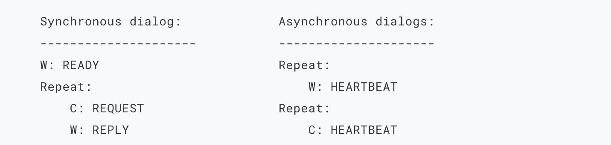
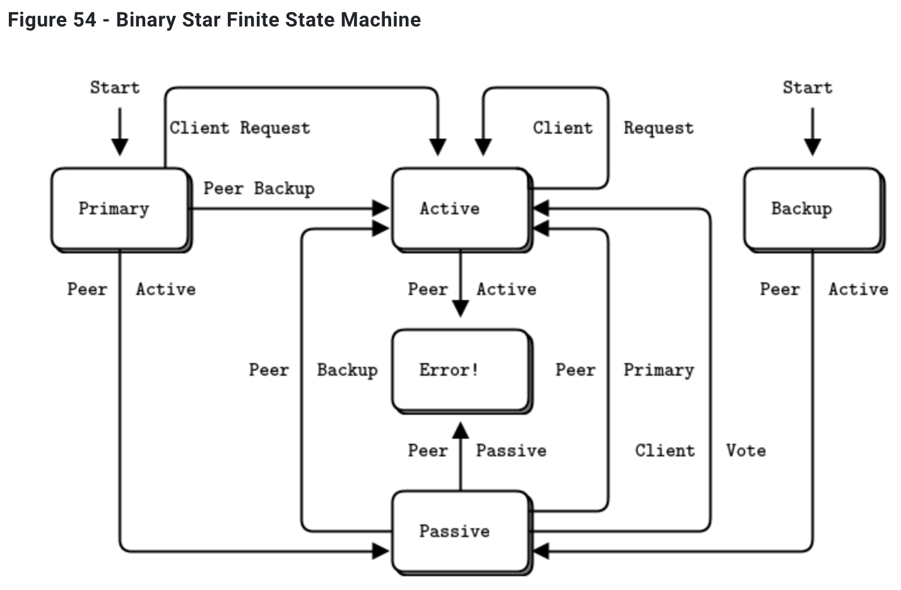
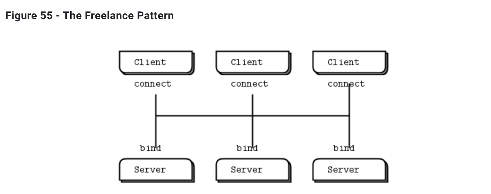

# 第4章 - 可靠的请求响应模式

​		第三章 - 高级请求响应模式涵盖了使用ZeroMQ的请求响应模式的高级用法，并提供了工作示例。本章将探讨可靠性的一般问题，并在ZeroMQ的核心请求响应模式之上构建一套可靠的消息传递模式。

​		在本章中，我们重点关注用户空间的请求响应*模式*，这些可复用的模型可以帮助您设计自己的ZeroMQ架构：

- *懒惰海盗*模式：从客户端实现可靠的请求-应答
- *简单海盗*模式：使用负载均衡实现可靠的请求-应答
- *偏执海盗*模式：带心跳检测的可靠请求-应答
- *管家*模式：面向服务的可靠排队
- *泰坦尼克*模式：基于磁盘/断开连接的可靠排队
- *双活*模式：主备服务器故障转移
- *自由职业者*模式：无代理的可靠请求-应答

## 什么是“可靠性”？ 

​		大多数讨论“可靠性”的人其实并不真正知道他们在说什么。我们只能根据故障来定义可靠性。也就是说，如果我们能处理一系列明确定义且理解的故障，那么我们就对这些故障来说是可靠的。不多也不少。那么，让我们来看看在一个分布式ZeroMQ应用中可能导致故障的原因，大致按概率降序排列：

- 应用代码是最大的罪魁祸首。它可能崩溃并退出，冻结并停止响应输入，对输入反应过慢，耗尽所有内存，等等。

- 系统代码——比如我们使用ZeroMQ编写的代理——可能由于与应用代码相同的原因而崩溃。系统代码*应该*比应用代码更可靠，但它仍然可能崩溃和烧毁，尤其是在试图为慢速客户端排队消息时可能会耗尽内存。

- 消息队列可能溢出，通常发生在已经学会残酷对待慢客户端的系统代码中。当队列溢出时，它开始丢弃消息。因此我们得到了“丢失”的消息。

- 网络可能会失败（例如，WiFi被关闭或超出范围）。在这种情况下，ZeroMQ会自动重新连接，但与此同时，消息可能会丢失。

- 硬件可能会失败，并带走在该机器上运行的所有进程。

- 网络可能会以奇异的方式失败，例如，交换机上的某些端口可能死掉，导致网络的那些部分变得无法访问。

- 整个数据中心可能遭受雷击、地震、火灾，或更常见的电力或冷却故障。

​		要使软件系统完全可靠地抵御*所有*这些可能的故障，是一项极其困难且昂贵的工作，超出了本书的范围。

​		因为上面列表中的前五种情况涵盖了大公司以外99.9%的现实世界需求（根据我刚刚进行的一项高度科学研究，该研究还告诉我78%的统计数据是当场编造的，而且永远不要相信我们自己没伪造的统计数据），所以这就是我们将要检查的内容。如果你是一个有钱在最后两种情况上花钱的大公司，立即联系我的公司吧！我的海滨别墅后面有个大坑，等着被改造成行政游泳池。

## 设计可靠性 

​		因此，为了让事情变得极其简单，可靠性就是“当代码冻结或崩溃时保持事物正常运行”，这种情况我们简称为“死亡”。然而，我们希望保持正常运行的事物比单纯的消息更为复杂。我们需要取每个核心ZeroMQ消息模式，看看如何使其工作（如果我们能够）即使在代码死亡时。

​		让我们逐一看看：

- 请求-响应：如果服务器死亡（在处理请求时），客户端可以弄清楚，因为它不会得到回答。然后它可以生气地放弃，稍后等待并再试一次，找另一个服务器，等等。至于客户端死亡，我们现在可以把它当作“别人的问题”。
- 发布-订阅：如果客户端死亡（已经获得了一些数据），服务器不知道。发布-订阅不会从客户端向服务器发送任何信息。但客户端可以通过其他方式联系服务器，例如通过请求-响应，并请求：“请重新发送我错过的所有内容”。至于服务器死亡，这里暂不涉及。订阅者还可以自行验证它们是否运行得太慢，并采取行动（例如，警告操作员并死亡）。
- 管道：如果工作器死亡（在工作时），通风器不知道。管道就像时间的磨碎齿轮，只能单向工作。但下游收集器可以检测到一个任务没有完成，并向通风器发送消息说：“嘿，重新发送任务324！”如果通风器或收集器死亡，最初发送工作批的任何上游客户端都可以厌倦等待并重新发送整个批次。这不优雅，但系统代码真的不应该经常死亡。

​		在本章中，我们将只关注请求-响应，这是可靠消息传递的低挂果实。

​		基本的请求-响应模式（一个REQ客户端套接字对一个REP服务器套接字进行阻塞发送/接收）在处理最常见的故障类型时得分较低。如果服务器在处理请求时崩溃，客户端只会永远挂起。如果网络丢失了请求或回复，客户端也会永远挂起。

​		由于ZeroMQ能够无声地重新连接对等端，对消息进行负载均衡等，请求-响应仍比TCP好得多。但对于真正的工作来说，它仍然不够好。唯一可以真正信任基本请求-响应模式的情况是在同一进程中的两个线程之间，没有网络或单独的服务器进程会死亡。

​		然而，通过一些额外的工作，这个简单的模式成为跨分布式网络进行实际工作的良好基础，我们得到了一套可靠的请求-响应（RRR）模式，我喜欢称之为*海盗*模式（希望你最终能明白这个笑话）。

​		根据我的经验，大致有三种方式将客户端连接到服务器。每种方式都需要特定的可靠性方法：

- 多个客户端直接与单个服务器通话。用例：客户端需要与之通话的单个知名服务器。我们旨在处理的故障类型：服务器崩溃和重启，以及网络断开。
- 多个客户端与代理代理通话，代理将工作分发给多个工作器。用例：面向服务的事务处理。我们旨在处理的故障类型：工作器崩溃和重启，工作器忙循环，工作器过载，队列崩溃和重启，以及网络断开。
- 多个客户端与多个服务器通话，无中间代理。用例：分布式服务，如域名解析。我们旨在处理的故障类型：服务崩溃和重启，服务忙循环，服务过载，以及网络断开。

​		每种方法都有其权衡，通常你会混合使用它们。我们将详细查看所有三种情况。

## 客户端可靠性（懒惰海盗模式）

​		我们可以通过对客户端进行一些更改来实现非常简单的可靠请求-响应。我们称之为懒惰海盗模式。与其执行阻塞接收，我们：

- 轮询REQ套接字，并仅在确定回复已到达时从中接收。
- 如果在超时期限内没有收到回复，重新发送请求。
- 如果经过几次请求仍然没有回复，放弃交易。

​		如果你尝试以非严格的发送/接收方式使用REQ套接字，你会得到一个错误（技术上来说，REQ套接字实现了一个小的有限状态机来强制执行发送/接收乒乓，因此错误代码被称为“EFSM”）。当我们想在海盗模式中使用REQ时，这稍微有些烦人，因为我们可能在得到回复之前发送了几个请求。

​		一个相当好的蛮力解决方案是在出错后关闭并重新打开REQ套接字：

lpclient.py

```python
#
#  Lazy Pirate client
#  Use zmq_poll to do a safe request-reply
#  To run, start lpserver and then randomly kill/restart it
#
#   Author: Daniel Lundin <dln(at)eintr(dot)org>
#
import itertools
import logging
import sys
import zmq

logging.basicConfig(format="%(levelname)s: %(message)s", level=logging.INFO)

REQUEST_TIMEOUT = 2500
REQUEST_RETRIES = 3
SERVER_ENDPOINT = "tcp://localhost:5555"

context = zmq.Context()

logging.info("Connecting to server…")
client = context.socket(zmq.REQ)
client.connect(SERVER_ENDPOINT)

for sequence in itertools.count():
    request = str(sequence).encode()
    logging.info("Sending (%s)", request)
    client.send(request)

    retries_left = REQUEST_RETRIES
    while True:
        if (client.poll(REQUEST_TIMEOUT) & zmq.POLLIN) != 0:
            reply = client.recv()
            if int(reply) == sequence:
                logging.info("Server replied OK (%s)", reply)
                retries_left = REQUEST_RETRIES
                break
            else:
                logging.error("Malformed reply from server: %s", reply)
                continue

        retries_left -= 1
        logging.warning("No response from server")
        # Socket is confused. Close and remove it.
        client.setsockopt(zmq.LINGER, 0)
        client.close()
        if retries_left == 0:
            logging.error("Server seems to be offline, abandoning")
            sys.exit()

        logging.info("Reconnecting to server…")
        # Create new connection
        client = context.socket(zmq.REQ)
        client.connect(SERVER_ENDPOINT)
        logging.info("Resending (%s)", request)
        client.send(request)
```

将此与匹配的服务器一起运行：

lpserver.py

```Python
#
#  Lazy Pirate server
#  Binds REQ socket to tcp://*:5555
#  Like hwserver except:
#   - echoes request as-is
#   - randomly runs slowly, or exits to simulate a crash.
#
#   Author: Daniel Lundin <dln(at)eintr(dot)org>
#
from random import randint
import itertools
import logging
import time
import zmq

logging.basicConfig(format="%(levelname)s: %(message)s", level=logging.INFO)

context = zmq.Context()
server = context.socket(zmq.REP)
server.bind("tcp://*:5555")

for cycles in itertools.count():
    request = server.recv()

    # Simulate various problems, after a few cycles
    if cycles > 3 and randint(0, 3) == 0:
        logging.info("Simulating a crash")
        break
    elif cycles > 3 and randint(0, 3) == 0:
        logging.info("Simulating CPU overload")
        time.sleep(2)

    logging.info("Normal request (%s)", request)
    time.sleep(1)  # Do some heavy work
    server.send(request)
```


​		为了运行这个测试案例，分别在两个控制台窗口中启动客户端和服务器。服务器会在几条消息之后随机出现异常行为。你可以检查客户端的响应。以下是服务器的典型输出：

```bash
I: normal request (1)
I: normal request (2)
I: normal request (3)
I: simulating CPU overload
I: normal request (4)
I: simulating a crash
```

​		以下是客户端的响应：

```bash
I: connecting to server...
I: server replied OK (1)
I: server replied OK (2)
I: server replied OK (3)
W: no response from server, retrying...
I: connecting to server...
W: no response from server, retrying...
I: connecting to server...
E: server seems to be offline, abandoning
```

​		客户端为每条消息编排一个序列，并检查回复是否完全按顺序返回：没有请求或回复丢失，也没有回复重复返回或顺序错误。运行这个测试几次，直到你确信这种机制确实有效。在生产应用中你不需要序列号；它们只是帮助我们信任我们的设计。

​		客户端使用一个REQ套接字，并执行蛮力的关闭/重新打开，因为REQ套接字强加了严格的发送/接收周期。你可能会想尝试使用DEALER，但这不是一个好决定。首先，这意味着要模拟REQ所做的带有信封的秘密调料（如果你忘记了这是什么，这是一个很好的迹象，表明你不想不得不这样做）。其次，这意味着可能会收到你没预料到的回复。

​		只在客户端处理故障在我们有一组客户端与单个服务器通话时是有效的。它可以处理服务器崩溃，但前提是恢复意味着重新启动同一个服务器。如果存在永久性错误，例如服务器硬件的电源供应死机，这种方法就不起作用。因为在任何架构中，服务器中的应用代码通常是故障的最大来源，所以依赖单个服务器并不是一个好主意。

​		所以，利弊如下：

- 优点：简单易懂和实现。 
- 优点：与现有的客户端和服务器应用代码轻松协作。 
- 优点：ZeroMQ自动重试实际重新连接，直到成功。 
- 缺点：不会故障转移到备用或替代服务器。

## 基本可靠排队（简单海盗模式）

​		我们的第二种方法扩展了懒惰海盗模式，加入了一个队列代理，让我们可以透明地与多个服务器（我们更准确地称之为“工作器”）通信。我们将分阶段开发这一模式，从一个最小工作模型开始，即简单海盗模式。

​		在所有这些海盗模式中，工作器都是无状态的。如果应用程序需要一些共享状态，例如共享数据库，我们在设计消息传递框架时并不知道。有了队列代理意味着工作器可以来来去去而客户端对此一无所知。如果一个工作器死亡，另一个将接替它。这是一个简洁的拓扑结构，只有一个真正的弱点，即中心队列本身，它可能成为管理的问题，也是一个单点故障。


​		队列代理的基础是第3章 - 高级请求-应答模式中的负载均衡代理。要处理死亡或阻塞的工作器，我们需要做的*最少*事情是什么？事实证明，惊人的是很少。我们客户端已经有了重试机制。因此，使用负载均衡模式将工作得相当好。这符合ZeroMQ的理念，即我们可以通过在中间插入天真的代理来扩展像请求-响应这样的点对点模式。

​		我们不需要特殊的客户端；我们仍然使用懒惰海盗客户端。这里是队列，与负载均衡代理的主要任务完全相同：

spqueue.py

```Python
#
#  Simple Pirate queue
#  This is identical to the LRU pattern, with no reliability mechanisms
#  at all. It depends on the client for recovery. Runs forever.
#
#   Author: Daniel Lundin <dln(at)eintr(dot)org>
#

import zmq

LRU_READY = "\x01"

context = zmq.Context(1)

frontend = context.socket(zmq.ROUTER) # ROUTER
backend = context.socket(zmq.ROUTER) # ROUTER
frontend.bind("tcp://*:5555") # For clients
backend.bind("tcp://*:5556")  # For workers

poll_workers = zmq.Poller()
poll_workers.register(backend, zmq.POLLIN)

poll_both = zmq.Poller()
poll_both.register(frontend, zmq.POLLIN)
poll_both.register(backend, zmq.POLLIN)

workers = []

while True:
    if workers:
        socks = dict(poll_both.poll())
    else:
        socks = dict(poll_workers.poll())

    # Handle worker activity on backend
    if socks.get(backend) == zmq.POLLIN:
        # Use worker address for LRU routing
        msg = backend.recv_multipart()
        if not msg:
            break
        address = msg[0]
        workers.append(address)

        # Everything after the second (delimiter) frame is reply
        reply = msg[2:]

        # Forward message to client if it's not a READY
        if reply[0] != LRU_READY:
            frontend.send_multipart(reply)

    if socks.get(frontend) == zmq.POLLIN:
        #  Get client request, route to first available worker
        msg = frontend.recv_multipart()
        request = [workers.pop(0), ''.encode()] + msg
        backend.send_multipart(request)
```

​		这是工作器，它采用懒惰海盗服务器并为负载均衡模式进行适配（使用REQ的“就绪”信号）：

spworker.py

```Python
#
#  Simple Pirate worker
#  Connects REQ socket to tcp://*:5556
#  Implements worker part of LRU queueing
#
#   Author: Daniel Lundin <dln(at)eintr(dot)org>


from random import randint
import time
import zmq

LRU_READY = "\x01"

context = zmq.Context(1)
worker = context.socket(zmq.REQ)

identity = "%04X-%04X" % (randint(0, 0x10000), randint(0,0x10000))
worker.setsockopt_string(zmq.IDENTITY, identity)
worker.connect("tcp://localhost:5556")

print("I: (%s) worker ready" % identity)
worker.send_string(LRU_READY)

cycles = 0
while True:
    msg = worker.recv_multipart()
    if not msg:
        break

    cycles += 1
    if cycles>0 and randint(0, 5) == 0:
        print("I: (%s) simulating a crash" % identity)
        break
    elif cycles>3 and randint(0, 5) == 0:
        print("I: (%s) simulating CPU overload" % identity)
        time.sleep(3)
    print("I: (%s) normal reply" % identity)
    time.sleep(1) # Do some heavy work
    worker.send_multipart(msg)
```

​		要测试这一点，按任意顺序启动几个工作器、一个懒惰海盗客户端和队列。你会看到工作器最终都会崩溃并烧毁，客户端会重试然后放弃。队列永远不会停止，你可以反复重启工作器和客户端。这个模型适用于任何数量的客户端和工作器。

## 强健可靠排队（偏执海盗模式）


​		简单海盗队列模式工作得相当好，尤其是因为它仅仅是两个现有模式的组合。然而，它确实有一些弱点：

- 面对队列崩溃和重启时并不稳健。客户端会恢复，但工作器不会。虽然ZeroMQ会自动重新连接工作器的套接字，但就重新启动的队列而言，工作器尚未发出就绪信号，因此不存在。为了解决这个问题，我们需要从队列到工作器进行心跳检测，这样工作器可以检测到队列已经消失。
- 队列无法检测到工作器故障，所以如果工作器在闲置时死亡，队列无法在向其发送请求之前从其工作器队列中移除它。客户端白白等待和重试。这不是一个关键问题，但并不理想。为了使其正常工作，我们需要从工作器到队列进行心跳检测，这样队列可以在任何阶段检测到丢失的工作器。

​		我们将在严谨的偏执海盗模式中解决这些问题。

​		我们之前对工作器使用了REQ套接字。对于偏执海盗工作器，我们将切换到DEALER套接字。这样做的优点是让我们能够随时发送和接收消息，而不是REQ强加的步调一致的发送/接收。DEALER的缺点是我们必须自己进行信封管理（重新阅读第3章 - 高级请求-响应模式，了解这个概念的背景）。

​		我们仍然使用懒惰海盗客户端。这里是偏执海盗队列代理：

ppqueue.py

```Python
#
##  Paranoid Pirate queue
#
#   Author: Daniel Lundin <dln(at)eintr(dot)org>
#

from collections import OrderedDict
import time

import zmq

HEARTBEAT_LIVENESS = 3     # 3..5 is reasonable
HEARTBEAT_INTERVAL = 1.0   # Seconds

#  Paranoid Pirate Protocol constants
PPP_READY = b"\x01"      # Signals worker is ready
PPP_HEARTBEAT = b"\x02"  # Signals worker heartbeat


class Worker(object):
    def __init__(self, address):
        self.address = address
        self.expiry = time.time() + HEARTBEAT_INTERVAL * HEARTBEAT_LIVENESS

class WorkerQueue(object):
    def __init__(self):
        self.queue = OrderedDict()

    def ready(self, worker):
        self.queue.pop(worker.address, None)
        self.queue[worker.address] = worker

    def purge(self):
        """Look for & kill expired workers."""
        t = time.time()
        expired = []
        for address, worker in self.queue.items():
            if t > worker.expiry:  # Worker expired
                expired.append(address)
        for address in expired:
            print("W: Idle worker expired: %s" % address)
            self.queue.pop(address, None)

    def next(self):
        address, worker = self.queue.popitem(False)
        return address

context = zmq.Context(1)

frontend = context.socket(zmq.ROUTER) # ROUTER
backend = context.socket(zmq.ROUTER)  # ROUTER
frontend.bind("tcp://*:5555") # For clients
backend.bind("tcp://*:5556")  # For workers

poll_workers = zmq.Poller()
poll_workers.register(backend, zmq.POLLIN)

poll_both = zmq.Poller()
poll_both.register(frontend, zmq.POLLIN)
poll_both.register(backend, zmq.POLLIN)

workers = WorkerQueue()

heartbeat_at = time.time() + HEARTBEAT_INTERVAL

while True:
    if len(workers.queue) > 0:
        poller = poll_both
    else:
        poller = poll_workers
    socks = dict(poller.poll(HEARTBEAT_INTERVAL * 1000))

    # Handle worker activity on backend
    if socks.get(backend) == zmq.POLLIN:
        # Use worker address for LRU routing
        frames = backend.recv_multipart()
        if not frames:
            break

        address = frames[0]
        workers.ready(Worker(address))

        # Validate control message, or return reply to client
        msg = frames[1:]
        if len(msg) == 1:
            if msg[0] not in (PPP_READY, PPP_HEARTBEAT):
                print("E: Invalid message from worker: %s" % msg)
        else:
            frontend.send_multipart(msg)

        # Send heartbeats to idle workers if it's time
        if time.time() >= heartbeat_at:
            for worker in workers.queue:
                msg = [worker, PPP_HEARTBEAT]
                backend.send_multipart(msg)
            heartbeat_at = time.time() + HEARTBEAT_INTERVAL
    if socks.get(frontend) == zmq.POLLIN:
        frames = frontend.recv_multipart()
        if not frames:
            break

        frames.insert(0, workers.next())
        backend.send_multipart(frames)


    workers.purge()
```

​		队列通过工作器心跳检测扩展了负载均衡模式。心跳检测是那些“简单”的事情之一，很难做对。我稍后会对此进行更多解释。

这是偏执海盗工作器：

ppworker.py

```Python
#
##  Paranoid Pirate worker
#
#   Author: Daniel Lundin <dln(at)eintr(dot)org>
#

from random import randint
import time

import zmq

HEARTBEAT_LIVENESS = 3
HEARTBEAT_INTERVAL = 1
INTERVAL_INIT = 1
INTERVAL_MAX = 32

#  Paranoid Pirate Protocol constants
PPP_READY = b"\x01"      # Signals worker is ready
PPP_HEARTBEAT = b"\x02"  # Signals worker heartbeat

def worker_socket(context, poller):
    """Helper function that returns a new configured socket
       connected to the Paranoid Pirate queue"""
    worker = context.socket(zmq.DEALER) # DEALER
    identity = b"%04X-%04X" % (randint(0, 0x10000), randint(0, 0x10000))
    worker.setsockopt(zmq.IDENTITY, identity)
    poller.register(worker, zmq.POLLIN)
    worker.connect("tcp://localhost:5556")
    worker.send(PPP_READY)
    return worker


context = zmq.Context(1)
poller = zmq.Poller()

liveness = HEARTBEAT_LIVENESS
interval = INTERVAL_INIT

heartbeat_at = time.time() + HEARTBEAT_INTERVAL

worker = worker_socket(context, poller)
cycles = 0
while True:
    socks = dict(poller.poll(HEARTBEAT_INTERVAL * 1000))

    # Handle worker activity on backend
    if socks.get(worker) == zmq.POLLIN:
        #  Get message
        #  - 3-part envelope + content -> request
        #  - 1-part HEARTBEAT -> heartbeat
        frames = worker.recv_multipart()
        if not frames:
            break # Interrupted

        if len(frames) == 3:
            # Simulate various problems, after a few cycles
            cycles += 1
            if cycles > 3 and randint(0, 5) == 0:
                print("I: Simulating a crash")
                break
            if cycles > 3 and randint(0, 5) == 0:
                print("I: Simulating CPU overload")
                time.sleep(3)
            print("I: Normal reply")
            worker.send_multipart(frames)
            liveness = HEARTBEAT_LIVENESS
            time.sleep(1)  # Do some heavy work
        elif len(frames) == 1 and frames[0] == PPP_HEARTBEAT:
            print("I: Queue heartbeat")
            liveness = HEARTBEAT_LIVENESS
        else:
            print("E: Invalid message: %s" % frames)
        interval = INTERVAL_INIT
    else:
        liveness -= 1
        if liveness == 0:
            print("W: Heartbeat failure, can't reach queue")
            print("W: Reconnecting in %0.2fs..." % interval)
            time.sleep(interval)

            if interval < INTERVAL_MAX:
                interval *= 2
            poller.unregister(worker)
            worker.setsockopt(zmq.LINGER, 0)
            worker.close()
            worker = worker_socket(context, poller)
            liveness = HEARTBEAT_LIVENESS
    if time.time() > heartbeat_at:
        heartbeat_at = time.time() + HEARTBEAT_INTERVAL
        print("I: Worker heartbeat")
        worker.send(PPP_HEARTBEAT)
```

​		关于此示例的一些评论：

- 代码包括之前的故障模拟。这使得它（a）非常难以调试，并且（b）危险重用。当你想调试这个时，禁用故障模拟。
- 工作器使用与我们为懒惰海盗客户端设计的类似的重连策略，但有两个主要区别：（a）它执行指数退避，并且（b）无限期重试（而客户端重试几次后就报告故障）。

​		尝试客户端、队列和工作器，例如使用这样的脚本：

```bash
ppqueue &
for i in 1 2 3 4; do
    ppworker &
    sleep 1
done
lpclient &
```

​		你应该看到工作器一个接一个地死亡，因为它们模拟崩溃，客户端最终放弃。你可以停止和重新启动队列，客户端和工作器将重新连接并继续。无论你对队列和工作器做了什么，客户端都不会得到乱序回复：整个链条要么工作，要么客户端放弃。

## 心跳检测 

​		心跳检测解决了如何知道对等端是否存活或死亡的问题。这不是特定于ZeroMQ的问题。TCP有很长的超时时间（大约30分钟），这意味着可能无法知道对等端是死亡了、断开连接了，还是带着一箱伏特加、一个红发女郎和一大笔费用账户去布拉格度周末了。

​		要做好心跳检测并不容易。在编写偏执海盗示例时，花了大约五个小时才让心跳检测正常工作。请求-响应链的其余部分可能只花了大约十分钟。特别容易产生“假故障”，也就是说，当对等端决定它们已经断开连接，因为心跳没有正确发送时。

​		我们将看看人们在使用ZeroMQ进行心跳检测时的三个主要解决方案。

### 不予理睬 

​		最常见的方法是根本不进行心跳检测，希望一切顺利。许多（如果不是大多数）ZeroMQ应用程序都是这样做的。ZeroMQ通过在许多情况下隐藏对等端来鼓励这种做法。这种方法会导致什么问题？

- 当我们在需要跟踪对等端的应用程序中使用ROUTER套接字时，随着对等端断开连接和重新连接，应用程序将泄露内存（应用程序为每个对等端持有的资源）并变得越来越慢。
- 当我们使用基于SUB或DEALER的数据接收方时，我们无法区分良好的沉默（没有数据）和不良的沉默（另一端死亡）。当接收方知道另一端死亡时，它可以例如切换到备用路线。
- 如果我们使用长时间保持沉默的TCP连接，在某些网络中，它会死亡。发送一些东西（技术上是“保活”而不是心跳），将保持网络活跃。

### 单向心跳 

​		第二个选择是每隔一秒左右从每个节点向其对等端发送一条心跳消息。当一个节点在一定超时时间内（通常是几秒）没有从另一个节点那里听到任何东西时，它将把那个对等端视为死亡。听起来不错，对吗？可悲的是，不是。这在某些情况下有效，但在其他情况下有恼人的边缘情况。

​		对于发布-订阅，这确实有效，而且是你唯一可以使用的模型。SUB套接字不能向PUB套接字回复，但PUB套接字可以愉快地向其订阅者发送“我还活着”的消息。

​		作为优化，你可以只在没有实际数据发送时发送心跳。此外，如果网络活动是一个问题（例如，在移动网络上活动会耗电），你可以逐渐放慢发送心跳的速度。只要接收方能够检测到故障（活动突然停止），那就没问题。

​		以下是此设计的典型问题：

- 在我们发送大量数据时，可能会不准确，因为心跳将被那些数据延迟。如果心跳被延迟，你可能会由于网络拥塞而得到错误的超时和断开连接。因此，始终将任何传入数据视为心跳，无论发送方是否优化了心跳。
- 虽然发布-订阅模式会丢弃消失的接收方的消息，但PUSH和DEALER套接字会对它们进行排队。所以如果你向死亡的对等端发送心跳，它回来后会收到你发送的所有心跳，可能是成千上万。哇，哇！
- 这种设计假设整个网络的心跳超时是一样的。但这不会准确。一些对等端将希望非常积极的心跳检测，以便快速检测到故障。而有些则希望非常放松的心跳检测，以便让沉睡的网络休息并节省电力。

### 乒乓心跳 

​		第三个选择是使用乒乓对话。一个对等端向另一个发送ping命令，后者回复pong命令。这两个命令都没有有效载荷。ping和pong不相关。由于在某些网络中，“客户端”和“服务器”的角色是任意的，我们通常规定任何对等端实际上都可以发送ping并期望收到pong作为响应。然而，由于超时取决于最了解的动态客户端的网络拓扑，通常是客户端ping服务器。

​		这适用于所有基于ROUTER的代理。我们在第二个模型中使用的同样的优化使这个工作效果更好：将任何传入数据视为pong，并且只在不发送其他数据时发送ping。

### 偏执海盗的心跳检测 

​		对于偏执海盗，我们选择了第二种方法。这可能不是最简单的选择：如果今天设计这个，我可能会尝试乒乓方法。然而，原则是相似的。心跳消息在两个方向上异步流动，任何一方都可以决定另一方“死亡”并停止与之交谈。

​		在工作器中，我们是这样处理队列的心跳的：

- 我们计算一个*活跃度*，即在决定队列死亡前我们还能错过多少次心跳。它从三开始，我们每次错过心跳就减一。 我们在zmq_poll循环中等待，每次等待一秒，这是我们的心跳间隔。 
- 如果在这段时间内收到来自队列的任何消息，我们将活跃度重置为三。
- 如果在这段时间内没有消息，我们就倒数我们的活跃度。 
- 如果活跃度降到零，我们认为队列死亡。 
- 如果队列死亡，我们销毁我们的套接字，创建一个新的，并重新连接。 
- 为了避免打开和关闭过多的套接字，我们等待一定的间隔时间再重新连接，并每次将间隔时间加倍，直到达到32秒。 

​		这是我们处理*发送到*队列的心跳的方式：

- 我们计算何时发送下一个心跳；这是一个单一变量，因为我们只与一个对等端——队列通话。 
- 在zmq_poll循环中，每当我们超过这个时间时，我们就向队列发送一个心跳。 

以下是工作器的核心心跳代码：

```C
#define HEARTBEAT_LIVENESS  3       //  3-5 is reasonable
#define HEARTBEAT_INTERVAL  1000    //  msecs
#define INTERVAL_INIT       1000    //  Initial reconnect
#define INTERVAL_MAX       32000    //  After exponential backoff

...
//  If liveness hits zero, queue is considered disconnected
size_t liveness = HEARTBEAT_LIVENESS;
size_t interval = INTERVAL_INIT;

//  Send out heartbeats at regular intervals
uint64_t heartbeat_at = zclock_time () + HEARTBEAT_INTERVAL;

while (true) {
    zmq_pollitem_t items [] = { { worker,  0, ZMQ_POLLIN, 0 } };
    int rc = zmq_poll (items, 1, HEARTBEAT_INTERVAL * ZMQ_POLL_MSEC);

    if (items [0].revents & ZMQ_POLLIN) {
        //  Receive any message from queue
        liveness = HEARTBEAT_LIVENESS;
        interval = INTERVAL_INIT;
    }
    else
    if (--liveness == 0) {
        zclock_sleep (interval);
        if (interval < INTERVAL_MAX)
            interval *= 2;
        zsocket_destroy (ctx, worker);
        ...
        liveness = HEARTBEAT_LIVENESS;
    }
    //  Send heartbeat to queue if it's time
    if (zclock_time () > heartbeat_at) {
        heartbeat_at = zclock_time () + HEARTBEAT_INTERVAL;
        //  Send heartbeat message to queue
    }
}
```

​		队列执行相同的操作，但它会为每个工作器管理一个过期时间。

​		以下是一些关于实现心跳的建议：

- 使用 zmq_poll 或者反应器作为应用程序主任务的核心。
- 首先构建节点之间的心跳机制，通过模拟失败来测试它，*然后*再构建其余的消息流程。事后添加心跳机制要困难得多。
- 使用简单的跟踪，即打印到控制台，来使这个工作。为了帮助您追踪节点之间的消息流，使用像 zmsg 提供的 dump 方法，并且递增地给您的消息编号，这样您可以看到是否有间隔。
- 在真实应用中，心跳机制必须是可配置的，并且通常与对等方协商。一些节点会希望有积极的心跳，低至 10 毫秒。其他远程节点可能希望心跳高达 30 秒。
- 如果您对不同的节点有不同的心跳间隔，您的轮询超时应该是这些中最低（时间最短）的。不要使用无限的超时。
- 在您用于消息的同一个套接字上进行心跳，这样您的心跳也可以充当*保活信号*，以防止网络连接变得陈旧（有些防火墙可能对静默连接不友好）。

## 合约和协议 

​		如果你在注意，你会意识到 Paranoid Pirate 和 Simple Pirate 由于心跳的原因并不兼容。但我们如何定义“可互操作性”呢？为了保证可互操作性，我们需要一种合约，一种协议，它允许不同时间、不同地点的不同团队编写能够保证一起工作的代码。我们称这为“协议”。

​		没有规格说明书的实验是有趣的，但这不是真实应用的明智基础。如果我们想用另一种语言编写工作器怎么办？我们是否需要阅读代码来了解事物的工作原理？如果我们出于某种原因想改变协议怎么办？即使是简单的协议，如果成功，也会发展变得更复杂。

​		缺乏合约是一次性应用的明确迹象。那么，让我们为这个协议写一个合约。我们怎么做呢？

​		在 [Introduction | ZeroMQ RFC](https://rfc.zeromq.org/) 有一个维基，我们特别为 ZeroMQ 公共合约建立了它。要创建新的规范，如果需要的话在维基上注册，并遵循指示。这相当直接，尽管写技术文本并不是每个人的菜。

> ZeroMQ RFC 这是 ZeroMQ RFC 项目。
>
> 我们收集用于 APIs、文件格式、线协议和流程的规范。
>
> 变更过程是 C4：http://rfc.zeromq.org/spec:42，但有一些修改：
>
> - 根据 C4 通过拉取请求创建和修改规范。
> - 每个规范都有一个编辑，他会根据需要将 RFC 发布到 [http://rfc.zeromq.org。](http://rfc.zeromq.org./)
> - 规范的生命周期应遵循 COSS 中定义的生命周期。
> - 非外观性变更只允许在 Raw 和 Draft 规范上进行。

​		我用了大约十五分钟时间来起草新的 Pirate Pattern 协议[6/PPP | ZeroMQ RFC](https://rfc.zeromq.org/spec/6/)。这不是一个大规范，但它确实捕捉到了足够的信息，可以作为争论的基础（“你的队列不兼容 PPP；请修复它！"）。

> ### 偏执海盗协议
>
> - 状态：稳定 
>
> - 编辑：Pieter Hintjens [ph@imatix.com](mailto:ph@imatix.com) 
>
>
> 偏执海盗协议（PPP）定义了客户端（或客户）与工作节点之间可靠的请求-回复对话。PPP 涵盖了存在检测、心跳机制和请求-回复处理。它起源于《指南》第4章。
>
> #### 许可 
>
> 版权所有 (c) 2011 iMatix Corporation。
>
> 此规范是免费软件；您可以根据由自由软件基金会发布的 GNU 通用公共许可证的条款对其进行重新分发和/或修改；许可证的版本可以是第3版，或者（根据您的选择）任何后续版本。
>
> 此规范的发布是希望它会有用，但不提供任何形式的保证；甚至不包括对适销性或适用于特定目的的隐含保证。有关更多细节，请参阅 GNU 通用公共许可证。
>
> 您应该已经随此程序收到一份 GNU 通用公共许可证的副本；如果没有，请查看 http://www.gnu.org/licenses。
>
> #### 变更过程 
>
> 此规范是一个自由和开放的标准（参见“自由和开放标准的定义”），并受数字标准组织的共识导向规范系统（COSS）（参见“共识导向规范系统”）的管理。
>
> #### 语言 
>
> 本文档中的关键词“必须（MUST）”、“禁止（MUST NOT）”、“必需（REQUIRED）”、“应该（SHALL）”、“不应该（SHALL NOT）”、“应该（SHOULD）”、“不应该（SHOULD NOT）”、“推荐（RECOMMENDED）”、“可以（MAY）”和“可选（OPTIONAL）”应按照 RFC 2119 中的描述进行解释（参见“在 RFC 中使用的关键词以指示要求级别”）。
>
> #### 目标 
>
> PPP 实现了客户端与工作节点之间的可靠请求-回复对话。PPP 涵盖了存在检测、心跳机制和请求-回复处理。它起源于《指南》第4章。
>
> PPP 的目标是：
>
> - 通过使用心跳机制，使双方都能检测到对方节点的断开。
>
> - 允许客户端实现“最近最少使用”模式，以将任务分配给工作节点。
>
> - 允许客户端通过将请求重新发送给其他工作节点来从死亡或断开连接的工作节点中恢复。
>
>
> #### 架构
>
> 
>
> ##### 角色 
>
> PPP 定义了两种类型的节点：
>
> - “客户端”发出工作请求。每个请求都是一条消息，并且独立处理。
> - “工作节点”处理请求并以回复响应。每个请求都会产生一个回复。
>
> ##### 整体对话 
>
> PPP 连接单个客户端和一组工作节点。我们没有指定哪些节点连接到哪些节点，但通常工作节点会连接到客户端。
>
> 客户端可能是中介（例如，队列设备），或者可能是直接实现 PPP 的应用程序。
>
> PPP 对话由两个交织的对话组成，如下所示（‘C’ 代表客户端，‘W’ 代表工作节点）：
>
> 
>
> 分解这一过程：
>
> - 工作节点通过向客户端发送 READY 来启动对话。
> - 客户端以 REQUEST 响应。
> - 工作节点以 REPLY 回复，这样不断重复。
> - 工作节点定期向客户端发送 HEARTBEAT。
> - 客户端定期向工作节点发送 HEARTBEAT。
>
> 任何对话中的第一条消息**必须**是 W:READY。
>
> ##### 命令规范 
>
> READY : 包含单个字节 0x01 的单部分消息。 
>
> HEARTBEAT : 包含单个字节 0x02 的单部分消息。 
>
> REQUEST : 包含一个可选的带空终止符的地址堆栈，后跟一个或多个部分的消息内容的多部分消息。 
>
> REPLY : 包含一个可选的带空终止符的地址堆栈，后跟一个或多个部分的消息内容的多部分消息。 
>
> ##### 心跳规范 
>
> 节点应定期并按照约定的时间间隔发送心跳。如果在一定的倍数时间间隔内（通常为3-5倍）没有收到心跳，节点可以认为对方节点“已断开”。
>
> 如果工作节点检测到客户端已断开连接，它**必须**再次发送 READY 以开始新的对话。
>
> 如果客户端检测到工作节点已断开连接，它**应该**停止向其发送任何类型的消息。
>

​		将 PPP 变成一个真正的协议需要更多工作：

- 在 READY 命令中应该有一个协议版本号，以便能够区分不同版本的 PPP。
- 现在，READY 和 HEARTBEAT 与请求和回复并不完全区分开。要使它们区分开来，我们需要一个包含“消息类型”部分的消息结构。

## 面向服务的可靠队列（Majordomo 模式）


​		进步的好处在于，当律师和委员会不参与时，它发生得有多快。一页纸的 MDP 规范将 PPP 变成了更加稳固的东西。这就是我们应该如何设计复杂架构：首先写下合约，*然后*再编写软件来实现它们。

> ### Majordomo 协议
>
> - 状态：稳定 
> - 编辑：Pieter Hintjens [ph@imatix.com](mailto:ph@imatix.com) 
> - 贡献者：Chuck Remes [cremes@mac.com](mailto:cremes@mac.com)，Guido Goldstein [zmqdev@a-nugget.de](mailto:zmqdev@a-nugget.de) 
>
> Majordomo 协议（MDP）定义了一套客户端应用、一个代理和一套工作应用之间的可靠面向服务的请求-回复对话。MDP 涵盖了存在检测、心跳机制和面向服务的请求-回复处理。它源自于《指南》第4章中定义的 Majordomo 模式。
>
> #### 许可 
>
> 版权所有 (c) 2011 iMatix Corporation。
>
> 此规范是免费软件；您可以根据由自由软件基金会发布的 GNU 通用公共许可证的条款对其进行重新分发和/或修改；许可证的版本可以是第3版，或者（根据您的选择）任何后续版本。
>
> 此规范的发布是希望它会有用，但不提供任何形式的保证；甚至不包括对适销性或适用于特定目的的隐含保证。有关更多细节，请参阅 GNU 通用公共许可证。
>
> 您应该已经随此程序收到一份 GNU 通用公共许可证的副本；如果没有，请查看 http://www.gnu.org/licenses。
>
> #### 变更过程 
>
> 此规范是一个自由和开放的标准（参见“自由和开放标准的定义”），并受数字标准组织的共识导向规范系统（COSS）（参见“共识导向规范系统”）的管理。
>
> #### 语言 
>
> 本文档中的关键词“必须（MUST）”、“禁止（MUST NOT）”、“必需（REQUIRED）”、“应该（SHALL）”、“不应该（SHALL NOT）”、“应该（SHOULD）”、“不应该（SHOULD NOT）”、“推荐（RECOMMENDED）”、“可以（MAY）”和“可选（OPTIONAL）”应按照 RFC 2119 中的描述进行解释（参见“在 RFC 中使用的关键词以指示要求级别”）。
>
> #### 目标 
>
> Majordomo 协议（MDP）定义了一套客户端应用、一个代理和一套工作应用之间的可靠面向服务的请求-回复对话。MDP 涵盖了存在检测、心跳机制和面向服务的请求-回复处理。它源自于《指南》第4章中定义的 Majordomo 模式（参见“ØMQ - 指南”）。Majordomo 模式与同名的开源邮件列表软件无关。
>
> MDP 是 6/PPP 的进化，增加了基于名称的服务解析和更结构化的协议命令。
>
> MDP 的目标是：
>
> - 允许基于抽象服务名称将请求路由到工作节点。
> - 通过使用心跳机制，使双方都能检测到对方节点的断开。
> - 允许代理实现“最近最少使用”模式，以将任务分配给特定服务的工作节点。
> - 允许代理通过将请求重新发送给其他工作节点来从死亡或断开连接的工作节点中恢复。
>
> #### 架构
>
> 
>
> ##### 整体拓扑 
>
> MDP 连接一组客户端应用程序、单个代理设备和一组工作应用程序。客户端和工作节点都连接到代理。客户端和工作节点彼此不可见，并且都可以任意地进出。代理**可以**开放两个套接字（端口），一个前端用于客户端，一个后端用于工作节点。然而，MDP 也被设计为可以通过单个代理套接字工作。
>
> 我们将发出请求的应用程序定义为‘客户端’，处理这些请求的应用程序定义为‘工作节点’。MDP 做出了以下假设：
>
> - 工作节点是幂等的，即执行相同请求多次是安全的。
> - 工作节点最多同时处理一个请求，并且每个成功的请求都会发出确切一个回复。
>
> Majordomo 代理处理一组共享请求队列，每个服务一个。每个队列有多个写入者（客户端）和多个读取者（工作节点）。代理**应**公平地为客户端服务，并**可以**按任何方式向工作节点分配请求，包括轮询和最近最少使用。
>
> MDP 包含两个子协议：
>
> - MDP/Client，涵盖 MDP 代理与客户端应用程序的通信方式。
> - MDP/Worker，涵盖 MDP 代理与工作应用程序的通信方式。 
>
> 代理可以是中介（设备），也可以是直接实现 MDP/Worker 的客户端应用程序。同样，代理可以直接集成服务，而不是使用 MDP/Worker。
>
> ##### ROUTER 地址 
>
> 代理**必须**使用 ROUTER 套接字来接受来自客户端的请求，以及来自工作节点的连接。代理**可以**为每个子协议使用单独的套接字，也**可以**为两个子协议使用单个套接字。
>
> 从 ØMQ 参考手册（参见“”）：
>
> > 在接收消息时，ROUTER 套接字应在将消息传递给应用程序之前，在消息前添加一个包含发起对等方身份的消息部分。在发送消息时，ROUTER 套接字应移除消息的第一部分，并使用它来确定消息应路由到的对等方的身份。
> >
>
> 这个额外的框架在下面解释的子协议命令中没有显示。
>
> ##### MDP/Client 
>
> MDP/Client 是由客户端发起的严格同步对话（其中‘C’代表客户端，‘B’代表代理）：
>
> 
>
> 一个 **REQUEST** 命令包含一个由 4 个或更多帧组成的多部分消息，在线路上的格式如下：
>
> - 帧 0：空（零字节，对 REQ 应用程序不可见）
> - 帧 1：“MDPC01”（六个字节，代表 MDP/Client v0.1）
> - 帧 2：服务名称（可打印字符串）
> - 帧 3+：请求体（不透明二进制）
>
> 一个 **REPLY** 命令包含一个由 4 个或更多帧组成的多部分消息，在线路上的格式如下：
>
> - 帧 0：空（零字节，对 REQ 应用程序不可见）
> - 帧 1：“MDPC01”（六个字节，代表 MDP/Client v0.1）
> - 帧 2：服务名称（可打印字符串）
> - 帧 3+：回复体（不透明二进制）
>
> 客户端在实现同步请求-回复模式时**应**使用 REQ 套接字。REQ 套接字将在发出的请求中默默地创建帧 0，并在将回复传递给调用应用程序之前移除它。客户端在实现异步模式时可以使用 DEALER（XREQ）套接字。在这种情况下，客户端**必须**明确创建空的帧 0。
>
> 客户端**可以**使用任何适合的策略来恢复对无响应代理的请求。一种推荐的策略是：
>
> - 在请求套接字上使用轮询而不是阻塞接收。
> - 如果在某个超时时间内没有回复，关闭请求套接字，打开一个新套接字，并在该新套接字上重新发送请求。
> - 如果经过几次重试后仍无回复，标记该事务为失败。 
>
> 服务名称是一个与工作节点在其 READY 命令中指定的服务名称匹配的 0MQ 字符串（见下文 MDP/Worker）。代理**应该**将没有注册服务的客户端请求排队，并在没有注册服务的情况下在合理且可配置的时间内使这些请求过期。
>
> ##### MDP/Worker 
>
> MDP/Worker 是服务工作节点发起的同步请求-回复对话和独立于两个方向的异步心跳对话的混合。这是同步对话（其中 'S' 代表服务工作节点，'B' 代表代理）：
>
> 
>
> 异步心跳对话在相同的套接字上运行，并且工作方式如下：
>
> 
>
> **READY**命令由4个帧组成的多部分消息组成，格式如下：
>
> - 帧0：空帧 
> - 帧1： “MDPW01”（六个字节，表示MDP/Worker v0.1） 
> - 帧2：0x01（一个字节，表示READY） 
> - 帧3：服务名称（可打印字符串） 
>
> **REQUEST**命令由6个或更多帧的多部分消息组成，格式如下：
>
> - 帧0：空帧 
> - 帧1： “MDPW01”（六个字节，表示MDP/Worker v0.1） 
> - 帧2：0x02（一个字节，表示REQUEST） 
> - 帧3：客户端地址（信封堆栈） 
> - 帧4：空（零字节，信封分隔符） 
> - 帧5+：请求主体（不透明二进制） 
>
> **REPLY**命令由6个或更多帧的多部分消息组成，格式如下：
>
> - 帧0：空帧 
> - 帧1： “MDPW01”（六个字节，表示MDP/Worker v0.1） 
> - 帧2：0x03（一个字节，表示REPLY） 
> - 帧3：客户端地址（信封堆栈） 
> - 帧4：空（零字节，信封分隔符） 
> - 帧5+：回复主体（不透明二进制） 
>
> **HEARTBEAT**命令由3个帧的多部分消息组成，格式如下：
>
> - 帧0：空帧 
> - 帧1： “MDPW01”（六个字节，表示MDP/Worker v0.1） 
> - 帧2：0x04（一个字节，表示HEARTBEAT） 
>
> **DISCONNECT**命令由3个帧的多部分消息组成，格式如下：
>
> - 帧0：空帧 
> - 帧1： “MDPW01”（六个字节，表示MDP/Worker v0.1） 
> - 帧2：0x05（一个字节，表示DISCONNECT） 
>
> MD/Worker命令都以空帧开头，以允许在经纪人中一致处理客户端和工作者的帧，通过单个套接字传输。空帧没有其他重要性。
>
> **打开和关闭连接** 
>
> - 工作者负责打开和关闭逻辑连接。一个工作者**必须**使用一个 ØMQ DEALER（XREQ）套接字连接到一个经纪人。
> - 由于 ØMQ 在失败后会自动重新连接对等方，因此每个 MDP 命令都包括协议头，以允许对对等方接收到的所有消息进行正确验证。
> - 工作者通过创建一个新套接字、连接它，然后发送一个READY命令来打开与经纪人的连接以注册一个服务。一个工作者处理一个服务，而许多工作者**可以**处理相同的服务。工作者**不得**发送进一步的READY。
> - READY没有响应。工作者**应**假定注册成功，直到或除非它收到一个DISCONNECT，或通过心跳检测到经纪人失败。
> - 工作者**可以**随时发送DISCONNECT，包括在READY之前。当经纪人从工作者那里收到DISCONNECT时，不得再向该工作者发送进一步的命令。
> - 经纪人**可以**随时发送DISCONNECT，定义之后至少从工作者那里接收了一个命令。
> - 经纪人**必须**对任何有效但意外的命令发送DISCONNECT，然后不再向该工作者发送任何命令。经纪人应对无效消息做出回应，通过删除它们并将该对等方视为无效。
> - 当工作者收到DISCONNECT时，它不得再向经纪人发送进一步的命令；它**必须**关闭其套接字，并在新套接字上重新连接到经纪人。此机制允许工作者在经纪人失败和恢复后重新注册。
>
> **请求和回复处理** 
>
> - REQUEST和REPLY命令**必须**包含一个客户端地址帧。该帧**必须**后跟一个空帧（大小为零）。
> - 每个直接连接客户端的地址都由ROUTER套接字前置到来自客户端的所有请求消息中。该ROUTER套接字还期望客户端地址前置到发送给客户端的每个回复消息中。
>
> **心跳** 
>
> HEARTBEAT命令随时有效，在READY命令之后。
>
> 除DISCONNECT之外的任何接收到的命令都作为心跳。在发送其他命令的同时，对等方**不应**发送HEARTBEAT命令。
>
> 经纪人和工作者都**必须**定期并经过同意地发送心跳。如果在某个间隔的多个倍数内（通常为3-5）没有收到心跳，对等方**必须**将另一对等方视为“断开连接”。
>
> 如果工作者检测到经纪人已断开连接，它**应该**重新开始新的对话。
>
> 如果经纪人检测到工作者已断开连接，它**应该**停止向其发送任何类型的消息。
>
> ##### 可靠性 
>
> Majordomo模式旨在扩展基本的ØMQ请求-响应模式，以具备检测并从特定一组故障中恢复的能力，这些故障包括：
>
> - 工作者应用程序崩溃、运行过慢或冻结。
> - 与网络断开连接的工作者应用程序（暂时或永久性）。
> - 临时断开网络连接的客户端应用程序。
> - 队列经纪人崩溃并重新启动。
> - 队列经纪人遭受永久性故障。
> - 由于上述任何故障而丢失的请求或响应。
>
> 一般的方法是在需要时进行重试和重新连接，使用心跳机制。Majordomo通过在经纪人中不保留重要状态来间接支持活-活经纪人故障切换，实际的切换到备用经纪人由客户端和工作者处理，而不是由协议处理。关于这些故障以及Majordomo用于检测和恢复的策略的更详细讨论，请参阅指南第4章（请参阅“ØMQ - The Guide"）。
>
> ##### 可扩展性和性能 
>
> Majordomo的设计旨在可扩展到大量（数千个）的工作者和客户端，仅受经纪人上的系统资源限制。通过根据服务对工作者进行分区，可以允许多个应用程序共享相同的经纪人基础架构。
>
> 对于单个客户端应用程序的吞吐性能将受到限制，每秒只能处理数万个而不是数百万个请求-响应事务，这是由于往返成本和基于经纪人的方法的额外延迟所致。请求和响应消息越大，Majordomo的效率就越高。Majordomo可以与高速数据传递架构相辅相成。
>
> 经纪人的系统要求适中：每个客户端只能排队一个未处理的请求，而消息内容可以在客户端和工作者之间进行切换而无需复制或处理。因此，单个经纪人线程可以每秒切换数百万条消息，而多线程实现（提供多个独立的虚拟经纪人，每个都在自己的端口上）可以扩展到所需的核心数。
>
> ##### 安全性 
>
> MDP不实施任何身份验证、访问控制或加密机制，不应在需要这些机制的部署中使用。但是，所有这些机制都可以在MDP之上进行分层，并且可能成为未来RFC的主题。
>
> ##### 参考实现 
>
> 指南第4章的C99 Majordomo示例（请参阅“ØMQ - The Guide"）充当MDP的主要参考实现。Guido Goldstein创建了MDP的Python实现。
>
> ##### 已知弱点 
>
> - 必须在经纪人和工作者中设置相似的心跳率，否则将发生错误的断开连接。将来将开发更好的心跳设计。 
> - 使用多个帧进行命令格式化会对性能产生影响。MDP的未来版本可能会将命令放入单个帧中。

​		Majordomo 协议（MDP）以一种有趣的方式扩展并改进了 PPP：它在客户端发送的请求中添加了“服务名称”，并要求工作器为特定服务进行注册。添加服务名称将我们的 Paranoid Pirate 队列变成了一个面向服务的代理。MDP 的好处在于，它源于实际工作的代码，一个更简单的祖先协议（PPP），以及一系列精确的改进，每个改进都解决了一个明确的问题。这使得起草起来很容易。

​		为了实现Majordomo，我们需要为客户端和工作端编写一个框架。要求每个应用开发者阅读规范并使之有效运行并不明智，当他们可以使用一个更简单的API来完成这些工作时。

​		因此，尽管我们的第一个合同（MDP本身）定义了我们分布式架构各部分如何相互通信，我们的第二个合同定义了用户应用程序如何与我们将要设计的技术框架进行交互。

​		Majordomo有两个部分，一个客户端和一个工作端。因为我们将编写客户端和工作端应用程序，我们将需要两个API。这是使用简单面向对象方法的客户端API的一个草图：

```C
mdcli_t *mdcli_new     (char *broker);
void     mdcli_destroy (mdcli_t **self_p);
zmsg_t  *mdcli_send    (mdcli_t *self, char *service, zmsg_t **request_p);
```

​		这是全部内容。我们打开一个与经纪人的会话，发送一个请求消息，收到一个回复消息，最终关闭连接。以下是工作器 API 的草图：

```C
mdwrk_t *mdwrk_new     (char *broker,char *service);
void     mdwrk_destroy (mdwrk_t **self_p);
zmsg_t  *mdwrk_recv    (mdwrk_t *self, zmsg_t *reply);
```

​		它或多或少是对称的，但工作器对话框有些不同。工作器第一次执行 recv() 时，它传递一个空回复。此后，它传递当前回复，并获得一个新请求。

​		客户端和工作器 API 的构建相当简单，因为它们大量基于我们已经开发的 Paranoid Pirate 代码。这是客户端 API：

mdcliapi.py

```python
"""Majordomo Protocol Client API, Python version.

Implements the MDP/Worker spec at http:#rfc.zeromq.org/spec:7.

Author: Min RK <benjaminrk@gmail.com>
Based on Java example by Arkadiusz Orzechowski
"""

import logging

import zmq

import MDP
from zhelpers import dump

class MajorDomoClient(object):
    """Majordomo Protocol Client API, Python version.

      Implements the MDP/Worker spec at http:#rfc.zeromq.org/spec:7.
    """
    broker = None
    ctx = None
    client = None
    poller = None
    timeout = 2500
    retries = 3
    verbose = False

    def __init__(self, broker, verbose=False):
        self.broker = broker
        self.verbose = verbose
        self.ctx = zmq.Context()
        self.poller = zmq.Poller()
        logging.basicConfig(format="%(asctime)s %(message)s", datefmt="%Y-%m-%d %H:%M:%S",
                level=logging.INFO)
        self.reconnect_to_broker()


    def reconnect_to_broker(self):
        """Connect or reconnect to broker"""
        if self.client:
            self.poller.unregister(self.client)
            self.client.close()
        self.client = self.ctx.socket(zmq.REQ)
        self.client.linger = 0
        self.client.connect(self.broker)
        self.poller.register(self.client, zmq.POLLIN)
        if self.verbose:
            logging.info("I: connecting to broker at %s...", self.broker)

    def send(self, service, request):
        """Send request to broker and get reply by hook or crook.

        Takes ownership of request message and destroys it when sent.
        Returns the reply message or None if there was no reply.
        """
        if not isinstance(request, list):
            request = [request]
        request = [MDP.C_CLIENT, service] + request
        if self.verbose:
            logging.warn("I: send request to '%s' service: ", service)
            dump(request)
        reply = None

        retries = self.retries
        while retries > 0:
            self.client.send_multipart(request)
            try:
                items = self.poller.poll(self.timeout)
            except KeyboardInterrupt:
                break # interrupted

            if items:
                msg = self.client.recv_multipart()
                if self.verbose:
                    logging.info("I: received reply:")
                    dump(msg)

                # Don't try to handle errors, just assert noisily
                assert len(msg) >= 3

                header = msg.pop(0)
                assert MDP.C_CLIENT == header

                reply_service = msg.pop(0)
                assert service == reply_service

                reply = msg
                break
            else:
                if retries:
                    logging.warn("W: no reply, reconnecting...")
                    self.reconnect_to_broker()
                else:
                    logging.warn("W: permanent error, abandoning")
                    break
                retries -= 1

        return reply

    def destroy(self):
        self.context.destroy()
```

​		让我们看看客户端 API 在实际操作中的样子，这是一个测试程序示例，进行了 100K 次请求-回复循环：

mdclient.py

```Python
"""
Majordomo Protocol client example. Uses the mdcli API to hide all MDP aspects

Author : Min RK <benjaminrk@gmail.com>

"""

import sys
from mdcliapi import MajorDomoClient

def main():
    verbose = '-v' in sys.argv
    client = MajorDomoClient("tcp://localhost:5555", verbose)
    count = 0
    while count < 100000:
        request = b"Hello world"
        try:
            reply = client.send(b"echo", request)
        except KeyboardInterrupt:
            break
        else:
            # also break on failure to reply:
            if reply is None:
                break
        count += 1
    print ("%i requests/replies processed" % count)

if __name__ == '__main__':
    main()
```

​		这是工作器 API：

mdwrkapi.py

```Python
"""Majordomo Protocol Worker API, Python version

Implements the MDP/Worker spec at http:#rfc.zeromq.org/spec:7.

Author: Min RK <benjaminrk@gmail.com>
Based on Java example by Arkadiusz Orzechowski
"""

import logging
import time
import zmq

from zhelpers import dump
# MajorDomo protocol constants:
import MDP

class MajorDomoWorker(object):
    """Majordomo Protocol Worker API, Python version

    Implements the MDP/Worker spec at http:#rfc.zeromq.org/spec:7.
    """

    HEARTBEAT_LIVENESS = 3 # 3-5 is reasonable
    broker = None
    ctx = None
    service = None

    worker = None # Socket to broker
    heartbeat_at = 0 # When to send HEARTBEAT (relative to time.time(), so in seconds)
    liveness = 0 # How many attempts left
    heartbeat = 2500 # Heartbeat delay, msecs
    reconnect = 2500 # Reconnect delay, msecs

    # Internal state
    expect_reply = False # False only at start

    timeout = 2500 # poller timeout
    verbose = False # Print activity to stdout

    # Return address, if any
    reply_to = None

    def __init__(self, broker, service, verbose=False):
        self.broker = broker
        self.service = service
        self.verbose = verbose
        self.ctx = zmq.Context()
        self.poller = zmq.Poller()
        logging.basicConfig(format="%(asctime)s %(message)s",
                            datefmt="%Y-%m-%d %H:%M:%S",
                            level=logging.INFO)
        self.reconnect_to_broker()


    def reconnect_to_broker(self):
        """Connect or reconnect to broker"""
        if self.worker:
            self.poller.unregister(self.worker)
            self.worker.close()
        self.worker = self.ctx.socket(zmq.DEALER)
        self.worker.linger = 0
        self.worker.connect(self.broker)
        self.poller.register(self.worker, zmq.POLLIN)
        if self.verbose:
            logging.info("I: connecting to broker at %s...", self.broker)

        # Register service with broker
        self.send_to_broker(MDP.W_READY, self.service, [])

        # If liveness hits zero, queue is considered disconnected
        self.liveness = self.HEARTBEAT_LIVENESS
        self.heartbeat_at = time.time() + 1e-3 * self.heartbeat


    def send_to_broker(self, command, option=None, msg=None):
        """Send message to broker.

        If no msg is provided, creates one internally
        """
        if msg is None:
            msg = []
        elif not isinstance(msg, list):
            msg = [msg]

        if option:
            msg = [option] + msg

        msg = [b'', MDP.W_WORKER, command] + msg
        if self.verbose:
            logging.info("I: sending %s to broker", command)
            dump(msg)
        self.worker.send_multipart(msg)


    def recv(self, reply=None):
        """Send reply, if any, to broker and wait for next request."""
        # Format and send the reply if we were provided one
        assert reply is not None or not self.expect_reply

        if reply is not None:
            assert self.reply_to is not None
            reply = [self.reply_to, b''] + reply
            self.send_to_broker(MDP.W_REPLY, msg=reply)

        self.expect_reply = True

        while True:
            # Poll socket for a reply, with timeout
            try:
                items = self.poller.poll(self.timeout)
            except KeyboardInterrupt:
                break # Interrupted

            if items:
                msg = self.worker.recv_multipart()
                if self.verbose:
                    logging.info("I: received message from broker: ")
                    dump(msg)

                self.liveness = self.HEARTBEAT_LIVENESS
                # Don't try to handle errors, just assert noisily
                assert len(msg) >= 3

                empty = msg.pop(0)
                assert empty == b''

                header = msg.pop(0)
                assert header == MDP.W_WORKER

                command = msg.pop(0)
                if command == MDP.W_REQUEST:
                    # We should pop and save as many addresses as there are
                    # up to a null part, but for now, just save one...
                    self.reply_to = msg.pop(0)
                    # pop empty
                    empty = msg.pop(0)
                    assert empty == b''

                    return msg # We have a request to process
                elif command == MDP.W_HEARTBEAT:
                    # Do nothing for heartbeats
                    pass
                elif command == MDP.W_DISCONNECT:
                    self.reconnect_to_broker()
                else :
                    logging.error("E: invalid input message: ")
                    dump(msg)

            else:
                self.liveness -= 1
                if self.liveness == 0:
                    if self.verbose:
                        logging.warn("W: disconnected from broker - retrying...")
                    try:
                        time.sleep(1e-3*self.reconnect)
                    except KeyboardInterrupt:
                        break
                    self.reconnect_to_broker()

            # Send HEARTBEAT if it's time
            if time.time() > self.heartbeat_at:
                self.send_to_broker(MDP.W_HEARTBEAT)
                self.heartbeat_at = time.time() + 1e-3*self.heartbeat

        logging.warn("W: interrupt received, killing worker...")
        return None


    def destroy(self):
        # context.destroy depends on pyzmq >= 2.1.10
        self.ctx.destroy(0)
```

​		让我们看看工作器 API 在实际操作中的样子，这是一个实现回声服务的测试程序示例：

mdworker.py

```Python
"""Majordomo Protocol worker example.

Uses the mdwrk API to hide all MDP aspects

Author: Min RK <benjaminrk@gmail.com>
"""

import sys
from mdwrkapi import MajorDomoWorker

def main():
    verbose = '-v' in sys.argv
    worker = MajorDomoWorker("tcp://localhost:5555", b"echo", verbose)
    reply = None
    while True:
        request = worker.recv(reply)
        if request is None:
            break # Worker was interrupted
        reply = request # Echo is complex... :-)


if __name__ == '__main__':
    main()
```

​		关于工作器 API 代码，请注意以下几点：

- API 是单线程的。这意味着，例如，工作器不会在后台发送心跳。幸运的是，这正是我们想要的：如果工作器应用程序卡住，心跳将停止，经纪人将停止向工作器发送请求。
- 工作器 API 不执行指数退避；额外的复杂性不值得。
- API 不进行任何错误报告。如果某些事情不符合预期，它们会引发断言（或根据语言的不同引发异常）。这对于参考实现来说是理想的，因此任何协议错误都会立即显示出来。对于实际应用程序，API 应该对无效消息具有鲁棒性。

​		您可能想知道为什么工作器 API 在手动关闭其套接字并打开一个新套接字时，ZeroMQ 会在对等方消失并返回时自动重新连接套接字。回顾一下简单海盗和偏执海盗的工作器以理解。尽管 ZeroMQ 会在经纪人死亡并重新启动时自动重新连接工作器，但这不足以将工作器重新注册到经纪人。我知道至少有两种解决方案。我们在这里使用的最简单的方法是，工作器使用心跳监控连接，如果它认为经纪人已死亡，关闭其套接字并用新套接字重新开始。另一种方法是经纪人在收到工作器的心跳时对不知名的工作器进行挑战，并要求它们重新注册。这需要协议支持。

​		现在让我们设计 Majordomo 经纪人。它的核心结构是一组队列，每个服务一个。我们将在工作器出现时创建这些队列（我们可以在工作器消失时删除它们，但现在忘记它，因为它变得复杂）。此外，我们为每项服务保留一队工作器。

​		这是经纪人：

mdbroker.py

```Python
"""
Majordomo Protocol broker
A minimal implementation of http:#rfc.zeromq.org/spec:7 and spec:8

Author: Min RK <benjaminrk@gmail.com>
Based on Java example by Arkadiusz Orzechowski
"""

import logging
import sys
import time
from binascii import hexlify

import zmq

# local
import MDP
from zhelpers import dump

class Service(object):
    """a single Service"""
    name = None # Service name
    requests = None # List of client requests
    waiting = None # List of waiting workers

    def __init__(self, name):
        self.name = name
        self.requests = []
        self.waiting = []

class Worker(object):
    """a Worker, idle or active"""
    identity = None # hex Identity of worker
    address = None # Address to route to
    service = None # Owning service, if known
    expiry = None # expires at this point, unless heartbeat

    def __init__(self, identity, address, lifetime):
        self.identity = identity
        self.address = address
        self.expiry = time.time() + 1e-3*lifetime

class MajorDomoBroker(object):
    """
    Majordomo Protocol broker
    A minimal implementation of http:#rfc.zeromq.org/spec:7 and spec:8
    """

    # We'd normally pull these from config data
    INTERNAL_SERVICE_PREFIX = b"mmi."
    HEARTBEAT_LIVENESS = 3 # 3-5 is reasonable
    HEARTBEAT_INTERVAL = 2500 # msecs
    HEARTBEAT_EXPIRY = HEARTBEAT_INTERVAL * HEARTBEAT_LIVENESS

    # ---------------------------------------------------------------------

    ctx = None # Our context
    socket = None # Socket for clients & workers
    poller = None # our Poller

    heartbeat_at = None# When to send HEARTBEAT
    services = None # known services
    workers = None # known workers
    waiting = None # idle workers

    verbose = False # Print activity to stdout

    # ---------------------------------------------------------------------


    def __init__(self, verbose=False):
        """Initialize broker state."""
        self.verbose = verbose
        self.services = {}
        self.workers = {}
        self.waiting = []
        self.heartbeat_at = time.time() + 1e-3*self.HEARTBEAT_INTERVAL
        self.ctx = zmq.Context()
        self.socket = self.ctx.socket(zmq.ROUTER)
        self.socket.linger = 0
        self.poller = zmq.Poller()
        self.poller.register(self.socket, zmq.POLLIN)
        logging.basicConfig(format="%(asctime)s %(message)s",
                            datefmt="%Y-%m-%d %H:%M:%S",
                            level=logging.INFO)


    # ---------------------------------------------------------------------

    def mediate(self):
        """Main broker work happens here"""
        while True:
            try:
                items = self.poller.poll(self.HEARTBEAT_INTERVAL)
            except KeyboardInterrupt:
                break # Interrupted
            if items:
                msg = self.socket.recv_multipart()
                if self.verbose:
                    logging.info("I: received message:")
                    dump(msg)

                sender = msg.pop(0)
                empty = msg.pop(0)
                assert empty == b''
                header = msg.pop(0)

                if (MDP.C_CLIENT == header):
                    self.process_client(sender, msg)
                elif (MDP.W_WORKER == header):
                    self.process_worker(sender, msg)
                else:
                    logging.error("E: invalid message:")
                    dump(msg)

            self.purge_workers()
            self.send_heartbeats()

    def destroy(self):
        """Disconnect all workers, destroy context."""
        while self.workers:
            self.delete_worker(self.workers.values()[0], True)
        self.ctx.destroy(0)


    def process_client(self, sender, msg):
        """Process a request coming from a client."""
        assert len(msg) >= 2 # Service name + body
        service = msg.pop(0)
        # Set reply return address to client sender
        msg = [sender, b''] + msg
        if service.startswith(self.INTERNAL_SERVICE_PREFIX):
            self.service_internal(service, msg)
        else:
            self.dispatch(self.require_service(service), msg)


    def process_worker(self, sender, msg):
        """Process message sent to us by a worker."""
        assert len(msg) >= 1 # At least, command

        command = msg.pop(0)

        worker_ready = hexlify(sender) in self.workers

        worker = self.require_worker(sender)

        if (MDP.W_READY == command):
            assert len(msg) >= 1 # At least, a service name
            service = msg.pop(0)
            # Not first command in session or Reserved service name
            if (worker_ready or service.startswith(self.INTERNAL_SERVICE_PREFIX)):
                self.delete_worker(worker, True)
            else:
                # Attach worker to service and mark as idle
                worker.service = self.require_service(service)
                self.worker_waiting(worker)

        elif (MDP.W_REPLY == command):
            if (worker_ready):
                # Remove & save client return envelope and insert the
                # protocol header and service name, then rewrap envelope.
                client = msg.pop(0)
                empty = msg.pop(0) # ?
                msg = [client, b'', MDP.C_CLIENT, worker.service.name] + msg
                self.socket.send_multipart(msg)
                self.worker_waiting(worker)
            else:
                self.delete_worker(worker, True)

        elif (MDP.W_HEARTBEAT == command):
            if (worker_ready):
                worker.expiry = time.time() + 1e-3*self.HEARTBEAT_EXPIRY
            else:
                self.delete_worker(worker, True)

        elif (MDP.W_DISCONNECT == command):
            self.delete_worker(worker, False)
        else:
            logging.error("E: invalid message:")
            dump(msg)

    def delete_worker(self, worker, disconnect):
        """Deletes worker from all data structures, and deletes worker."""
        assert worker is not None
        if disconnect:
            self.send_to_worker(worker, MDP.W_DISCONNECT, None, None)

        if worker.service is not None:
            worker.service.waiting.remove(worker)
        self.workers.pop(worker.identity)

    def require_worker(self, address):
        """Finds the worker (creates if necessary)."""
        assert (address is not None)
        identity = hexlify(address)
        worker = self.workers.get(identity)
        if (worker is None):
            worker = Worker(identity, address, self.HEARTBEAT_EXPIRY)
            self.workers[identity] = worker
            if self.verbose:
                logging.info("I: registering new worker: %s", identity)

        return worker

    def require_service(self, name):
        """Locates the service (creates if necessary)."""
        assert (name is not None)
        service = self.services.get(name)
        if (service is None):
            service = Service(name)
            self.services[name] = service

        return service

    def bind(self, endpoint):
        """Bind broker to endpoint, can call this multiple times.

        We use a single socket for both clients and workers.
        """
        self.socket.bind(endpoint)
        logging.info("I: MDP broker/0.1.1 is active at %s", endpoint)

    def service_internal(self, service, msg):
        """Handle internal service according to 8/MMI specification"""
        returncode = b"501"
        if b"mmi.service" == service:
            name = msg[-1]
            returncode = b"200" if name in self.services else b"404"
        msg[-1] = returncode

        # insert the protocol header and service name after the routing envelope ([client, ''])
        msg = msg[:2] + [MDP.C_CLIENT, service] + msg[2:]
        self.socket.send_multipart(msg)

    def send_heartbeats(self):
        """Send heartbeats to idle workers if it's time"""
        if (time.time() > self.heartbeat_at):
            for worker in self.waiting:
                self.send_to_worker(worker, MDP.W_HEARTBEAT, None, None)

            self.heartbeat_at = time.time() + 1e-3*self.HEARTBEAT_INTERVAL

    def purge_workers(self):
        """Look for & kill expired workers.

        Workers are oldest to most recent, so we stop at the first alive worker.
        """
        while self.waiting:
            w = self.waiting[0]
            if w.expiry < time.time():
                logging.info("I: deleting expired worker: %s", w.identity)
                self.delete_worker(w,False)
                self.waiting.pop(0)
            else:
                break

    def worker_waiting(self, worker):
        """This worker is now waiting for work."""
        # Queue to broker and service waiting lists
        self.waiting.append(worker)
        worker.service.waiting.append(worker)
        worker.expiry = time.time() + 1e-3*self.HEARTBEAT_EXPIRY
        self.dispatch(worker.service, None)

    def dispatch(self, service, msg):
        """Dispatch requests to waiting workers as possible"""
        assert (service is not None)
        if msg is not None:# Queue message if any
            service.requests.append(msg)
        self.purge_workers()
        while service.waiting and service.requests:
            msg = service.requests.pop(0)
            worker = service.waiting.pop(0)
            self.waiting.remove(worker)
            self.send_to_worker(worker, MDP.W_REQUEST, None, msg)

    def send_to_worker(self, worker, command, option, msg=None):
        """Send message to worker.

        If message is provided, sends that message.
        """

        if msg is None:
            msg = []
        elif not isinstance(msg, list):
            msg = [msg]

        # Stack routing and protocol envelopes to start of message
        # and routing envelope
        if option is not None:
            msg = [option] + msg
        msg = [worker.address, b'', MDP.W_WORKER, command] + msg

        if self.verbose:
            logging.info("I: sending %r to worker", command)
            dump(msg)

        self.socket.send_multipart(msg)


def main():
    """create and start new broker"""
    verbose = '-v' in sys.argv
    broker = MajorDomoBroker(verbose)
    broker.bind("tcp://*:5555")
    broker.mediate()

if __name__ == '__main__':
    main()
```

​		这是我们看到的最复杂的例子。它几乎有 500 行代码。编写这些内容并使其变得相当健壮花了两天时间。然而，对于一个完整的面向服务的经纪人来说，这仍然是一小段代码。

​		关于经纪人代码，请注意以下几点：

- Majordomo 协议允许我们在单个套接字上处理客户端和工作器。这对于部署和管理经纪人的人来说更好：它只坐在一个 ZeroMQ 端点上，而不是大多数代理需要的两个。
- 经纪人正确实现了 MDP/0.1 的所有内容（据我所知），包括在经纪人发送无效命令时断开连接、心跳等。
- 它可以扩展为运行多个线程，每个线程管理一个套接字和一组客户端和工作器。对于分割大型架构来说可能很有趣。C 代码已经围绕经纪人类组织起来，以使这变得微不足道。
- 主要/故障转移或实时/实时经纪人可靠性模型很容易，因为经纪人本质上没有状态，除了服务存在。由客户端和工作器选择另一个经纪人，如果他们的首选项没有启动和运行。
- 示例使用五秒心跳，主要是为了减少启用跟踪时的输出量。对于大多数局域网应用程序，实际值会更低。然而，任何重试都必须足够慢，以允许服务重新启动，至少 10 秒。

​		我们后来改进并扩展了协议和 Majordomo 实现，现在它位于自己的 Github 项目中。如果您想要一个真正可用的 Majordomo 堆栈，请使用 GitHub 项目。

## 异步 Majordomo 模式 

​		上一节中的 Majordomo 实现简单而愚蠢。客户端只是原始的简单海盗，包装在一个性感的 API 中。当我在测试盒上启动客户端、经纪人和工作器时，它可以在大约 14 秒内处理 100,000 个请求。这部分是由于代码，它愉快地复制消息帧，好像 CPU 周期是免费的。但真正的问题是我们在进行网络往返。ZeroMQ 禁用了 Nagle 算法[Nagle's algorithm - Wikipedia](https://en.wikipedia.org/wiki/Nagle's_algorithm)，但往返仍然很慢。

​		理论在理论上很棒，但在实践中，实践更好。让我们用一个简单的测试程序来衡量往返的实际成本。这将发送一堆消息，首先等待每个消息的回复，然后作为一个批次发送，以批次形式读取所有回复。这两种方法做了相同的工作，但给出了非常不同的结果。我们模拟了一个客户端、经纪人和工作器：

tripping.py

```Python
"""Round-trip demonstrator

While this example runs in a single process, that is just to make
it easier to start and stop the example. Client thread signals to
main when it's ready.
"""

import sys
import threading
import time

import zmq

from zhelpers import zpipe

def client_task (ctx, pipe):
    client = ctx.socket(zmq.DEALER)
    client.identity = b'C'
    client.connect("tcp://localhost:5555")

    print ("Setting up test...")
    time.sleep(0.1)

    print ("Synchronous round-trip test...")
    start = time.time()
    requests = 10000
    for r in range(requests):
        client.send(b"hello")
        client.recv()
    print (" %d calls/second" % (requests / (time.time()-start)))

    print ("Asynchronous round-trip test...")
    start = time.time()
    for r in range(requests):
        client.send(b"hello")
    for r in range(requests):
        client.recv()
    print (" %d calls/second" % (requests / (time.time()-start)))

    # signal done:
    pipe.send(b"done")

def worker_task():
    ctx = zmq.Context()
    worker = ctx.socket(zmq.DEALER)
    worker.identity = b'W'
    worker.connect("tcp://localhost:5556")

    while True:
        msg = worker.recv_multipart()
        worker.send_multipart(msg)
    ctx.destroy(0)

def broker_task():
    # Prepare our context and sockets
    ctx = zmq.Context()
    frontend = ctx.socket(zmq.ROUTER)
    backend = ctx.socket(zmq.ROUTER)
    frontend.bind("tcp://*:5555")
    backend.bind("tcp://*:5556")

    # Initialize poll set
    poller = zmq.Poller()
    poller.register(backend, zmq.POLLIN)
    poller.register(frontend, zmq.POLLIN)

    while True:
        try:
            items = dict(poller.poll())
        except:
            break # Interrupted

        if frontend in items:
            msg = frontend.recv_multipart()
            msg[0] = b'W'
            backend.send_multipart(msg)
        if backend in items:
            msg = backend.recv_multipart()
            msg[0] = b'C'
            frontend.send_multipart(msg)

def main():
    # Create threads
    ctx = zmq.Context()
    client,pipe = zpipe(ctx)

    client_thread = threading.Thread(target=client_task, args=(ctx, pipe))
    worker_thread = threading.Thread(target=worker_task)
    worker_thread.daemon=True
    broker_thread = threading.Thread(target=broker_task)
    broker_thread.daemon=True

    worker_thread.start()
    broker_thread.start()
    client_thread.start()

    # Wait for signal on client pipe
    client.recv()

if __name__ == '__main__':
    main()
```

​		在我的开发盒上，这个程序显示：


​		请注意，客户端线程在开始前稍作暂停。这是为了解决路由器套接字的一个“特性”：如果您发送一条带有尚未连接的对等方地址的消息，该消息将被丢弃。在这个例子中，我们不使用负载均衡机制，所以如果没有睡眠，工作器线程连接太慢，它将丢失消息，使我们的测试陷入混乱。

​		正如我们所见，以最简单的情况进行往返比异步的“尽可能快地将其推入管道”方法慢 20 倍。让我们看看是否可以将这应用于 Majordomo 以使其更快。

​		首先，我们修改客户端 API 以在两个单独的方法中发送和接收：

```C
mdcli_t *mdcli_new     (char *broker);
void     mdcli_destroy (mdcli_t **self_p);
int      mdcli_send    (mdcli_t *self, char *service, zmsg_t **request_p);
zmsg_t  *mdcli_recv    (mdcli_t *self);
```

​		将同步客户端 API 重构为异步只需几分钟的工作：

mdcliapi2.py

```python
"""Majordomo Protocol Client API, Python version.

Implements the MDP/Worker spec at http:#rfc.zeromq.org/spec:7.

Author: Min RK <benjaminrk@gmail.com>
Based on Java example by Arkadiusz Orzechowski
"""

import logging

import zmq

import MDP
from zhelpers import dump

class MajorDomoClient(object):
    """Majordomo Protocol Client API, Python version.

      Implements the MDP/Worker spec at http:#rfc.zeromq.org/spec:7.
    """
    broker = None
    ctx = None
    client = None
    poller = None
    timeout = 2500
    verbose = False

    def __init__(self, broker, verbose=False):
        self.broker = broker
        self.verbose = verbose
        self.ctx = zmq.Context()
        self.poller = zmq.Poller()
        logging.basicConfig(format="%(asctime)s %(message)s",
                            datefmt="%Y-%m-%d %H:%M:%S",
                            level=logging.INFO)
        self.reconnect_to_broker()


    def reconnect_to_broker(self):
        """Connect or reconnect to broker"""
        if self.client:
            self.poller.unregister(self.client)
            self.client.close()
        self.client = self.ctx.socket(zmq.DEALER)
        self.client.linger = 0
        self.client.connect(self.broker)
        self.poller.register(self.client, zmq.POLLIN)
        if self.verbose:
            logging.info("I: connecting to broker at %s...", self.broker)

    def send(self, service, request):
        """Send request to broker
        """
        if not isinstance(request, list):
            request = [request]

        # Prefix request with protocol frames
        # Frame 0: empty (REQ emulation)
        # Frame 1: "MDPCxy" (six bytes, MDP/Client x.y)
        # Frame 2: Service name (printable string)

        request = [b'', MDP.C_CLIENT, service] + request
        if self.verbose:
            logging.warn("I: send request to '%s' service: ", service)
            dump(request)
        self.client.send_multipart(request)

    def recv(self):
        """Returns the reply message or None if there was no reply."""
        try:
            items = self.poller.poll(self.timeout)
        except KeyboardInterrupt:
            return # interrupted

        if items:
            # if we got a reply, process it
            msg = self.client.recv_multipart()
            if self.verbose:
                logging.info("I: received reply:")
                dump(msg)

            # Don't try to handle errors, just assert noisily
            assert len(msg) >= 4

            empty = msg.pop(0)
            header = msg.pop(0)
            assert MDP.C_CLIENT == header

            service = msg.pop(0)
            return msg
        else:
            logging.warn("W: permanent error, abandoning request")
```

​		区别在于：

- 我们使用 DEALER 套接字而不是 REQ，因此我们在每个请求和每个响应之前使用一个空的分隔符帧来模拟 REQ。
- 我们不重试请求；如果应用程序需要重试，它可以自己做。 
- 我们将同步发送方法分解为单独的发送和接收方法。 
- 发送方法是异步的，发送后立即返回。因此，调用者可以在收到响应之前发送多条消息。 
- 接收方法等待（带有超时）一个响应，并将其返回给调用者。 

​		这是相应的客户端测试程序，它发送 100,000 条消息，然后连续收回 100,000 条：

mdclient2.py

```Python
"""
Majordomo Protocol client example. Uses the mdcli API to hide all MDP aspects

Author : Min RK <benjaminrk@gmail.com>

"""

import sys
from mdcliapi2 import MajorDomoClient

def main():
    verbose = '-v' in sys.argv
    client = MajorDomoClient("tcp://localhost:5555", verbose)
    requests = 100000
    for i in range(requests):
        request = b"Hello world"
        try:
            client.send(b"echo", request)
        except KeyboardInterrupt:
            print ("send interrupted, aborting")
            return

    count = 0
    while count < requests:
        try:
            reply = client.recv()
        except KeyboardInterrupt:
            break
        else:
            # also break on failure to reply:
            if reply is None:
                break
        count += 1
    print ("%i requests/replies processed" % count)

if __name__ == '__main__':
    main()
```

​		因为我们根本没有修改协议，所以经纪人和工作器保持不变。我们立即看到性能提升。以下是同步客户端完成 100K 请求-回复循环的情况：


​		这是异步客户端，只有一个工作器：


​		快了两倍。不错，但让我们启动 10 个工作器，看看它如何处理流量


​		它不是完全异步的，因为工作器按严格的最后使用基础获取它们的消息。但是，它将随着工作器的增加而更好地扩展。在我的 PC 上，八个左右的工作器之后，它不会变得更快。四个核心只能扩展到这么远。但是，我们通过几分钟的工作在吞吐量上获得了 4 倍的提高。经纪人仍然未优化。它花费大部分时间复制消息帧，而不是进行零拷贝，尽管它可以做到。但是我们每秒获得 25K 可靠的请求/回复调用，而且努力不大。

​		然而，异步 Majordomo 模式并非全是好处。它有一个根本性的弱点，即它不能在没有更多工作的情况下幸存下来的经纪人崩溃。如果您查看 mdcliapi2 代码，您会发现在失败后它不会尝试重新连接。适当的重新连接将需要以下内容：

- 每个请求和每个回复都有一个编号，并且彼此匹配，这理想情况下需要更改协议来强制执行。
- 在客户端 API 中跟踪并保留所有未完成的请求，即那些尚未收到回复的请求。
- 在故障转移的情况下，客户端 API 需要将所有未完成的请求重新发送给经纪人。

​		这并不是一个决定性的问题，但它确实表明性能往往意味着复杂性。对于 Majordomo 来说，这样做是否值得？这取决于您的使用情况。对于您每个会话只调用一次的名称查找服务来说，不值得。但对于为数千客户提供服务的 Web 前端来说，可能是值得的。

## 服务发现 

​		所以，我们有了一个不错的面向服务的经纪人，但我们无法知道特定服务是否可用。我们知道请求失败了，但我们不知道为什么。能够问经纪人“回声服务是否在运行？”是很有用的。最明显的方法是修改我们的 MDP/客户端协议，添加查询这一点的命令。但 MDP/客户端的一个很大的魅力在于它的简单性。向其添加服务发现将使其变得像 MDP/工作器协议一样复杂。

​		另一个选择是做类似电子邮件的处理方式，要求将无法投递的请求返回。这在异步世界中可以很好地工作，但它也增加了复杂性。我们需要方法来区分返回的请求和回复，并适当处理这些请求。

​		让我们尝试使用我们已经构建的内容，在 MDP 之上而不是修改它来实现这一点。服务发现本身就是一项服务。它可能确实是几个管理服务之一，例如“禁用服务 X”、“提供统计数据”等。我们想要的是一个不影响协议或现有应用程序的通用、可扩展的解决方案。

​		因此，这里有一个小型 RFC，它在 MDP 之上添加了这一层：Majordomo 管理界面 ([8/MMI | ZeroMQ RFC](https://rfc.zeromq.org/spec/8/))。我们已经在经纪人中实现了它，虽然除非你读完整个内容，否则你可能会错过这一点。我将解释它在经纪人中是如何工作的：

- 当客户端请求一个以 mmi. 开头的服务时，我们不会将其路由到工作器，而是在内部处理它。
- 我们在这个经纪人中只处理一项服务，即 mmi.service，服务发现服务。
- 请求的有效载荷是外部服务的名称（由工作器提供的真实服务）。
- 根据是否有工作器为该服务注册，经纪人返回“200”（正常）或“404”（未找到）。

> ### Majordomo 管理接口
>
> - 状态：稳定 
> - 编辑：Pieter Hintjens [ph@imatix.com](mailto:ph@imatix.com) Majordomo 
>
> 管理接口 (MMI) 定义了一个命名空间和一组 MDP 经纪人可能提供的管理服务。MMI 是在 7/MDP 协议之上构建的。
>
> #### 许可证 
>
> 版权所有 (c) 2011 iMatix Corporation。
>
> 本规范是免费软件；您可以根据由自由软件基金会发布的 GNU 通用公共许可证的条款重新分发和/或修改它；许可证的版本为第 3 版，或（由您选择）任何后续版本。
>
> 本规范的分发是希望它将是有用的，但没有任何保证；甚至没有对适销性或适用于特定目的的隐含保证。有关更多详细信息，请参见 GNU 通用公共许可证。
>
> 您应该已经随本程序收到了 GNU 通用公共许可证的副本；如果没有，请参见 http://www.gnu.org/licenses。
>
> #### 变更流程 
>
> 本规范是一个免费和开放的标准（见“自由和开放标准的定义”），并受数字标准组织的共识导向规范系统（COSS）（见“共识导向规范系统”）的管理。
>
> #### 语言 
>
> 本文档中的关键词“MUST”（必须）、“MUST NOT”（不得）、“REQUIRED”（要求）、“SHALL”（将）、“SHALL NOT”（不将）、“SHOULD”（应该）、“SHOULD NOT”（不应该）、“RECOMMENDED”（推荐）、“MAY”（可以）和“OPTIONAL”（可选）应按照 RFC 2119 中描述的进行解释（见“在 RFC 中使用关键词以指示要求级别”）。
>
> #### 目标 
>
> Majordomo 管理接口 (MMI) 定义了一个命名空间和一组 MDP 经纪人可能提供的管理服务。MMI 是在 7/MDP 协议之上构建的。
>
> MMI 的目标是：
>
> - 定义一个命名空间，用于由 MDP 经纪人提供给 MDP 客户端应用程序的管理服务。
> - 定义一组 MMI 兼容经纪人应实现的默认管理服务。 
>
> #### 架构 
>
> ##### 命名空间 
>
> MMI 经纪人实现必须在内部处理以“mmi.”开头的所有服务。它必须断开任何尝试在此命名空间中注册服务的工作器。
>
> ##### 默认服务 
>
> MMI 经纪人实现必须实现以下服务：
>
> mmi.service - 接受包含服务名称的请求，如果至少有一个工作器为服务注册，则回复“200”（找到），如果没有工作器为该服务注册，则回复“404”（未找到）。 “mmi.”命名空间中未实现的任何服务必须导致回复“501”（未实现）。
>
> ##### 参考实现 
>
> 指南第 4 章中的 C99 Majordomo 示例（见“ØMQ - 指南”）作为 MMI 的主要参考实现。这些示例的其他语言翻译可能是可用的。

​		以下是我们在应用程序中使用服务发现的方式：

mmiecho.py

```Python
"""
MMI echo query example

Author : Min RK <benjaminrk@gmail.com>

"""

import sys
from mdcliapi import MajorDomoClient

def main():
    verbose = '-v' in sys.argv
    client = MajorDomoClient("tcp://localhost:5555", verbose)
    request = b"echo"
    reply = client.send(b"mmi.service", request)

    if reply:
        replycode = reply[0]
        print ("Lookup echo service:", replycode)
    else:
        print ("E: no response from broker, make sure it's running")

if __name__ == '__main__':
    main()
```

​		尝试有无工作器运行时进行测试，您应该会看到小程序相应地报告“200”或“404”。我们示例经纪人中的 MMI 实现是脆弱的。例如，如果工作器消失了，服务仍然被视为“存在”。实际上，经纪人应该在一些可配置的超时后移除没有工作器的服务。

## 幂等服务 

​		幂等不是您服用药物就可以解决的问题。它的意思是重复一个操作是安全的。检查时钟是幂等的。把信用卡借给孩子则不是。虽然许多客户端到服务器的用例是幂等的，但有些则不是。幂等用例的例子包括：

- 无状态任务分发，即一个管道，其中服务器是无状态工作器，完全基于请求提供的状态计算回复。在这种情况下，多次执行相同的请求是安全的（尽管效率不高）。
- 将逻辑地址转换为要绑定或连接到的端点的域名服务。在这种情况下，多次进行相同的查找请求是安全的。

​		以下是非幂等用例的示例：

- 日志记录服务。人们不希望同一日志信息被记录多次。
- 对下游节点产生影响的任何服务，例如，向其他节点发送信息。如果该服务多次收到相同的请求，下游节点将获得重复的信息。
- 以某种非幂等方式修改共享数据的任何服务；例如，借记银行账户的服务在不做额外工作的情况下不是幂等的。

​		当我们的服务器应用程序不是幂等的时，我们必须更仔细地考虑它们可能崩溃的确切时间。如果应用程序在空闲时或处理请求时死亡，通常是没问题的。我们可以使用数据库事务来确保借记和贷记总是一起完成，如果根本完成的话。如果服务器在发送回复时死亡，那就是个问题，因为就服务器而言，它已经完成了它的工作。

​		如果网络在回复正返回客户端时死亡，就会出现同样的问题。客户端会认为服务器死了，并会重新发送请求，服务器将两次执行相同的工作，这不是我们想要的。

​		要处理非幂等操作，请使用标准的解决方案来检测和拒绝重复的请求。这意味着：

- 客户端必须为每个请求加上唯一的客户端标识符和唯一的消息编号。
- 服务器在发回回复之前，使用客户端 ID 和消息编号的组合作为键来存储它。
- 服务器在收到来自特定客户端的请求时，首先检查它是否有该客户端 ID 和消息编号的回复。如果有，它不处理请求，而是重新发送回复。

## 断开连接的可靠性（泰坦尼克模式）

​		一旦你意识到 Majordomo 是一个“可靠”的消息经纪人，你可能会想要添加一些旋转的铁锈（即，基于铁的硬盘盘片）。毕竟，这适用于所有企业消息系统。这是一个如此诱人的想法，以至于对它持负面态度有点令人遗憾。但残酷的愤世嫉俗是我的专长之一。所以，你不想让基于铁锈的经纪人坐在你架构的中心的一些原因是：

- 正如你所见，懒惰海盗客户端表现出色。它适用于从直接客户端到服务器到分布式队列代理的各种架构。它确实倾向于假设工作器是无状态且幂等的。但我们可以在不求助于铁锈的情况下解决这个限制。
- 铁锈带来了一系列问题，从性能缓慢到你必须管理、修复和应对的额外部分，因为它们不可避免地在日常操作开始时出现故障。海盗模式的一般美在于它们的简单性。它们不会崩溃。如果你仍然担心硬件，你可以转移到根本没有经纪人的对等模式。我将在本章稍后解释。

​		然而，对于基于铁锈的可靠性，有一个明智的用例，那就是异步断开连接的网络。它解决了海盗的一个主要问题，即客户端必须实时等待答案。如果客户端和工作器只是偶尔连接（将电子邮件作为类比），我们不能在客户端和工作器之间使用无状态网络。我们必须在中间放置状态。

​		所以，这里是泰坦尼克模式，我们将消息写入磁盘以确保它们永远不会丢失，无论客户端和工作器连接多么断断续续。正如我们为服务发现所做的那样，我们将泰坦尼克建立在 MDP 之上而不是扩展它。它极其懒惰，因为这意味着我们可以在专门的工作器中实现我们的防火遗忘可靠性，而不是在经纪人中。这有几个原因很好：

- 这*更*容易，因为我们分而治之：经纪人处理消息路由，工作器处理可靠性。 
- 它让我们可以混合用一种语言编写的经纪人和用另一种语言编写的工作器。 
- 它让我们可以独立发展防火遗忘技术。 

​		唯一的缺点是在经纪人和硬盘之间有一个额外的网络跳跃。收益轻而易举地值得。

​		有许多方法可以制作持久的请求-回复架构。我们的目标是一种简单而无痛的方法。在玩了几个小时后，我能想到的最简单的设计是“代理服务”。也就是说，泰坦尼克根本不影响工作器。如果客户端希望立即获得回复，它会直接与服务交谈并希望服务可用。如果客户端乐意等一会儿，它会改为与泰坦尼克交谈，并问：“嘿，伙计，当我去买杂货时，你能帮我处理这个吗？”


​		因此，泰坦尼克既是工作器又是客户端。客户端和泰坦尼克之间的对话大致如下：

- 客户端：请接受这个请求。泰坦尼克：好的，完成了。 
- 客户端：你有回复给我吗？泰坦尼克：是的，给你。或者，不，还没有。 
- 客户端：好的，你现在可以清除那个请求了，我满意了。泰坦尼克：好的，完成了。 

​		而泰坦尼克与经纪人和工作器之间的对话是这样的：

- 泰坦尼克：嘿，经纪人，有咖啡服务吗？经纪人：嗯，是的，看起来像是。 
- 泰坦尼克：嘿，咖啡服务，请帮我处理这个。 
- 咖啡：当然，给你。 
- 泰坦尼克：太棒了！

​		你可以通过这个流程和可能的失败场景来工作。如果工作器在处理请求时崩溃，泰坦尼克会无限次重试。如果回复在某处丢失了，泰坦尼克会重试。如果请求被处理了但客户端没有收到回复，它会再次请求。如果泰坦尼克在处理请求或回复时崩溃，客户端会再试一次。只要请求完全提交到安全存储中，工作就不会丢失。

​		握手过程是刻板的，但可以进行流水线处理，即客户端可以使用异步 Majordomo 模式来完成大量工作，然后稍后获取响应。

​		我们需要一种方法让客户端请求**其**回复。我们将有许多客户端请求相同的服务，而且客户端会以不同的身份消失和重新出现。这里有一个简单、相对安全的解决方案：

- 每个请求都会生成一个通用唯一标识符（UUID），泰坦尼克在将请求排队后将其返回给客户端。 
- 当客户端请求回复时，必须指定原始请求的 UUID。 

​		在现实情况下，客户端会希望安全地存储其请求的 UUID，例如，在本地数据库中。

​		在我们跳进去写另一个正式规范（有趣，有趣！）之前，让我们考虑客户端如何与泰坦尼克通信。一种方法是使用单一服务并发送三种不同类型的请求。另一种看起来更简单的方法是使用三个服务：

- titanic.request：存储一个请求消息，并为该请求返回一个 UUID。 
- titanic.reply：如果可用，获取给定请求 UUID 的回复。 
- titanic.close：确认回复已被存储并处理。 

​		我们将制作一个多线程工作器，正如我们从 ZeroMQ 的多线程经验中所见，这是微不足道的。然而，让我们先勾勒出泰坦尼克在 ZeroMQ 消息和帧方面的样子。这给了我们泰坦尼克服务协议（[9/TSP | ZeroMQ RFC](https://rfc.zeromq.org/spec/9/)）。

> ### 泰坦尼克服务协议
>
> - 状态：稳定 
> - 编辑：Pieter Hintjens [ph@imatix.com](mailto:ph@imatix.com) 
>
> 泰坦尼克服务协议 (TSP) 定义了一组服务、请求和回复，实现了在一个网络上断开连接的持久消息传递的泰坦尼克模式，该网络包含任意连接的客户端和工作器。
>
> #### 许可证 
>
> 版权所有 (c) 2011 iMatix Corporation。
>
> 本规范是免费软件；您可以根据由自由软件基金会发布的 GNU 通用公共许可证的条款重新分发和/或修改它；许可证的版本为第 3 版，或（由您选择）任何后续版本。
>
> 本规范的分发是希望它将是有用的，但没有任何保证；甚至没有对适销性或适用于特定目的的隐含保证。有关更多详细信息，请参见 GNU 通用公共许可证。
>
> 您应该已经随本程序收到了 GNU 通用公共许可证的副本；如果没有，请参见 http://www.gnu.org/licenses。
>
> #### 变更流程 
>
> 本规范是一个免费和开放的标准（见“自由和开放标准的定义”），并受数字标准组织的共识导向规范系统（COSS）（见“共识导向规范系统”）的管理。
>
> #### 语言 
>
> 本文档中的关键词“MUST”（必须）、“MUST NOT”（不得）、“REQUIRED”（要求）、“SHALL”（将）、“SHALL NOT”（不将）、“SHOULD”（应该）、“SHOULD NOT”（不应该）、“RECOMMENDED”（推荐）、“MAY”（可以）和“OPTIONAL”（可选）应按照 RFC 2119 中描述的进行解释（见“在 RFC 中使用关键词以指示要求级别”）。
>
> #### 目标 
>
> 泰坦尼克服务协议 (TSP) 定义了一组服务、请求和回复，实现了在一个网络上断开连接的持久消息传递的泰坦尼克模式，该网络包含任意连接的客户端和工作器。
>
> 泰坦尼克模式在《指南》第 4 章中得到发展（见“ØMQ - 指南”），作为一个基于磁盘的可靠消息传递的简单设计。泰坦尼克允许客户端和工作器在不同时连接到网络的情况下工作，并定义了请求的安全存储和回复的检索的握手过程。
>
> TSP 旨在正式规范客户端应用程序与泰坦尼克模式任意实现之间的接口。
>
> #### 架构 
>
> ##### 概述 
>
> 泰坦尼克是在 Majordomo 协议之上构建的一层（[/spec:7/MDP 7/MDP]）。TSP 客户端使用 MDP/Client 与 MDP 经纪人通信。泰坦尼克不需要对工作器进行修改，工作器使用 MDP/Worker 协议与 MDP 经纪人通信。
>
> 泰坦尼克模式将持久性置于经纪人之外，作为一个代理服务，对客户端看起来像一个工作器，对工作器看起来像一个客户端：
>
> 
>
> ##### 服务 
>
> 泰坦尼克实现（“服务器”）**必须**实现以下服务：
>
> - titanic.request - 客户端要求服务器存储一个新请求。 
> - titanic.reply - 客户端查询服务器是否有可用的回复。 
> - titanic.close - 客户端告诉服务器它已完成处理回复。
>
> **titanic.request 服务** 
>
> titanic.request 服务接受一个请求，将其持久存储，并为该请求返回一个 UUID（通用唯一标识符）。它是一个包含两个或多个帧的多部分请求消息，如下所示：
>
> - 帧 0：服务名称（可打印字符串）
>
> - 帧 1+：请求主体（不透明二进制） 
>
> 注意，这个请求消息是*通过 MDP* 传输的。服务名称是目标服务，例如“echo”。titanic.request 服务**必须**以一个或多个帧回复，如下所示：
>
> - 帧 0：状态码（下文解释） 
>
> - 帧 1：UUID，如果成功 
>
> 状态码**必须**是下面“状态帧”部分列出的代码之一。UUID **必须**格式化为 32 个十六进制字符（'0' 到 '9' 和 'A' 到 'Z' 或 'a' 到 'z'）。
>
> **titanic.reply 服务** 
>
> titanic.reply 服务接受一个 UUID，如果该 UUID 存在回复，则返回回复消息。它接受一个包含 1 个帧的请求消息，如下所示：
>
> - 帧 0：UUID（由 titanic.request 返回） 
>
> titanic.reply 服务**必须**以一个或多个帧回复，如下所示：
>
> - 帧 0：状态码（下文解释） 
> - 帧 1+：请求主体（不透明二进制），如果成功 
>
> 状态码**必须**是下面“状态帧”部分列出的代码之一。UUID **必须**格式化为 32 个可打印的十六进制字符（'0' 到 '9' 和 'A' 到 'Z' 或 'a' 到 'z'）。
>
> titanic.reply 服务是幂等的，成功向客户端传递回复后，**不得**删除回复。多次对 titanic.reply 提出相同 UUID 的请求应导致客户端收到相同的响应，直到请求被执行。见下文的“请求执行”。
>
> **titanic.close 服务** 
>
> titanic.close 服务接受一个 UUID，并删除该 UUID 的任何请求和回复。它接受一个包含 1 个帧的请求消息，如下所示：
>
> - 帧 0：UUID（由 titanic.request 返回） 
>
> titanic.close 服务**必须**以 1 个帧回复，如下所示：
>
> - 帧 0：状态码（下文解释） 
>
> 状态码**必须**是下面“状态帧”部分列出的代码之一。UUID **必须**格式化为 32 个十六进制字符（'0' 到 '9' 和 'A' 到 'Z' 或 'a' 到 'z'）。
>
> titanic.close 服务是幂等的，如果 UUID 未知，**必须**返回“200 OK”。
>
> ##### 请求执行 
>
> 服务器通过在服务可用时将请求发送给经纪人来异步执行请求。TSP 并未定义性能特性。
>
> ##### 状态帧 
>
> 每个 TSP 服务的回复都包含一个状态帧，其后是零个或多个内容帧。状态帧包含一个格式化为三位数字的字符串，后面可选地跟有描述性文本。客户端**不得**以任何方式将文本视为重要。实现**不得**使用此处未定义的状态码：
>
> 200 - OK。TSP 服务成功执行了请求。对于 titanic.reply 服务，这还意味着“真实”服务成功执行了。 
>
> 300 - PENDING。客户端**应**在稍后时间重试请求。 
>
> 400 - UNKNOWN。客户端使用无效或未知的 UUID，**不应**重试。 
>
> 500 - ERROR。由于某些内部错误，服务器无法完成请求。客户端**应**在稍后时间重试。 
>
> ##### 参考实现 
>
> 《指南》第 4 章中的 C99 泰坦尼克示例（见“ØMQ - 指南”）作为 TSP 的主要参考实现。这些示例的其他语言翻译可能是可用的。

​		使用 TSP 显然比通过 MDP 直接访问服务对客户端应用程序更费工夫。这是最短的稳健“回声”客户端示例：

ticlient.py

```Python
"""
Titanic client example
Implements client side of http:rfc.zeromq.org/spec:9

Author : Min RK <benjaminrk@gmail.com>
"""

import sys
import time

from mdcliapi import MajorDomoClient

def service_call (session, service, request):
    """Calls a TSP service

    Returns reponse if successful (status code 200 OK), else None
    """
    reply = session.send(service, request)
    if reply:
        status = reply.pop(0)
        if status == b"200":
            return reply
        elif status == b"400":
            print ("E: client fatal error 400, aborting")
            sys.exit (1)
        elif status == b"500":
            print ("E: server fatal error 500, aborting")
            sys.exit (1)
    else:
        sys.exit (0);    #  Interrupted or failed

def main():
    verbose = '-v' in sys.argv
    session = MajorDomoClient("tcp://localhost:5555", verbose)

    #  1. Send 'echo' request to Titanic
    request = [b"echo", b"Hello world"]
    reply = service_call(session, b"titanic.request", request)

    uuid = None

    if reply:
        uuid = reply.pop(0)
        print ("I: request UUID ", uuid)

    #  2. Wait until we get a reply
    while True:
        time.sleep (.1)
        request = [uuid]
        reply = service_call (session, b"titanic.reply", request)

        if reply:
            reply_string = reply[-1]
            print ("I: reply:", reply_string)

            #  3. Close request
            request = [uuid]
            reply = service_call (session, b"titanic.close", request)
            break
        else:
            print ("I: no reply yet, trying again...")
            time.sleep(5)     #  Try again in 5 seconds
    return 0

if __name__ == '__main__':
    main()
```

​		当然，这可以并且应该被封装在某种框架或 API 中。要求普通应用开发者学习消息传递的全部细节并不健康：这会伤害他们的大脑，耗费时间，并提供许多制造错误复杂性的方式。此外，它还使增加智能变得困难。

​		例如，这个客户端在每个请求上都会阻塞，而在真实应用中，我们希望在执行任务时能做一些有用的工作。这需要一些非平凡的管道工作来构建一个后台线程，并且能够清晰地与之通信。这是你希望用一个简单的 API 封装起来的东西，普通开发者不能误用。这和我们对 Majordomo 使用的方法是一样的。

​		这是泰坦尼克的实现。这个服务器使用三个线程处理三个服务，正如所提议的。它使用最残酷的方式实现了对磁盘的完全持久化：每条消息一个文件。它如此简单，简直令人害怕。唯一复杂的部分是它保持了一个所有请求的单独队列，以避免反复读取目录：

titanic.py

```Python
"""
Titanic service

Implements server side of http:#rfc.zeromq.org/spec:9

Author: Min RK <benjaminrk@gmail.com>
"""

import pickle
import os
import sys
import threading
import time
from uuid import uuid4

import zmq

from mdwrkapi import MajorDomoWorker
from mdcliapi import MajorDomoClient

from zhelpers import zpipe

TITANIC_DIR = ".titanic"

def request_filename (suuid):
    """Returns freshly allocated request filename for given UUID str"""
    return os.path.join(TITANIC_DIR, "%s.req" % suuid)

#

def reply_filename (suuid):
    """Returns freshly allocated reply filename for given UUID str"""
    return os.path.join(TITANIC_DIR, "%s.rep" % suuid)

# ---------------------------------------------------------------------
# Titanic request service

def titanic_request (pipe):
    worker = MajorDomoWorker("tcp://localhost:5555", b"titanic.request")

    reply = None

    while True:
        # Send reply if it's not null
        # And then get next request from broker
        request = worker.recv(reply)
        if not request:
            break      # Interrupted, exit

        # Ensure message directory exists
        if not os.path.exists(TITANIC_DIR):
            os.mkdir(TITANIC_DIR)

        # Generate UUID and save message to disk
        suuid = uuid4().hex
        filename = request_filename (suuid)
        with open(filename, 'wb') as f:
            pickle.dump(request, f)

        # Send UUID through to message queue
        pipe.send_string(suuid)

        # Now send UUID back to client
        # Done by the worker.recv() at the top of the loop
        reply = [b"200", suuid.encode('utf-8')]


# ---------------------------------------------------------------------
# Titanic reply service

def titanic_reply ():
    worker = MajorDomoWorker("tcp://localhost:5555", b"titanic.reply")
    reply = None

    while True:
        request = worker.recv(reply)
        if not request:
            break      # Interrupted, exit

        suuid = request.pop(0).decode('utf-8')
        req_filename = request_filename(suuid)
        rep_filename = reply_filename(suuid)
        if os.path.exists(rep_filename):
            with open(rep_filename, 'rb') as f:
                reply = pickle.load(f)
            reply = [b"200"] + reply
        else:
            if os.path.exists(req_filename):
                reply = [b"300"] # pending
            else:
                reply = [b"400"] # unknown


# ---------------------------------------------------------------------
# Titanic close service

def titanic_close():
    worker = MajorDomoWorker("tcp://localhost:5555", b"titanic.close")
    reply = None

    while True:
        request = worker.recv(reply)
        if not request:
            break      # Interrupted, exit

        suuid = request.pop(0).decode('utf-8')
        req_filename = request_filename(suuid)
        rep_filename = reply_filename(suuid)
        # should these be protected?  Does zfile_delete ignore files
        # that have already been removed?  That's what we are doing here.
        if os.path.exists(req_filename):
            os.remove(req_filename)
        if os.path.exists(rep_filename):
            os.remove(rep_filename)
        reply = [b"200"]


def service_success(client, suuid):
    """Attempt to process a single request, return True if successful"""
    # Load request message, service will be first frame
    filename = request_filename (suuid)

    # If the client already closed request, treat as successful
    if not os.path.exists(filename):
        return True

    with open(filename, 'rb') as f:
        request = pickle.load(f)
    service = request.pop(0)
    # Use MMI protocol to check if service is available
    mmi_request = [service]
    mmi_reply = client.send(b"mmi.service", mmi_request)
    service_ok = mmi_reply and mmi_reply[0] == b"200"

    if service_ok:
        reply = client.send(service, request)
        if reply:
            filename = reply_filename (suuid)
            with open(filename, "wb") as f:
                pickle.dump(reply, f)
            return True

    return False


def main():
    verbose = '-v' in sys.argv
    ctx = zmq.Context()

    # Create MDP client session with short timeout
    client = MajorDomoClient("tcp://localhost:5555", verbose)
    client.timeout = 1000 # 1 sec
    client.retries = 1 # only 1 retry

    request_pipe, peer = zpipe(ctx)
    request_thread = threading.Thread(target=titanic_request, args=(peer,))
    request_thread.daemon = True
    request_thread.start()
    reply_thread = threading.Thread(target=titanic_reply)
    reply_thread.daemon = True
    reply_thread.start()
    close_thread = threading.Thread(target=titanic_close)
    close_thread.daemon = True
    close_thread.start()

    poller = zmq.Poller()
    poller.register(request_pipe, zmq.POLLIN)

    queue_filename = os.path.join(TITANIC_DIR, 'queue')

    # Main dispatcher loop
    while True:
        # Ensure message directory exists
        if not os.path.exists(TITANIC_DIR):
            os.mkdir(TITANIC_DIR)
            f = open(queue_filename,'wb')
            f.close()
        # We'll dispatch once per second, if there's no activity
        try:
            items = poller.poll(1000)
        except KeyboardInterrupt:
            break;              # Interrupted

        if items:
            # Append UUID to queue, prefixed with '-' for pending
            suuid = request_pipe.recv().decode('utf-8')
            with open(queue_filename, 'ab') as f:
                line = "-%s\n" % suuid
                f.write(line.encode('utf-8'))

        # Brute-force dispatcher
        with open(queue_filename, 'rb+') as f:
            for entry in f.readlines():
                entry = entry.decode('utf-8')
                # UUID is prefixed with '-' if still waiting
                if entry[0] == '-':
                    suuid = entry[1:].rstrip() # rstrip '\n' etc.
                    print ("I: processing request %s" % suuid)
                    if service_success(client, suuid):
                        # mark queue entry as processed
                        here = f.tell()
                        f.seek(-1*len(entry), os.SEEK_CUR)
                        f.write('+'.encode('utf-8'))
                        f.seek(here, os.SEEK_SET)


if __name__ == '__main__':
    main()
```

​		要测试这一点，请启动 mdbroker 和 titanic，然后运行 ticlient。现在随意启动 mdworker，你应该会看到客户端获得回应并愉快地退出。

​		关于这段代码的一些说明：

- 请注意，一些循环是通过发送开始的，而另一些则是通过接收消息开始的。这是因为泰坦尼克在不同的角色中既充当客户端又充当工作器。 
- 泰坦尼克经纪人使用 MMI 服务发现协议，仅向似乎正在运行的服务发送请求。由于我们小型 Majordomo 经纪人中的 MMI 实现相当差劲，这并不会始终有效。 
- 我们使用 inproc 连接从 titanic.request 服务发送新的请求数据到主调度器。这样可以避免调度器扫描磁盘目录、加载所有请求文件并按日期/时间排序。 

​		这个例子的重要之处不在于性能（尽管我还没有测试，但肯定很糟糕），而在于它如何很好地实现可靠性合约。要尝试它，请启动 mdbroker 和 titanic 程序。然后启动 ticlient，再启动 mdworker echo 服务。你可以使用 -v 选项运行这四个程序，以进行详细的活动追踪。你可以停止并重启*除客户端以外*的任何部分，且不会丢失任何东西。

​		如果你想在实际情况下使用泰坦尼克，你很快就会问“我们怎样才能让它更快？”

​		以下是我会做的事情，从示例实现开始：

- 使用单个磁盘文件存储所有数据，而不是多个文件。操作系统通常更擅长处理少量大文件而不是许多小文件。 
- 将该磁盘文件组织为一个循环缓冲区，以便新请求可以连续地写入（偶尔环绕）。一个线程全速写入磁盘文件，可以快速工作。 
- 在内存中保持索引，并在启动时从磁盘缓冲区重建索引。这样可以节省为了在磁盘上完全安全地保持索引所需的额外磁头飘动。你可能会希望在每条消息后或每 N 毫秒执行一次 fsync，如果你准备在系统故障时丢失最后 M 条消息的话。 
- 使用固态驱动器而不是旋转的氧化铁盘片。 
- 预先分配整个文件，或以大块分配，这样可以根据需要让循环缓冲区增大或缩小。这避免了碎片化，并确保大多数读写是连续的。 

​		等等。我不推荐将消息存储在数据库中，甚至不是“快速”的键/值存储，除非你真的喜欢特定的数据库并且不担心性能问题。你将为抽象付出高昂的代价，比原始磁盘文件高出十倍到千倍。

​		如果你想让泰坦尼克*更可靠*，将请求复制到第二台服务器，将其放置在足够远的第二个位置，以在你的主要位置遭受核攻击时幸存下来，但又不会产生太多延迟。

​		如果你想让泰坦尼克*更快但可靠性更低*，仅将请求和回复存储在内存中。这将为你提供断开连接网络的功能，但请求不会在泰坦尼克服务器本身崩溃时幸存下来。

## 高可用性对称节点（双活模式）


​		双活模式将两台服务器置于主-备份高可用对称节点。在任何给定时间，其中一个（活动的）接受来自客户端应用程序的连接。另一个（被动的）什么都不做，但两台服务器相互监控。如果活动服务器从网络中消失，经过一定时间后，被动服务器将接管成为活动服务器。

​		我们在 iMatix 为我们的 OpenAMQ 服务器开发了双活模式。我们设计它是为了：

- 提供一个简单明了的高可用解决方案。 
- 足够简单，实际上可以理解和使用。 
- 在需要时可靠地故障转移，并且仅在需要时。 

​		假设我们有一对运行中的双活，以下是导致故障转移的不同场景：

- 运行主服务器的硬件出现严重问题（电源爆炸、机器起火，或有人误拔插头），并消失。应用程序看到这一点，并重新连接到备份服务器。 
- 主服务器所在的网络段崩溃——可能路由器受到电源冲击——应用程序开始重新连接到备份服务器。 
- 主服务器崩溃或被操作员杀死并且没有自动重启。


​		从故障转移中恢复的过程如下：

- 操作员重启主服务器并解决导致其从网络中消失的问题。 
- 在对应用程序造成最小干扰的时刻停止备份服务器。 
- 当应用程序已重新连接到主服务器时，操作员重新启动备份服务器。 

​		恢复（使用主服务器作为活动服务器）是手动操作。痛苦的经验教会我们，自动恢复是不可取的。原因有几个：

- 故障转移会对应用程序造成服务中断，可能持续 10-30 秒。如果有真正的紧急情况，这比完全停机要好得多。但是如果恢复导致进一步的 10-30 秒中断，最好是在用户已经离开网络的非高峰时段进行。
- 当出现紧急情况时，对那些试图修复问题的人来说，首要任务是确定性。自动恢复为系统管理员带来了不确定性，他们再也不能确定哪台服务器是负责的，而不是仔细检查。
- 自动恢复可能会造成网络发生故障转移然后恢复的情况，使操作员处于分析发生了什么的困难位置。服务中断了，但原因不清楚。

​		尽管如此，如果主服务器再次运行并且备份服务器失败，双活模式将回退到主服务器。事实上，这就是我们如何促成恢复的。

​		关闭双活对称节点的过程是：

1. 停止被动服务器，然后在任何时候停止活动服务器，或 
2. 以任何顺序停止两台服务器，但在几秒钟内。 

​		先停止活动服务器然后停止被动服务器，如果延迟时间超过故障转移超时时间，将导致应用程序断开连接，然后重新连接，然后再次断开连接，这可能会扰乱用户。

### 详细要求 

​		双活尽可能简单，同时仍能准确工作。实际上，当前设计是第三次完全重新设计。我们发现之前的设计太复杂，试图做太多事情，我们削减了功能，直到得到一个易于理解、易于使用并足够可靠的设计。

​		这是我们对高可用性架构的要求：

- 故障转移旨在提供针对灾难性系统故障的保险，例如硬件故障、火灾、事故等。我们已经介绍了从普通服务器崩溃中恢复的更简单方法。
- 故障转移时间应在 60 秒以下，最好在 10 秒以下。
- 故障转移必须自动发生，而恢复必须手动进行。我们希望应用程序自动切换到备份服务器，但我们不希望它们除非操作员解决了存在的问题并决定再次打断应用程序时才切换回主服务器。
- 客户端应用程序的语义应该简单，易于开发人员理解。理想情况下，它们应该隐藏在客户端 API 中。
- 网络架构师应该有明确的指导，以避免设计可能导致*脑裂综合征*的设计，其中双活对称节点的两台服务器都认为它们是活动服务器。
- 两台服务器启动的顺序不应有依赖。
- 必须能够在不停止客户端应用程序的情况下（尽管它们可能被迫重新连接）对任一服务器进行计划停机和重启。
- 操作员必须随时能够监控两台服务器。
- 必须能够使用高速专用网络连接连接两台服务器。也就是说，故障转移同步必须能够使用特定的 IP 路由。

​		我们做出以下假设：

- 单个备份服务器提供足够的保险；我们不需要多级备份。
- 主服务器和备份服务器同样能够承载应用程序负载。我们不尝试在服务器之间平衡负载。
- 有足够的预算来覆盖几乎一直无所事事的完全冗余备份服务器。

​		我们不尝试覆盖以下内容：

- 使用活动备份服务器或负载均衡。在双活对称节点中，备份服务器处于非活动状态，直到主服务器离线前不做任何有用的工作。
- 以任何方式处理持久消息或事务。我们假设存在不可靠（可能不受信任）服务器或双活对称节点的网络。
- 以任何方式自动探索网络。双活对称节点是手动明确定义在网络中的，并且对应用程序已知（至少在它们的配置数据中）。
- 以任何方式在服务器之间复制状态或消息。在故障转移时，所有服务器端状态都必须由应用程序重新创建。

​		以下是我们在双活中使用的关键术语：

- *主服务器*：通常或最初处于活动状态的服务器。
- *备份服务器*：通常处于被动状态的服务器。如果主服务器从网络中消失并且客户端应用程序要求备份服务器连接，它将变为活动状态。
- *活动服务器*：接受客户端连接的服务器。最多只有一台活动服务器。
- *被动服务器*：如果活动服务器消失，将接管的服务器。请注意，当双活对称节点正常运行时，主服务器是活动的，备份是被动的。故障转移发生后，角色会互换。

​		要配置双活对称节点，你需要：

1. 告诉主服务器备份服务器的位置。 
2. 告诉备份服务器主服务器的位置。 
3. 可选地，调整两台服务器必须相同的故障转移响应时间。 

​		主要的调整问题是您希望服务器多久检查一次对等状态，并且多快激活故障转移。在我们的例子中，默认的故障转移超时值为 2000 毫秒。如果您减少这个值，备份服务器将更快地接管为活动状态，但可能在主服务器可以恢复的情况下接管。例如，您可能已将主服务器包装在一个 shell 脚本中，如果它崩溃，该脚本会重新启动它。在这种情况下，超时应该高于重新启动主服务器所需的时间。

​		为了让客户端应用程序正确工作，它们必须：

1. 知道两台服务器的地址。 
2. 尝试连接到主服务器，如果失败，再尝试连接到备份服务器。 
3. 检测失败的连接，通常使用心跳。 
4. 以至少与服务器故障转移超时相同的延迟时间，按顺序尝试重新连接到主服务器，然后是备份服务器。 
5. 在服务器上重新创建它们所需的所有状态。 
6. 在故障转移期间重新传输丢失的消息（如果消息需要可靠）。

​		 这不是琐碎的工作，我们通常会将其封装在一个 API 中，以便实际的最终用户应用程序隐藏。

​		以下是双活模式的主要局限性：

- 一个服务器进程不能成为多个双活对称节点的一部分。 
- 一台主服务器最多可以有一台备份服务器。 
- 被动服务器没有做任何有用的工作，因此被浪费了。 
- 备份服务器必须能够处理完整的应用程序负载。 
- 故障转移配置不能在运行时修改。 
- 客户端应用程序必须做一些工作才能从故障转移中受益。 

### 防止脑裂综合征 

​		*脑裂综合征*发生在集群的不同部分同时认为自己处于活动状态时。它导致应用程序停止相互看到。双活有一个用于检测和消除脑裂的算法，该算法基于三方决策机制（服务器不会决定成为活动服务器，直到它获得应用程序连接请求并且看不到其对等服务器）。

​		然而，仍然有可能设计一个网络来愚弄这个算法。一个典型的情况是一个双活对称节点，分布在两栋建筑之间，每栋建筑也有一组应用程序，且两栋建筑之间只有一条网络连接。断开这条连接会创建两组客户端应用程序，每组都有半个双活对称节点，每个故障转移服务器都会变为活动状态。

​		为了防止脑裂情况，我们必须使用专用网络连接来连接一个双活对称节点，这可以像把它们都插入同一个交换机一样简单，或者更好的是，直接使用交叉电缆在两台机器之间连接。

​		我们不应该将一个双活架构分割成两个岛屿，每个岛屿都有一组应用程序。虽然这可能是一种常见的网络架构类型，但在这种情况下，你应该使用联合体，而不是高可用性故障转移。

​		一个合适的偏执网络配置会使用两个私有集群互连，而不是一个。此外，用于集群的网络卡与用于消息传输的网络卡是不同的，并且可能甚至在服务器硬件上使用不同的路径。目标是将网络中可能的故障与集群中可能的故障分开。网络端口可能有相对较高的故障率。

### 双活实现 

​		不多说，这里是一个双活服务器的概念验证实现。主服务器和备用服务器运行相同的代码，当你运行代码时可以选择它们的角色：

bstarsrv.py

```Python
# Binary Star Server
#
# Author: Dan Colish <dcolish@gmail.com>

from argparse import ArgumentParser
import time

from zhelpers import zmq

STATE_PRIMARY = 1
STATE_BACKUP = 2
STATE_ACTIVE = 3
STATE_PASSIVE = 4

PEER_PRIMARY = 1
PEER_BACKUP = 2
PEER_ACTIVE = 3
PEER_PASSIVE = 4
CLIENT_REQUEST = 5

HEARTBEAT = 1000


class BStarState(object):
    def __init__(self, state, event, peer_expiry):
        self.state = state
        self.event = event
        self.peer_expiry = peer_expiry


class BStarException(Exception):
    pass

fsm_states = {
    STATE_PRIMARY: {
        PEER_BACKUP: ("I: connected to backup (slave), ready as master",
                      STATE_ACTIVE),
        PEER_ACTIVE: ("I: connected to backup (master), ready as slave",
                      STATE_PASSIVE)
        },
    STATE_BACKUP: {
        PEER_ACTIVE: ("I: connected to primary (master), ready as slave",
                      STATE_PASSIVE),
        CLIENT_REQUEST: ("", False)
        },
    STATE_ACTIVE: {
        PEER_ACTIVE: ("E: fatal error - dual masters, aborting", False)
        },
    STATE_PASSIVE: {
        PEER_PRIMARY: ("I: primary (slave) is restarting, ready as master",
                       STATE_ACTIVE),
        PEER_BACKUP: ("I: backup (slave) is restarting, ready as master",
                      STATE_ACTIVE),
        PEER_PASSIVE: ("E: fatal error - dual slaves, aborting", False),
        CLIENT_REQUEST: (CLIENT_REQUEST, True)  # Say true, check peer later
        }
    }


def run_fsm(fsm):
    # There are some transitional states we do not want to handle
    state_dict = fsm_states.get(fsm.state, {})
    res = state_dict.get(fsm.event)
    if res:
        msg, state = res
    else:
        return
    if state is False:
        raise BStarException(msg)
    elif msg == CLIENT_REQUEST:
        assert fsm.peer_expiry > 0
        if int(time.time() * 1000) > fsm.peer_expiry:
            fsm.state = STATE_ACTIVE
        else:
            raise BStarException()
    else:
        print(msg)
        fsm.state = state


def main():
    parser = ArgumentParser()
    group = parser.add_mutually_exclusive_group()
    group.add_argument("-p", "--primary", action="store_true", default=False)
    group.add_argument("-b", "--backup", action="store_true", default=False)
    args = parser.parse_args()

    ctx = zmq.Context()
    statepub = ctx.socket(zmq.PUB)
    statesub = ctx.socket(zmq.SUB)
    statesub.setsockopt_string(zmq.SUBSCRIBE, u"")
    frontend = ctx.socket(zmq.ROUTER)

    fsm = BStarState(0, 0, 0)

    if args.primary:
        print("I: Primary master, waiting for backup (slave)")
        frontend.bind("tcp://*:5001")
        statepub.bind("tcp://*:5003")
        statesub.connect("tcp://localhost:5004")
        fsm.state = STATE_PRIMARY
    elif args.backup:
        print("I: Backup slave, waiting for primary (master)")
        frontend.bind("tcp://*:5002")
        statepub.bind("tcp://*:5004")
        statesub.connect("tcp://localhost:5003")
        statesub.setsockopt_string(zmq.SUBSCRIBE, u"")
        fsm.state = STATE_BACKUP

    send_state_at = int(time.time() * 1000 + HEARTBEAT)
    poller = zmq.Poller()
    poller.register(frontend, zmq.POLLIN)
    poller.register(statesub, zmq.POLLIN)

    while True:
        time_left = send_state_at - int(time.time() * 1000)
        if time_left < 0:
            time_left = 0
        socks = dict(poller.poll(time_left))
        if socks.get(frontend) == zmq.POLLIN:
            msg = frontend.recv_multipart()
            fsm.event = CLIENT_REQUEST
            try:
                run_fsm(fsm)
                frontend.send_multipart(msg)
            except BStarException:
                del msg

        if socks.get(statesub) == zmq.POLLIN:
            msg = statesub.recv()
            fsm.event = int(msg)
            del msg
            try:
                run_fsm(fsm)
                fsm.peer_expiry = int(time.time() * 1000) + (2 * HEARTBEAT)
            except BStarException:
                break
        if int(time.time() * 1000) >= send_state_at:
            statepub.send("%d" % fsm.state)
            send_state_at = int(time.time() * 1000) + HEARTBEAT

if __name__ == '__main__':
    main()
```

​		这是客户端代码：

bstarcli.py

```Python
from time import sleep
import zmq


REQUEST_TIMEOUT = 1000  # msecs
SETTLE_DELAY = 2000  # before failing over


def main():
    server = ['tcp://localhost:5001', 'tcp://localhost:5002']
    server_nbr = 0
    ctx = zmq.Context()
    client = ctx.socket(zmq.REQ)
    client.connect(server[server_nbr])
    poller = zmq.Poller()
    poller.register(client, zmq.POLLIN)

    sequence = 0
    while True:
        client.send_string("%s" % sequence)

        expect_reply = True
        while expect_reply:
            socks = dict(poller.poll(REQUEST_TIMEOUT))
            if socks.get(client) == zmq.POLLIN:
                reply = client.recv_string()
                if int(reply) == sequence:
                    print("I: server replied OK (%s)" % reply)
                    expect_reply = False
                    sequence += 1
                    sleep(1)
                else:
                    print("E: malformed reply from server: %s" % reply)
            else:
                print("W: no response from server, failing over")
                sleep(SETTLE_DELAY / 1000)
                poller.unregister(client)
                client.close()
                server_nbr = (server_nbr + 1) % 2
                print("I: connecting to server at %s.." % server[server_nbr])
                client = ctx.socket(zmq.REQ)
                poller.register(client, zmq.POLLIN)
                # reconnect and resend request
                client.connect(server[server_nbr])
                client.send_string("%s" % sequence)

if __name__ == '__main__':
    main()
```

​		要测试双活，以任意顺序启动服务器和客户端：

```bash
bstarsrv -p     # Start primary
bstarsrv -b     # Start backup
bstarcli
```

​		然后，你可以通过终止主服务器来触发故障转移，通过重启主服务器和终止备用服务器来恢复。注意客户端投票是如何触发故障转移和恢复的。

​		双活由一个有限状态机驱动。事件是对等节点的状态，所以“对等活跃”意味着另一个服务器告诉我们它是活跃的。“客户端请求”意味着我们收到了一个客户端请求。“客户端投票”意味着我们收到了一个客户端请求并且我们的对等节点在两个心跳内不活跃。

​		注意服务器使用PUB-SUB套接字进行状态交换。这里不会有其他套接字组合可用。PUSH和DEALER如果没有准备好接收消息的对等节点会阻塞。PAIR如果对等节点消失并返回则不会重新连接。ROUTER需要对等节点的地址才能向其发送消息。



### 双活反应器

​		双活足够有用和通用，可以打包为一个可复用的反应器类。然后反应器运行并在有消息要处理时调用我们的代码。这比复制/粘贴双活代码到每个我们希望具备该能力的服务器中要好得多。

​		在C语言中，我们包装了我们之前看到的CZMQ zloop类。zloop让你注册处理程序以对套接字和计时器事件做出反应。在双活反应器中，我们提供了对投票者和状态变化（活跃到被动，反之亦然）的处理程序。以下是bstar API：

```C
//  Create a new Binary Star instance, using local (bind) and
//  remote (connect) endpoints to set up the server peering.
bstar_t *bstar_new (int primary, char *local, char *remote);

//  Destroy a Binary Star instance
void bstar_destroy (bstar_t **self_p);

//  Return underlying zloop reactor, for timer and reader
//  registration and cancelation.
zloop_t *bstar_zloop (bstar_t *self);

//  Register voting reader
int bstar_voter (bstar_t *self, char *endpoint, int type,
                 zloop_fn handler, void *arg);

//  Register main state change handlers
void bstar_new_active (bstar_t *self, zloop_fn handler, void *arg);
void bstar_new_passive (bstar_t *self, zloop_fn handler, void *arg);

//  Start the reactor, which ends if a callback function returns -1,
//  or the process received SIGINT or SIGTERM.
int bstar_start (bstar_t *self);
```

​		这里是类的实现：

bstar.py

```Python
"""
Binary Star server

Author: Min RK <benjaminrk@gmail.com>
"""

import time

import zmq
from zmq.eventloop.ioloop import IOLoop, PeriodicCallback
from zmq.eventloop.zmqstream import ZMQStream

# States we can be in at any point in time
STATE_PRIMARY = 1          # Primary, waiting for peer to connect
STATE_BACKUP = 2           # Backup, waiting for peer to connect
STATE_ACTIVE = 3           # Active - accepting connections
STATE_PASSIVE = 4          # Passive - not accepting connections

# Events, which start with the states our peer can be in
PEER_PRIMARY = 1           # HA peer is pending primary
PEER_BACKUP = 2            # HA peer is pending backup
PEER_ACTIVE = 3            # HA peer is active
PEER_PASSIVE = 4           # HA peer is passive
CLIENT_REQUEST = 5         # Client makes request

# We send state information every this often
# If peer doesn't respond in two heartbeats, it is 'dead'
HEARTBEAT = 1000          # In msecs


class FSMError(Exception):
    """Exception class for invalid state"""
    pass


class BinaryStar(object):
    def __init__(self, primary, local, remote):
        # initialize the Binary Star
        self.ctx = zmq.Context()  # Our private context
        self.loop = IOLoop.instance()  # Reactor loop
        self.state = STATE_PRIMARY if primary else STATE_BACKUP

        self.event = None  # Current event
        self.peer_expiry = 0  # When peer is considered 'dead'
        self.voter_callback = None  # Voting socket handler
        self.master_callback = None  # Call when become master
        self.slave_callback = None  # Call when become slave

        # Create publisher for state going to peer
        self.statepub = self.ctx.socket(zmq.PUB)
        self.statepub.bind(local)

        # Create subscriber for state coming from peer
        self.statesub = self.ctx.socket(zmq.SUB)
        self.statesub.setsockopt_string(zmq.SUBSCRIBE, u'')
        self.statesub.connect(remote)

        # wrap statesub in ZMQStream for event triggers
        self.statesub = ZMQStream(self.statesub, self.loop)

        # setup basic reactor events
        self.heartbeat = PeriodicCallback(self.send_state,
                                          HEARTBEAT, self.loop)
        self.statesub.on_recv(self.recv_state)

    def update_peer_expiry(self):
        """Update peer expiry time to be 2 heartbeats from now."""
        self.peer_expiry = time.time() + 2e-3 * HEARTBEAT

    def start(self):
        self.update_peer_expiry()
        self.heartbeat.start()
        return self.loop.start()

    def execute_fsm(self):
        """Binary Star finite state machine (applies event to state)

        returns True if connections should be accepted, False otherwise.
        """
        accept = True
        if self.state == STATE_PRIMARY:
            # Primary server is waiting for peer to connect
            # Accepts CLIENT_REQUEST events in this state
            if self.event == PEER_BACKUP:
                print("I: connected to backup (slave), ready as master")
                self.state = STATE_ACTIVE
                if self.master_callback:
                    self.loop.add_callback(self.master_callback)
            elif self.event == PEER_ACTIVE:
                print("I: connected to backup (master), ready as slave")
                self.state = STATE_PASSIVE
                if self.slave_callback:
                    self.loop.add_callback(self.slave_callback)
            elif self.event == CLIENT_REQUEST:
                if time.time() >= self.peer_expiry:
                    print("I: request from client, ready as master")
                    self.state = STATE_ACTIVE
                    if self.master_callback:
                        self.loop.add_callback(self.master_callback)
                else:
                    # don't respond to clients yet - we don't know if
                    # the backup is currently Active as a result of
                    # a successful failover
                    accept = False
        elif self.state == STATE_BACKUP:
            # Backup server is waiting for peer to connect
            # Rejects CLIENT_REQUEST events in this state
            if self.event == PEER_ACTIVE:
                print("I: connected to primary (master), ready as slave")
                self.state = STATE_PASSIVE
                if self.slave_callback:
                    self.loop.add_callback(self.slave_callback)
            elif self.event == CLIENT_REQUEST:
                accept = False
        elif self.state == STATE_ACTIVE:
            # Server is active
            # Accepts CLIENT_REQUEST events in this state
            # The only way out of ACTIVE is death
            if self.event == PEER_ACTIVE:
                # Two masters would mean split-brain
                print("E: fatal error - dual masters, aborting")
                raise FSMError("Dual Masters")
        elif self.state == STATE_PASSIVE:
            # Server is passive
            # CLIENT_REQUEST events can trigger failover if peer looks dead
            if self.event == PEER_PRIMARY:
                # Peer is restarting - become active, peer will go passive
                print("I: primary (slave) is restarting, ready as master")
                self.state = STATE_ACTIVE
            elif self.event == PEER_BACKUP:
                # Peer is restarting - become active, peer will go passive
                print("I: backup (slave) is restarting, ready as master")
                self.state = STATE_ACTIVE
            elif self.event == PEER_PASSIVE:
                # Two passives would mean cluster would be non-responsive
                print("E: fatal error - dual slaves, aborting")
                raise FSMError("Dual slaves")
            elif self.event == CLIENT_REQUEST:
                # Peer becomes master if timeout has passed
                # It's the client request that triggers the failover
                assert self.peer_expiry > 0
                if time.time() >= self.peer_expiry:
                    # If peer is dead, switch to the active state
                    print("I: failover successful, ready as master")
                    self.state = STATE_ACTIVE
                else:
                    # If peer is alive, reject connections
                    accept = False
            # Call state change handler if necessary
            if self.state == STATE_ACTIVE and self.master_callback:
                self.loop.add_callback(self.master_callback)
        return accept

    # ---------------------------------------------------------------------
    # Reactor event handlers...

    def send_state(self):
        """Publish our state to peer"""
        self.statepub.send_string("%d" % self.state)

    def recv_state(self, msg):
        """Receive state from peer, execute finite state machine"""
        state = msg[0]
        if state:
            self.event = int(state)
            self.update_peer_expiry()
        self.execute_fsm()

    def voter_ready(self, msg):
        """Application wants to speak to us, see if it's possible"""
        # If server can accept input now, call appl handler
        self.event = CLIENT_REQUEST
        if self.execute_fsm():
            print("CLIENT REQUEST")
            self.voter_callback(self.voter_socket, msg)
        else:
            # Message will be ignored
            pass

    # -------------------------------------------------------------------------
    #

    def register_voter(self, endpoint, type, handler):
        """Create socket, bind to local endpoint, and register as reader for
        voting. The socket will only be available if the Binary Star state
        machine allows it. Input on the socket will act as a "vote" in the
        Binary Star scheme.  We require exactly one voter per bstar instance.

        handler will always be called with two arguments: (socket,msg)
        where socket is the one we are creating here, and msg is the message
        that triggered the POLLIN event.
        """
        assert self.voter_callback is None

        socket = self.ctx.socket(type)
        socket.bind(endpoint)
        self.voter_socket = socket
        self.voter_callback = handler

        stream = ZMQStream(socket, self.loop)
        stream.on_recv(self.voter_ready)
```

​		这为我们的服务器提供了以下简短的主程序：

bstarsrv2.py

```Python
"""
Binary Star server, using bstar reactor

Author: Min RK <benjaminrk@gmail.com>
"""

import sys

import zmq

from bstar import BinaryStar


def echo(socket, msg):
    """Echo service"""
    socket.send_multipart(msg)


def main():
    # Arguments can be either of:
    #     -p  primary server, at tcp://localhost:5001
    #     -b  backup server, at tcp://localhost:5002
    if '-p' in sys.argv:
        star = BinaryStar(True, "tcp://*:5003", "tcp://localhost:5004")
        star.register_voter("tcp://*:5001", zmq.ROUTER, echo)
    elif '-b' in sys.argv:
        star = BinaryStar(False, "tcp://*:5004", "tcp://localhost:5003")
        star.register_voter("tcp://*:5002", zmq.ROUTER, echo)
    else:
        print("Usage: bstarsrv2.py { -p | -b }\n")
        return

    star.start()

if __name__ == '__main__':
    main()
```

## 无代理可靠性（自由职业者模式） 

​		专注于基于代理的可靠性似乎有些讽刺，因为我们经常将ZeroMQ描述为“无代理消息传递”。然而，在消息传递中，就像在现实生活中一样，中间商既是负担也是好处。实际上，大多数消息传递架构都能从分布式和代理消息传递的混合中受益。当你可以自由决定想要进行哪些权衡时，你会得到最好的结果。这就是为什么我可以开车20分钟去批发商那里买五箱酒开派对，但我也可以走路十分钟到街角的店去买一瓶酒用于晚餐。我们对时间、精力和成本的高度环境敏感的相对评价对现实世界经济至关重要。它们对最优的基于消息的架构也是必不可少的。

​		这就是为什么ZeroMQ不**强加**以代理为中心的架构，尽管它确实为你提供了构建代理（也就是*代理服务器*）的工具，而且我们到目前为止只是为了练习就已经构建了十几个不同的。

​		因此，我们将在本章的结尾通过解构迄今为止构建的基于代理的可靠性，并将其转变为我称之为自由职业者模式的分布式点对点架构。我们的用例将是一个域名解析服务。这是ZeroMQ架构中的一个常见问题：我们怎么知道要连接的端点？在代码中硬编码TCP/IP地址是极其脆弱的。使用配置文件会造成管理上的噩梦。想象一下，如果你必须手动配置你使用的每台PC或移动电话上的网络浏览器，以实现“google.com”就是“74.125.230.82”。

​		ZeroMQ域名服务（我们将做一个简单实现）必须做到以下几点：

- 将逻辑域名解析为至少一个绑定端点和一个连接端点。一个现实的域名服务会提供多个绑定端点，也可能提供多个连接端点。
- 允许我们管理多个并行环境，例如“测试”与“生产”，而无需修改代码。
- 是可靠的，因为如果它不可用，应用程序将无法连接到网络。

​		将域名服务置于面向服务的Majordomo代理之后，在某些方面看来是聪明的。然而，直接将域名服务暴露为服务器，客户端可以直接连接到它，这样做更简单，也不会那么令人惊讶。如果我们做得对，域名服务将成为我们*唯一*需要在代码或配置文件中硬编码的全局网络端点。



​		我们旨在处理的故障类型包括服务器崩溃和重启、服务器忙碌循环、服务器过载和网络问题。为了获得可靠性，我们将创建一个域名服务器池，如果一个崩溃或消失，客户端可以连接到另一个，以此类推。实际上，两个就足够了。但为了这个例子，我们假设池可以是任何大小。

​		在这种架构中，一大组客户端直接连接到一小组服务器。服务器绑定到它们各自的地址。这与Majordomo这样的基于代理的方法根本不同，其中工作节点连接到代理。客户端有几个选择：

- 使用REQ套接字和懒海盗模式。简单，但需要一些额外的智能，以便客户端不会愚蠢地一次又一次地尝试重新连接到死亡服务器。
- 使用DEALER套接字并发出请求（这将均衡地传送到所有连接的服务器），直到他们得到回复。有效，但不优雅。
- 使用ROUTER套接字，以便客户端可以指定特定的服务器。但是客户端如何知道服务器套接字的身份呢？要么服务器必须先向客户端发送ping（复杂），要么服务器必须使用客户端已知的固定身份（讨厌）。

​		我们将在以下小节中逐一发展这些。

### 模型一：简单重试和故障转移 

​		因此，我们的菜单似乎提供了以下选择：简单、粗暴、复杂或讨厌。让我们从简单开始，然后解决问题。我们采用懒惰海盗模式，并将其重写为适用于多个服务器端点。

​		首先启动一个或多个服务器，指定一个绑定端点作为参数：

flserver1.py

```Python
#
# Freelance server - Model 1
# Trivial echo service
#
# Author: Daniel Lundin <dln(at)eintr(dot)org>
#

import sys
import zmq

if len(sys.argv) < 2:
    print "I: Syntax: %s <endpoint>" % sys.argv[0]
    sys.exit(0)

endpoint = sys.argv[1]
context = zmq.Context()
server = context.socket(zmq.REP)
server.bind(endpoint)

print "I: Echo service is ready at %s" % endpoint
while True:
    msg = server.recv_multipart()
    if not msg:
        break  # Interrupted
    server.send_multipart(msg)

server.setsockopt(zmq.LINGER, 0) # Terminate immediately
```

​		然后启动客户端，指定一个或多个连接端点作为参数：

```Python
#
# Freelance Client - Model 1
# Uses REQ socket to query one or more services
#
# Author: Daniel Lundin <dln(at)eintr(dot)org>
#

import sys
import time

import zmq

REQUEST_TIMEOUT = 1000  # ms
MAX_RETRIES = 3   # Before we abandon

def try_request(ctx, endpoint, request):
    print "I: Trying echo service at %s..." % endpoint
    client = ctx.socket(zmq.REQ)
    client.setsockopt(zmq.LINGER, 0)  # Terminate early
    client.connect(endpoint)
    client.send(request)
    poll = zmq.Poller()
    poll.register(client, zmq.POLLIN)
    socks = dict(poll.poll(REQUEST_TIMEOUT))
    if socks.get(client) == zmq.POLLIN:
        reply = client.recv_multipart()
    else:
        reply = ''
    poll.unregister(client)
    client.close()
    return reply

context = zmq.Context()
request = "Hello world"
reply = None

endpoints = len(sys.argv) - 1
if endpoints == 0:
    print "I: syntax: %s <endpoint> ..." % sys.argv[0]
elif endpoints == 1:
    # For one endpoint, we retry N times
    endpoint = sys.argv[1]
    for retries in xrange(MAX_RETRIES):
        reply = try_request(context, endpoint, request)
        if reply:
            break  # Success
        print "W: No response from %s, retrying" % endpoint
else:
    # For multiple endpoints, try each at most once
    for endpoint in sys.argv[1:]:
        reply = try_request(context, endpoint, request)
        if reply:
            break  # Success
        print "W: No response from %s" % endpoint

if reply:
    print "Service is running OK"
```

​		一个示例运行是：

```bash
flserver1 tcp://*:5555 &
flserver1 tcp://*:5556 &
flclient1 tcp://localhost:5555 tcp://localhost:5556
```

​		虽然基本方法是懒惰海盗模式，但客户端的目标是只获取一个成功的回复。它有两种技术，取决于您是运行单个服务器还是多个服务器：

- 对于单个服务器，客户端会像懒惰海盗一样尝试多次。 
- 对于多个服务器，客户端最多只会尝试每个服务器一次，直到它收到回复或尝试了所有服务器。 

​		这解决了懒惰海盗的主要弱点，即它不能故障转移到备用或替代服务器。

​		然而，这种设计在真实应用中不会很好地工作。如果我们连接许多套接字并且我们的主名称服务器宕机，我们将每次都经历这种痛苦的超时。

### 模型二：残忍的猎枪屠杀 

​		让我们将客户端切换到使用DEALER套接字。我们的目标是确保无论特定服务器是否运行，我们都能在最短的时间内得到回复。我们的客户端采取以下方法：

- 我们设置好东西，连接到所有服务器。 
- 当我们有请求时，我们会尽可能多次发送。 
- 我们等待第一个回复，并接受它。 
- 我们忽略任何其他回复。 

​		实际上会发生的情况是，当所有服务器都在运行时，ZeroMQ将分发请求，以便每个服务器都得到一个请求并发送一个回复。当任何服务器离线并断开连接时，ZeroMQ将将请求分发给其余服务器。因此，在某些情况下，服务器可能不止一次收到相同的请求。

​		对客户端更烦人的是我们会收到多个回复，但不能保证我们会收到精确数量的回复。请求和回复可能会丢失（例如，如果服务器在处理请求时崩溃）。

​		因此，我们必须给请求编号，并忽略任何与请求编号不匹配的回复。我们的模型一服务器将工作，因为它是一个回声服务器，但巧合并不是理解的好基础。因此，我们将制作一个模型二服务器，该服务器会消化消息并返回内容为“OK”的正确编号回复。我们将使用由两部分组成的消息：一个序列号和一个主体。

​		启动一个或多个服务器，每次指定一个绑定端点：

flserver2.py

```Python
#
# Freelance server - Model 2
# Does some work, replies OK, with message sequencing
#
# Author: Daniel Lundin <dln(at)eintr(dot)org>
#

import sys
import zmq

if len(sys.argv) < 2:
    print "I: Syntax: %s <endpoint>" % sys.argv[0]
    sys.exit(0)

endpoint = sys.argv[1]
context = zmq.Context()
server = context.socket(zmq.REP)
server.bind(endpoint)

print "I: Service is ready at %s" % endpoint
while True:
    request = server.recv_multipart()
    if not request:
        break  # Interrupted
    # Fail nastily if run against wrong client
    assert len(request) == 2

    address = request[0]
    reply = [address, "OK"]
    server.send_multipart(reply)

server.setsockopt(zmq.LINGER, 0)  # Terminate early
```

​		然后启动客户端，指定连接端点作为参数：

flclient2.py

```Python
#
# Freelance Client - Model 2
# Uses DEALER socket to blast one or more services
#
# Author: Daniel Lundin <dln(at)eintr(dot)org>
#

import sys
import time

import zmq

GLOBAL_TIMEOUT = 2500  # ms

class FLClient(object):
    def __init__(self):
        self.servers = 0
        self.sequence = 0
        self.context = zmq.Context()
        self.socket = self.context.socket(zmq.DEALER)   # DEALER

    def destroy(self):
        self.socket.setsockopt(zmq.LINGER, 0)  # Terminate early
        self.socket.close()
        self.context.term()

    def connect(self, endpoint):
        self.socket.connect(endpoint)
        self.servers += 1
        print "I: Connected to %s" % endpoint

    def request(self, *request):
        # Prefix request with sequence number and empty envelope
        self.sequence += 1
        msg = ['', str(self.sequence)] + list(request)


        # Blast the request to all connected servers
        for server in xrange(self.servers):
            self.socket.send_multipart(msg)

        # Wait for a matching reply to arrive from anywhere
        # Since we can poll several times, calculate each one
        poll = zmq.Poller()
        poll.register(self.socket, zmq.POLLIN)

        reply = None
        endtime = time.time() + GLOBAL_TIMEOUT / 1000
        while time.time() < endtime:
            socks = dict(poll.poll((endtime - time.time()) * 1000))
            if socks.get(self.socket) == zmq.POLLIN:
                reply = self.socket.recv_multipart()
                assert len(reply) == 3
                sequence = int(reply[1])
                if sequence == self.sequence:
                    break
        return reply

if len(sys.argv) == 1:
    print "I: Usage: %s <endpoint> ..." % sys.argv[0]
    sys.exit(0)

# Create new freelance client object
client = FLClient()

for endpoint in sys.argv[1:]:
    client.connect(endpoint)

start = time.time()
for requests in xrange(10000):
    request = "random name"
    reply = client.request(request)
    if not reply:
        print "E: Name service not available, aborting"
        break
print "Average round trip cost: %i usec" % ((time.time() - start) / 100)
client.destroy()
```

​		关于客户端实现，请注意以下几点：

- 客户端是一个很好的小类API，隐藏了创建ZeroMQ上下文和套接字以及与服务器通信的脏活。也就是说，如果可以称为“交谈”，那么中腹部的猎枪爆炸。
- 如果在几秒钟内找不到任何响应的服务器，客户端将放弃追逐。
- 客户端必须创建一个有效的REP信封，即在消息前面添加一个空消息帧。

​		客户端执行10,000次域名解析请求（假的，因为我们的服务器基本上什么也不做）并测量平均成本。在我的测试盒上，与一个服务器通话需要大约60微秒。与三个服务器通话，需要大约80微秒。

我们猎枪方法的优点和缺点是：

- 优点：它简单，易于制作和理解。 
- 优点：它可以完成故障转移的工作，并且只要至少有一个服务器在运行，它就能迅速工作。 
- 缺点：它会产生冗余的网络流量。 
- 缺点：我们不能优先考虑我们的服务器，即主要的，然后是次要的。 
- 缺点：服务器一次最多只能处理一个请求。

### 模型三：复杂又讨厌 

​		猎枪方法看起来好得令人难以置信。让我们科学地探讨所有的替代方案。我们将探索复杂/讨厌的选项，即使最终我们可能会意识到我们更喜欢粗暴的方法。啊，这就是我的人生故事。

​		我们可以通过将客户端切换到ROUTER套接字来解决客户端的主要问题。这使我们能够将请求发送到特定的服务器，避免我们知道已经死掉的服务器，并且一般来说可以像我们希望的那样智能。我们还可以通过将服务器切换到ROUTER套接字来解决服务器的主要问题（单线程）。

​		但是在两个匿名套接字（尚未设置身份）之间进行ROUTER到ROUTER通信是不可能的。双方只有在收到第一条消息后才会为对方生成一个身份，因此，在首先收到消息之前，任何一方都无法与对方通信。解决这个难题的唯一方法是作弊，使用一方的硬编码身份。在客户端/服务器的情况下，正确的作弊方法是让客户端“知道”服务器的身份。反过来做将是疯狂的，在复杂和讨厌之上，因为任何数量的客户端都应该能够独立产生。疯狂、复杂和讨厌是种族灭绝独裁者的伟大属性，但对软件来说却是糟糕的。

​		我们将不会发明另一个概念来管理，我们将使用连接端点作为身份。这是一个双方都能在没有比猎枪模型更多的先验知识的情况下达成一致的唯一字符串。这是一个狡猾且有效的方法来连接两个ROUTER套接字。

​		记住ZeroMQ身份是如何工作的。服务器ROUTER套接字在绑定其套接字之前设置一个身份。当客户端连接时，他们会进行一点握手来交换身份，然后任何一方才发送真正的消息。客户端ROUTER套接字，没有设置身份，向服务器发送一个空身份。服务器生成一个随机UUID来为自己指定客户端。服务器将其身份（我们已经同意将是一个端点字符串）发送给客户端。

​		这意味着我们的客户端一旦连接建立，就可以向服务器发送消息（即在ROUTER套接字上发送，指定服务器端点作为身份）。这并非在执行zmq_connect()后立即发生，而是在此之后的某个随机时间。这里存在一个问题：我们不知道服务器何时实际上会可用并完成连接握手。如果服务器在线，可能是几毫秒后。如果服务器宕机并且系统管理员出去吃午饭，可能是一小时后。

​		这里有一个小悖论。我们需要知道何时服务器连接并准备好工作。在Freelance模式中，不像本章前面看到的基于代理的模式，服务器在被讲话之前保持沉默。因此，在服务器告诉我们它在线之前，我们无法与服务器通话，直到我们问它。

​		我的解决方案是混合一点来自模型2的猎枪方法，这意味着我们会对任何我们能做的事情开火（无害的），如果有什么东西动了，我们知道它活着。我们不会发射真正的请求，而是一种类似于乒乓心跳的东西。

​		这又把我们带到了协议的领域，因此这里有一个简短的规范，定义了Freelance客户端和服务器如何交换乒乓命令和请求-回复命令。

> ### Freelance协议
>
> - 状态：稳定 
> - 编辑：Pieter Hintjens [ph@imatix.com](mailto:ph@imatix.com) 
>
> Freelance协议（FLP）定义了在客户端和服务器的N对N网络中无代理的可靠请求-回复对话。它起源于《指南》第4章。
>
> #### 许可证 
>
> 版权所有 (c) 2011 iMatix Corporation。
>
> 本规范是自由软件；你可以根据自由软件基金会发布的GNU通用公共许可证的条款重新分发和/或修改它；许可证的版本可以是第3版，或者（根据你的选择）任何后续版本。
>
> 本规范的发布希望它将是有用的，但不提供任何保证；甚至没有对适销性或适用于特定目的的隐含保证。有关更多细节，请参见GNU通用公共许可证。
>
> 你应该已经随这个程序收到了GNU通用公共许可证的副本；如果没有，请查看http://www.gnu.org/licenses。
>
> #### 变更流程 
>
> 本规范是一个自由和开放的标准（参见“自由和开放标准的定义”）并受数字标准组织的共识导向规范系统（COSS）（参见“共识导向规范系统”）的管辖。
>
> #### 语言 
>
> 本文档中的关键词“必须”（MUST）、“禁止”（MUST NOT）、“要求”（REQUIRED）、“将”（SHALL）、“不将”（SHALL NOT）、“应该”（SHOULD）、“不应该”（SHOULD NOT）、“推荐”（RECOMMENDED）、“可以”（MAY）和“可选”（OPTIONAL）应按照RFC 2119中所描述的进行解释（参见“用于RFC中表示要求级别的关键词”）。
>
> #### 目标 
>
> Freelance协议（FLP）定义了在客户端和服务器的N对N网络中无代理的可靠请求-回复对话。它起源于《指南》第4章。（参见“ØMQ - 指南”）
>
> FLP的目标是：
>
> - 能够在客户端和服务器之间建立一个N对N的网络，以对等方式连接彼此 
> - 在没有中介代理或设备的情况下运行。 
> - 能够实现多线程服务器。 
> - 能够实现服务器故障转移和恢复。 
>
> #### 架构 
>
> ##### 整体操作 
>
> FLP连接（通常较大的）一组客户端与（通常较小的）一组服务器，每个服务器都能够替代其他服务器。尽管客户端可能优先考虑服务器（主要、次要等），但这与FLP无关。
>
> 在Freelance模式中，客户端连接到服务器，并明确地寻址它们。服务器只能回复首先发送命令的客户端。
>
> 客户端可以发出两种类型的命令：
>
> - **Ping命令**，格式为包含四个字符“PING”的单个帧。服务器必须用包含四个字符“PONG”的消息作为响应。 
> - **请求命令**，格式为两个或更多帧，其中第一个帧是客户端控制帧（CCF），随后的帧是请求体。服务器必须返回未修改的CCF，后面跟着一个或多个回复体的帧。
>
> 客户端**可以**将CCF用于任何目的，包括请求序列编号。
>
> ##### 请求和回复路由 
>
> 客户端和服务器都必须使用ROUTER（XREP）套接字。根据ØMQ参考手册（参见“”）：
>
> > 当接收消息时，ROUTER（XREP）套接字应在将消息传递给应用程序之前，在消息前添加一个包含起源同行身份的消息部分。发送消息时，ROUTER（XREP）套接字应移除消息的第一部分，并用它来确定消息应路由到的同行的身份。
>
> 本讨论忽略这个额外的帧。
>
> 客户端使用*短暂*的套接字，并且不能设置身份。服务器使用*持久*套接字并且**必须**设置身份。
>
> 服务器身份是它们的*公开端点*。这是客户端将用来连接服务器的地址字符串，例如“tcp://192.168.55.162:5055”。
>
> ##### 服务器可靠性 
>
> 客户端**可以**定期发送ping命令。如果在一定的间隔时间内（通常是该间隔的2-3倍）没有“pong”到达，客户端**应该**认为服务器“断开连接”。

​		实现为服务器是简短而甜蜜的。这是我们的回声服务器，模型三，现在讲FLP：

flserver3.py

```Python
"""Freelance server - Model 3

Uses an ROUTER/ROUTER socket but just one thread

Author: Min RK <benjaminrk@gmail.com>
"""

import sys

import zmq

from zhelpers import dump

def main():
    verbose = '-v' in sys.argv

    ctx = zmq.Context()
    # Prepare server socket with predictable identity
    bind_endpoint = "tcp://*:5555"
    connect_endpoint = "tcp://localhost:5555"
    server = ctx.socket(zmq.ROUTER)
    server.identity = connect_endpoint
    server.bind(bind_endpoint)
    print "I: service is ready at", bind_endpoint

    while True:
        try:
            request = server.recv_multipart()
        except:
            break # Interrupted
        # Frame 0: identity of client
        # Frame 1: PING, or client control frame
        # Frame 2: request body
        address, control = request[:2]
        reply = [address, control]
        if control == "PING":
            reply[1] = "PONG"
        else:
            reply.append("OK")
        if verbose:
            dump(reply)
        server.send_multipart(reply)
    print "W: interrupted"

if __name__ == '__main__':
    main()
```

​		然而，Freelance客户端变得很大。为了清晰起见，它分为一个顶层应用程序和一个执行繁重工作的类。这是顶层应用程序：

flclient3.py

```Python
"""
Freelance client - Model 3

Uses flcliapi class to encapsulate Freelance pattern

Author : Min RK <benjaminrk@gmail.com>
"""

import time

from flcliapi import FreelanceClient

def main():
    # Create new freelance client object
    client = FreelanceClient()

    # Connect to several endpoints
    client.connect ("tcp://localhost:5555")
    client.connect ("tcp://localhost:5556")
    client.connect ("tcp://localhost:5557")

    # Send a bunch of name resolution 'requests', measure time
    requests = 10000
    start = time.time()
    for i in range(requests):
        request = ["random name"]
        reply = client.request(request)
        if not reply:
            print "E: name service not available, aborting"
            return

    print "Average round trip cost: %d usec" % (1e6*(time.time() - start) / requests)

if __name__ == '__main__':
    main()
```

​		而且，几乎与Majordomo代理一样复杂和庞大，这是客户端API类：

flcliapi.py

```Python
"""
flcliapi - Freelance Pattern agent class
Model 3: uses ROUTER socket to address specific services

Author: Min RK <benjaminrk@gmail.com>
"""

import threading
import time

import zmq

from zhelpers import zpipe

# If no server replies within this time, abandon request
GLOBAL_TIMEOUT = 3000    # msecs
# PING interval for servers we think are alivecp
PING_INTERVAL  = 2000    # msecs
# Server considered dead if silent for this long
SERVER_TTL     = 6000    # msecs


def flciapi_agent(peer):
    """This is the thread that handles our real flcliapi class
    """
    pass

# =====================================================================
# Synchronous part, works in our application thread

class FreelanceClient(object):
    ctx = None      # Our Context
    pipe = None     # Pipe through to flciapi agent
    agent = None    # agent in a thread

    def __init__(self):
        self.ctx = zmq.Context()
        self.pipe, peer = zpipe(self.ctx)
        self.agent = threading.Thread(target=agent_task, args=(self.ctx,peer))
        self.agent.daemon = True
        self.agent.start()


    def connect(self, endpoint):
        """Connect to new server endpoint
        Sends [CONNECT][endpoint] to the agent
        """
        self.pipe.send_multipart(["CONNECT", endpoint])
        time.sleep(0.1) # Allow connection to come up

    def request(self, msg):
        "Send request, get reply"
        request = ["REQUEST"] + msg
        self.pipe.send_multipart(request)
        reply = self.pipe.recv_multipart()
        status = reply.pop(0)
        if status != "FAILED":
            return reply


# =====================================================================
# Asynchronous part, works in the background

# ---------------------------------------------------------------------
# Simple class for one server we talk to

class FreelanceServer(object):
    endpoint = None         # Server identity/endpoint
    alive = True            # 1 if known to be alive
    ping_at = 0             # Next ping at this time
    expires = 0             # Expires at this time

    def __init__(self, endpoint):
        self.endpoint = endpoint
        self.alive = True
        self.ping_at = time.time() + 1e-3*PING_INTERVAL
        self.expires = time.time() + 1e-3*SERVER_TTL

    def ping(self, socket):
        if time.time() > self.ping_at:
            socket.send_multipart([self.endpoint, 'PING'])
            self.ping_at = time.time() + 1e-3*PING_INTERVAL

    def tickless(self, tickless):
        if tickless > self.ping_at:
            tickless = self.ping_at
        return tickless

# ---------------------------------------------------------------------
# Simple class for one background agent

class FreelanceAgent(object):
    ctx = None              # Own context
    pipe = None             # Socket to talk back to application
    router = None           # Socket to talk to servers
    servers = None          # Servers we've connected to
    actives = None          # Servers we know are alive
    sequence = 0            # Number of requests ever sent
    request = None          # Current request if any
    reply = None            # Current reply if any
    expires = 0             # Timeout for request/reply

    def __init__(self, ctx, pipe):
        self.ctx = ctx
        self.pipe = pipe
        self.router = ctx.socket(zmq.ROUTER)
        self.servers = {}
        self.actives = []

    def control_message (self):
        msg = self.pipe.recv_multipart()
        command = msg.pop(0)

        if command == "CONNECT":
            endpoint = msg.pop(0)
            print "I: connecting to %s...\n" % endpoint,
            self.router.connect(endpoint)
            server = FreelanceServer(endpoint)
            self.servers[endpoint] = server
            self.actives.append(server)
            # these are in the C case, but seem redundant:
            server.ping_at = time.time() + 1e-3*PING_INTERVAL
            server.expires = time.time() + 1e-3*SERVER_TTL
        elif command == "REQUEST":
            assert not self.request    # Strict request-reply cycle
            # Prefix request with sequence number and empty envelope
            self.request = [str(self.sequence), ''] + msg

            # Request expires after global timeout
            self.expires = time.time() + 1e-3*GLOBAL_TIMEOUT

    def router_message (self):
        reply = self.router.recv_multipart()
        # Frame 0 is server that replied
        endpoint = reply.pop(0)
        server = self.servers[endpoint]
        if not server.alive:
            self.actives.append(server)
            server.alive = 1

        server.ping_at = time.time() + 1e-3*PING_INTERVAL
        server.expires = time.time() + 1e-3*SERVER_TTL;

        # Frame 1 may be sequence number for reply
        sequence = reply.pop(0)
        if int(sequence) == self.sequence:
            self.sequence += 1
            reply = ["OK"] + reply
            self.pipe.send_multipart(reply)
            self.request = None


# ---------------------------------------------------------------------
# Asynchronous agent manages server pool and handles request/reply
# dialog when the application asks for it.

def agent_task(ctx, pipe):
    agent = FreelanceAgent(ctx, pipe)
    poller = zmq.Poller()
    poller.register(agent.pipe, zmq.POLLIN)
    poller.register(agent.router, zmq.POLLIN)

    while True:
        # Calculate tickless timer, up to 1 hour
        tickless = time.time() + 3600
        if (agent.request and tickless > agent.expires):
            tickless = agent.expires
            for server in agent.servers.values():
                tickless = server.tickless(tickless)
        try:
            items = dict(poller.poll(1000 * (tickless - time.time())))
        except:
            break              # Context has been shut down

        if agent.pipe in items:
            agent.control_message()

        if agent.router in items:
            agent.router_message()

        # If we're processing a request, dispatch to next server
        if (agent.request):
            if (time.time() >= agent.expires):
                # Request expired, kill it
                agent.pipe.send("FAILED")
                agent.request = None
            else:
                # Find server to talk to, remove any expired ones
                while agent.actives:
                    server = agent.actives[0]
                    if time.time() >= server.expires:
                        server.alive = 0
                        agent.actives.pop(0)
                    else:
                        request = [server.endpoint] + agent.request
                        agent.router.send_multipart(request)
                        break

        # Disconnect and delete any expired servers
        # Send heartbeats to idle servers if needed
        for server in agent.servers.values():
            server.ping(agent.router)
```

​		这个API实现相当复杂，使用了一些我们之前没有看到的技术。

- **多线程API**：客户端API由两部分组成，一个同步的flcliapi类在应用程序线程中运行，一个异步代理类作为后台线程运行。记住ZeroMQ如何轻松创建多线程应用。flcliapi和代理类通过inproc套接字通过消息进行通信。所有ZeroMQ方面（如创建和销毁上下文）都隐藏在API中。代理实际上充当一个小代理，在后台与服务器通信，这样当我们发出请求时，它可以尽力联系它认为可用的服务器。
- **无刻度轮询计时器**：在以前的轮询循环中，我们总是使用固定的刻度间隔，例如1秒，这很简单，但不是电力敏感客户端（如笔记本电脑或手机）上的最佳选择，因为唤醒CPU会消耗电力。为了好玩，也为了帮助拯救地球，代理使用无刻度计时器，根据我们预期的下一个超时时间来计算轮询延迟。一个正确的实现将保持超时列表的顺序。我们只是检查所有超时并计算到下一个超时的轮询延迟。

## 结论 

​		在本章中，我们看到了各种可靠的请求-回复机制，每种都有一定的成本和收益。示例代码大体上已经准备好实际使用，尽管它没有优化。在所有不同的模式中，两个最适合生产使用的是Majordomo模式，用于基于代理的可靠性，以及Freelance模式，用于无代理可靠性。